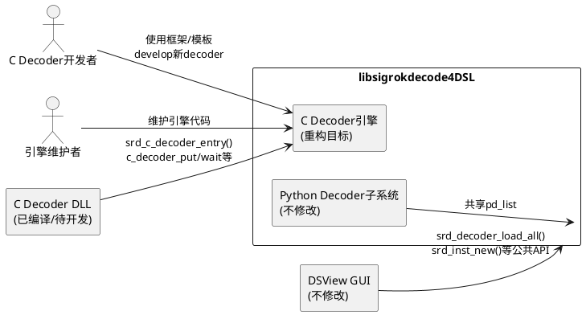
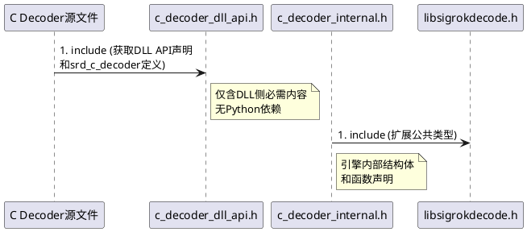
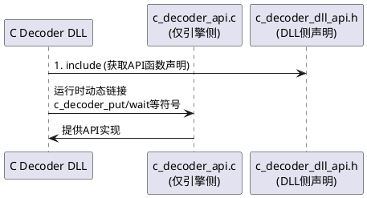
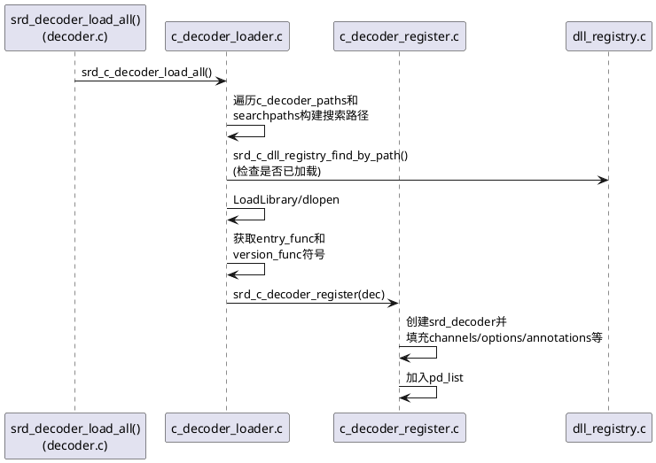
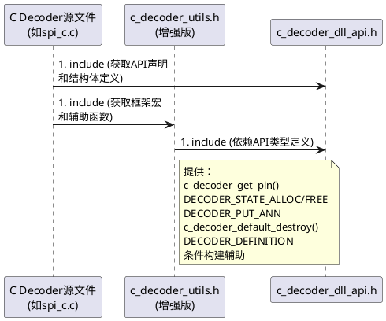
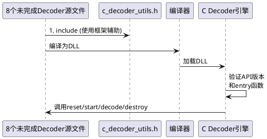
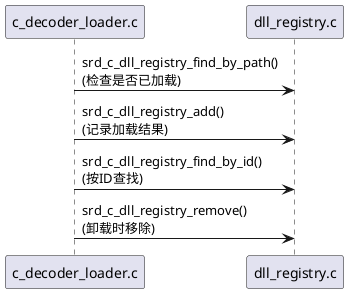
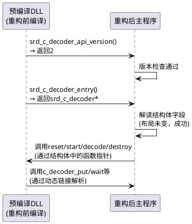

# **1. 组件定位**

## **1.1 核心职责**

本组件负责重构libsigrokdecode4DSL库中C decoder子系统的代码架构，实现清晰的模块划分、职责分离和代码复用，提升可维护性与可扩展性。

## **1.2 核心输入**

1. 现有C decoder源代码文件：spi_c.c, i2c_c.c, uart_c.c, can_c.c（已完成的4个decoder）
2. 未完成的8个C decoder源文件：counter_c.c, pwm_c.c, graycode_c.c, seven_segment_c.c, numbers_and_state_c.c, lm75_c.c, ds1307_c.c, ds3231_c.c
3. 双用途文件c_decoder_api.c（引擎API + DLL内部API）
4. 混合职责文件decoder.c（Python decoder加载 + C decoder DLL加载/注册/路径管理，约1550行）
5. 混合头文件libsigrokdecode.h（公共API声明 + 内部结构体定义如srd_c_decoder_inst）
6. 新增模块dll_registry.h/c（DLL注册表）
7. 新增工具头文件c_decoder_utils.h（仅含get_pin函数）
8. 已完成的接口对齐工作成果：srd_c_decoder结构体（含end/metadata回调）、srd_c_annotation（含ann_type字段）、API版本2、c_decoder_put_binary()等

## **1.3 核心输出**

1. 重构后的头文件体系：分离公共API头文件、内部实现头文件、C decoder专用头文件
2. 拆分后的源文件：从decoder.c中独立出C decoder加载/注册逻辑
3. c_decoder_api.c的职责明确化方案：引擎侧API与DLL侧API的物理或逻辑分离
4. 统一的C decoder框架/模板：消除各decoder间的重复代码
5. 增强版c_decoder_utils.h：包含完整的decoder开发辅助工具集
6. 8个未完成decoder的修复与统一实现
7. 清晰的模块间依赖关系文档

## **1.4 职责边界**

1. 不负责Python decoder子系统的重构（Python decoder加载逻辑保持不变）
2. 不负责libsigrokdecode4DSL库的公共API语义变更（srd_session_*、srd_inst_*等接口签名不变）
3. 不负责GUI层（DSView/）的任何修改
4. 不负责硬件驱动层（libsigrok4DSL/）的任何修改
5. 不负责新增decoder的协议解码逻辑实现（仅修复语法错误、统一框架结构，解码逻辑留作后续任务）
6. 不负责C decoder DLL的二进制接口（ABI）破坏性变更——srd_c_decoder_entry()和srd_c_decoder_api_version()两个导出函数的签名必须保持不变

# **2. 领域术语**

**C Decoder DLL**
: 编译为独立共享库（Windows上为.dll，Linux上为.so）的原生C协议解码器，通过srd_c_decoder_entry()导出函数向引擎注册自身。

**C Decoder引擎**
: libsigrokdecode4DSL库中负责加载、管理、调度C Decoder DLL的运行时基础设施，提供c_decoder_put/wait/has_channel等API供DLL调用。

**SRD_C_DECODER_DLL宏**
: 编译时条件宏，定义该宏时c_decoder_api.c编译为DLL内部API版本；未定义时编译为主程序引擎API版本。是当前双用途文件的核心分界机制。

**srd_c_decoder结构体**
: C decoder的自描述结构，包含id/name/channels/annotations等元数据及reset/start/decode/end/metadata/destroy生命周期回调指针，每个DLL通过entry函数返回此结构体的指针。

**srd_c_decoder_inst结构体**
: C decoder实例的运行时状态，包含会话关联、通道映射、采样缓冲区、条件匹配、线程同步等字段，当前定义在公共头文件libsigrokdecode.h中。

**DLL注册表（dll_registry）**
: 管理已加载C decoder DLL的条目列表（srd_c_dll_entry），记录文件路径、操作系统句柄、API版本、加载状态、decoder ID等信息。

**get_pin辅助函数**
: 根据通道索引和采样号从输入缓冲区读取单个bit值的内联函数，当前在每个C decoder（spi_c/i2c_c/uart_c/can_c）中重复定义，亦在c_decoder_utils.h中有定义。

**EARS模式**
: 需求规格中使用的标准验收条件语法格式，包含事件驱动（When...shall...）、状态驱动（While...shall...）、异常行为（If...shall...）等模式。

**向后兼容性**
: 重构后现有C decoder DLL（spi_c/i2c_c/uart_c/can_c）无需重新编译即可正常加载和运行的能力，核心保证是srd_c_decoder结构体布局和DLL导出函数签名不变。

# **3. 角色与边界**

## **3.1 核心角色**

- **C Decoder开发者**：使用C decoder框架/模板开发新decoder的开发人员，是框架API和工具集的直接使用者
- **引擎维护者**：维护libsigrokdecode4DSL库核心逻辑的开发人员，是重构后模块划分和头文件组织的直接受益者

## **3.2 外部系统**

- **主程序（DSView GUI）**：通过libsigrokdecode.h公共API调用decoder加载/实例化/会话管理，重构后其include方式和调用方式不变
- **Python decoder子系统**：与C decoder共享decoder.c中的pd_list和部分加载逻辑，重构后Python decoder路径不受影响
- **C decoder DLL（已编译的）**：运行时通过导出函数与引擎交互，重构后DLL接口保持向后兼容

## **3.3 交互上下文**

# **4. DFX约束**

## **4.1 性能**

1. 重构不得引入运行时性能退化：C decoder的decode()回调执行路径不得增加额外函数调用层级
2. 头文件重组后，编译时间不得显著增加（避免引入不必要的传递依赖）

## **4.2 可靠性**

1. 重构过程必须保证增量可验证：每个重构步骤完成后，现有4个C decoder（spi_c/i2c_c/uart_c/can_c）的功能测试必须全部通过
2. DLL加载失败时的错误信息必须保留当前的分级诊断能力（SRD_C_DLL_LOAD_FAILED / SRD_C_DLL_ENTRY_MISSING / SRD_C_DLL_VERSION_MISMATCH）

## **4.3 安全性**

无额外安全约束。当前系统为本地信号分析工具，无网络暴露面。

## **4.4 可维护性**

1. 重构后每个源文件（.c）的行数应不超过500行（decoder.c当前约1550行，必须拆分）
2. 每个头文件（.h）应具有单一明确的职责，可通过文件名直接推断其内容
3. 模块间的#include依赖必须是单向的、无环的
4. 新增C decoder时，开发者只需修改单个.c文件和CMakeLists.txt，无需修改引擎侧任何代码

## **4.5 兼容性**

1. **DLL二进制兼容性**：srd_c_decoder结构体的字段布局和字段顺序不得变更，srd_c_decoder_entry()和srd_c_decoder_api_version()的导出签名不得变更
2. **公共API兼容性**：libsigrokdecode.h中对前端暴露的SRD_API函数签名不得变更
3. **编译兼容性**：SRD_C_DECODER_DLL宏的条件编译机制必须保留，确保DLL和主程序仍可从相同源文件（或明确拆分后的源文件）分别编译
4. **API版本**：SRD_C_DECODER_API_VERSION保持为2，SRD_C_DECODER_API_MIN_VERSION保持为2

# **5. 核心能力**

## **5.1 头文件组织重构**

### **5.1.1 业务规则**

1. **公共API头文件职责纯粹化**：libsigrokdecode.h必须仅包含前端（DSView GUI）需要调用的SRD_API函数声明、必要的枚举定义（srd_error_code、srd_output_type、srd_term_type等）和不可避免的前端可见结构体（srd_decoder、srd_decoder_inst）

   a. 验收条件：[检查libsigrokdecode.h内容] → [srd_c_decoder_inst、srd_c_dll_entry等内部结构体定义不在该文件中]

2. **内部实现头文件独立化**：新增内部头文件（如c_decoder_internal.h），承载引擎内部使用的结构体定义（srd_c_decoder_inst、srd_pd_output、srd_proto_data等）和内部函数声明

   a. 验收条件：[引擎内部源文件需要srd_c_decoder_inst时] → [include内部头文件而非libsigrokdecode.h]

3. **C Decoder DLL专用头文件**：新增c_decoder_dll_api.h，仅包含DLL编译时需要的内容：srd_c_decoder结构体定义、SRD_C_DECODER_EXPORT宏、SRD_C_DECODER_API_VERSION常量、srd_c_annotation结构体、c_decoder_put/wait/has_channel/register_output/get_samplerate/get_option_*等DLL可调用API声明

   a. 验收条件：[C decoder源文件include c_decoder_dll_api.h] → [可成功编译为DLL，无需include引擎内部头文件]

4. **头文件依赖无环性**：头文件间的#include关系必须是无环的有向图

   a. 验收条件：[对头文件集做拓扑排序] → [排序成功，无循环依赖]

5. **禁止项**：禁止在C Decoder DLL专用头文件中包含Python.h或libsigrokdecode-internal.h

   a. 验收条件：[C decoder源文件的预处理展开结果] → [不包含Python.h相关内容]

### **5.1.2 交互流程**

### **5.1.3 异常场景**

1. **现有代码include路径破坏**

   a. 触发条件：拆分头文件后，现有源文件的#include指向不存在的头文件
   b. 系统行为：编译报错，明确指示缺失的头文件
   c. 用户感知：编译失败，需更新include路径

2. **结构体定义重复导致编译冲突**

   a. 触发条件：同一个结构体在多个头文件中定义，且被同一编译单元间接包含
   b. 系统行为：编译器报重定义错误
   c. 用户感知：编译失败，需调整头文件包含守卫或使用前向声明

## **5.2 c_decoder_api.c双用途分离**

### **5.2.1 业务规则**

1. **引擎侧API文件独立化**：c_decoder_api.c中供主程序使用的函数（c_decoder_put、c_decoder_put_binary、c_decoder_wait、c_decoder_has_channel、c_decoder_register_output、c_decoder_get_samplerate、c_decoder_get_option_*）必须能从独立源文件编译，不依赖SRD_C_DECODER_DLL宏

   a. 验收条件：[编译主程序时编译c_decoder_api.c] → [无需定义SRD_C_DECODER_DLL宏，编译成功]

2. **DLL侧API文件独立化**：当SRD_C_DECODER_DLL宏定义时编译的代码（当前仅包含错误日志重定义_srd_err和pd_list外部声明）必须提取到独立的文件或通过头文件机制替代

   a. 验收条件：[编译C decoder DLL时] → [不include c_decoder_api.c，而是include c_decoder_dll_api.h获取所需声明]

3. **消除双用途编译模式**：重构后c_decoder_api.c应只有一种编译模式——作为主程序引擎的一部分，SRD_C_DECODER_DLL宏在c_decoder_api.c中不再使用

   a. 验收条件：[grep SRD_C_DECODER_DLL c_decoder_api.c] → [无匹配结果]

4. **向后兼容保证**：DLL中调用的c_decoder_put/wait等函数，其运行时解析仍指向主程序中c_decoder_api.c导出的符号，行为不变

   a. 验收条件：[加载重构后编译的DLL到重构后的主程序] → [spi_c/i2c_c/uart_c/can_c功能测试通过]

### **5.2.2 交互流程**

### **5.2.3 异常场景**

1. **DLL运行时符号解析失败**

   a. 触发条件：重构后主程序未导出c_decoder_put等符号，或符号名变更
   b. 系统行为：DLL加载失败或运行时调用崩溃
   c. 用户感知：decoder无法使用或程序异常终止

2. **宏依赖遗留导致编译错误**

   a. 触发条件：c_decoder_api.c中残留对SRD_C_DECODER_DLL宏的条件编译代码
   b. 系统行为：主程序编译时行为不一致
   c. 用户感知：编译通过但运行时行为异常

## **5.3 decoder.c拆分**

### **5.3.1 业务规则**

1. **Python decoder加载逻辑保留在decoder.c中**：srd_decoder_load()、srd_decoder_doc_get()、srd_decoder_unload()等Python decoder相关函数留在decoder.c，该文件仅负责Python decoder的加载/卸载

   a. 验收条件：[重构后decoder.c行数] → [不超过500行]

2. **C decoder注册逻辑独立为c_decoder_register.c**：srd_c_decoder_register()函数（将srd_c_decoder转换为srd_decoder并加入pd_list）必须移至新文件c_decoder_register.c

   a. 验收条件：[grep srd_c_decoder_register decoder.c] → [无匹配结果，该函数在c_decoder_register.c中]

3. **C decoder DLL加载逻辑独立为c_decoder_loader.c**：srd_c_decoder_load()、srd_c_decoder_unload()、srd_c_decoder_load_all()、srd_c_decoder_load_single()、srd_c_decoder_check_version()、c_decoder_paths相关函数必须移至新文件c_decoder_loader.c

   a. 验收条件：[grep srd_c_decoder_load decoder.c] → [无匹配结果，这些函数在c_decoder_loader.c中]

4. **C decoder路径管理逻辑随DLL加载逻辑一起迁移**：srd_c_decoder_path_set()、srd_c_decoder_path_add()、srd_c_decoder_paths_clear()和c_decoder_paths静态变量移至c_decoder_loader.c

   a. 验收条件：[grep c_decoder_paths decoder.c] → [无匹配结果]

5. **srd_decoder_load_all()中的C decoder调度保留**：srd_decoder_load_all()函数中调用srd_c_decoder_load_all()的语句保留在decoder.c中，作为顶层加载入口

   a. 验收条件：[srd_decoder_load_all()函数仍可正确触发C decoder和Python decoder的加载]

6. **DLL注册表查询API保留在decoder.c或移至c_decoder_loader.c**：srd_c_dll_registry_get()和srd_c_dll_info_get()应随DLL加载逻辑一起迁移

   a. 验收条件：[这两个函数在c_decoder_loader.c中可找到实现]

### **5.3.2 交互流程**

### **5.3.3 异常场景**

1. **pd_list访问冲突**

   a. 触发条件：拆分后多个源文件需要访问static pd_list
   b. 系统行为：编译错误——static变量仅在定义文件可见
   c. 用户感知：需通过外部声明（extern）或getter函数暴露pd_list访问

2. **sessions访问冲突**

   a. 触发条件：c_decoder_loader.c中srd_c_decoder_unload()需要遍历sessions检查活跃实例
   b. 系统行为：编译错误——sessions在session.c中定义
   c. 用户感知：需通过外部声明或session.c提供的查询函数访问

## **5.4 C Decoder框架/模板设计**

### **5.4.1 业务规则**

1. **消除get_pin重复定义**：c_decoder_utils.h中的c_decoder_get_pin()函数必须成为唯一的pin读取实现，所有C decoder（包括已完成的4个）必须使用该函数而非各自的static get_pin()

   a. 验收条件：[grep "static.*get_pin" spi_c.c i2c_c.c uart_c.c can_c.c] → [无匹配结果]

2. **提供统一的decoder状态分配/释放宏**：框架必须提供DECODER_STATE_ALLOC(di, state_type)和DECODER_STATE_FREE(di)宏（或内联函数），封装当前每个decoder中重复的user_data分配/释放模式

   a. 验收条件：[新的C decoder使用DECODER_STATE_ALLOC而非手动g_malloc0+memset] → [代码正确运行，user_data正确分配和初始化]

3. **提供统一的annotation输出辅助**：框架必须提供DECODER_PUT_ANN(di, output_id, start, end, class, type, ...)宏（或内联函数），封装srd_c_annotation结构体构造和c_decoder_put调用

   a. 验收条件：[使用DECODER_PUT_ANN代替手动构造srd_c_annotation] → [annotation输出结果与重构前一致]

4. **提供统一的destroy实现**：框架必须提供默认的c_decoder_default_destroy()函数，实现user_data的g_free释放，各decoder可选择使用默认实现或提供自定义destroy

   a. 验收条件：[未提供自定义destroy的decoder] → [使用c_decoder_default_destroy，user_data正确释放]

5. **提供统一的SRD_C_DECODER_ENTRY定义宏**：框架必须提供DECODER_DEFINITION宏，封装srd_c_decoder结构体定义和srd_c_decoder_entry()/srd_c_decoder_api_version()两个导出函数的样板代码

   a. 验收条件：[使用DECODER_DEFINITION宏定义的decoder] → [DLL导出符号和结构体布局与手动定义一致]

6. **提供condition构建辅助**：框架必须提供DECODER_WAITterm构建辅助函数或宏，简化当前每个decoder中重复的g_malloc0+g_slist_append条件列表构建代码

   a. 验收条件：[使用辅助函数构建condition] → [c_decoder_wait行为与手动构建一致]

7. **禁止项**：框架不得引入对decoder解码逻辑的约束——decode()函数的具体实现仍由各decoder自行决定

   a. 验收条件：[框架不包含decode()的默认实现或模板] → [各decoder的decode()完全自主]

### **5.4.2 交互流程**

### **5.4.3 异常场景**

1. **宏展开导致调试困难**

   a. 触发条件：DECODER_DEFINITION等宏展开后的代码在调试器中难以定位
   b. 系统行为：GDB/LLDB单步跟踪时跳入宏展开代码
   c. 用户感知：调试体验下降，需通过断点在decode()函数入口处设置

2. **框架宏与decoder自定义逻辑冲突**

   a. 触发条件：decoder需要自定义reset/destroy逻辑，但框架默认实现不满足需求
   b. 系统行为：框架允许覆盖默认实现
   c. 用户感知：开发者提供自定义回调函数，框架宏自动使用自定义版本

## **5.5 未完成C Decoder修复与统一**

### **5.5.1 业务规则**

1. **语法错误修复**：8个未完成decoder（counter_c、pwm_c、graycode_c、seven_segment_c、numbers_and_state_c、lm75_c、ds1307_c、ds3231_c）中存在的语法错误必须全部修复，使其能通过编译

   a. 验收条件：[对8个decoder源文件执行编译] → [零编译错误]

2. **空初始化器修复**：当前多个未完成decoder中outputs数组使用了空初始化器（如`{, NULL}`），必须修复为合法C语法（如`{"", NULL}`或`{NULL}`）

   a. 验收条件：[grep "{, NULL}" c_decoders/*.c] → [无匹配结果]

3. **统一使用c_decoder_utils.h**：所有C decoder（包括已完成的4个和未完成的8个）必须统一include c_decoder_utils.h并使用c_decoder_get_pin()，消除各自的static get_pin()定义

   a. 验收条件：[每个C decoder源文件include c_decoder_utils.h] → [编译通过且功能正确]

4. **统一使用框架宏**：所有C decoder应使用DECODER_STATE_ALLOC/FREE、DECODER_PUT_ANN、c_decoder_default_destroy、DECODER_DEFINITION等框架宏/函数，消除重复样板代码

   a. 验收条件：[各decoder源文件行数减少] → [与不使用框架时相比，样板代码行数减少50%以上]

5. **end/metadata回调实现**：所有C decoder的srd_c_decoder结构体中end和metadata回调指针必须显式初始化（可为NULL表示无操作），不得遗漏

   a. 验收条件：[检查每个srd_c_decoder结构体初始化] → [end和metadata字段均有赋值]

6. **解码逻辑占位**：未完成decoder的decode()函数允许保留为空循环（仅调用c_decoder_wait等待终止），但必须具有正确的函数签名和框架结构

   a. 验收条件：[空decode()的decoder加载后] → [不崩溃，可正常创建实例并等待终止信号]

### **5.5.2 交互流程**

### **5.5.3 异常场景**

1. **未完成decoder解码逻辑为空导致无输出**

   a. 触发条件：用户选择未完成decoder（如counter_c）进行解码
   b. 系统行为：decoder正常运行但无annotation输出
   c. 用户感知：解码结果为空，无报错——这是预期行为，因为解码逻辑尚未实现

2. **修复语法错误引入新问题**

   a. 触发条件：修复空初始化器等语法错误时改变了数组语义
   b. 系统行为：decoder元数据（inputs/outputs/tags）与预期不符
   c. 用户感知：decoder在UI中显示的分类或输入输出类型不正确

## **5.6 DLL注册表模块集成完善**

### **5.6.1 业务规则**

1. **注册表与加载器职责清晰化**：dll_registry.h/c仅负责DLL条目的增删查管理（数据存储），c_decoder_loader.c负责DLL的加载/卸载逻辑（业务流程），两者不交叉

   a. 验收条件：[dll_registry.c中不包含LoadLibrary/dlopen/dlclose/FreeLibrary调用] → [仅cleanup中包含资源释放]

2. **注册表头文件依赖最小化**：dll_registry.h必须仅include必要的类型定义头文件，不间接引入Python.h或引擎内部实现细节

   a. 验收条件：[dll_registry.h的include列表] → [仅包含glib.h和类型定义头文件，不包含libsigrokdecode-internal.h]

3. **注册表状态枚举公开**：srd_c_dll_status枚举和srd_c_dll_entry结构体应从dll_registry.h对需要查询DLL状态的模块可见，但不必暴露给C decoder DLL

   a. 验收条件：[引擎内部模块可访问srd_c_dll_status] → [C decoder DLL编译时不可见该类型]

### **5.6.2 交互流程**

### **5.6.3 异常场景**

1. **注册表与实际pd_list不一致**

   a. 触发条件：srd_c_decoder_register()成功将decoder加入pd_list，但dll_registry_add()失败
   b. 系统行为：pd_list中有该decoder但注册表中无记录，导致unload找不到
   c. 用户感知：srd_c_decoder_unload()返回SRD_ERR_ARG但decoder仍可用——需确保两个操作的原子性

## **5.7 向后兼容性保障**

### **5.7.1 业务规则**

1. **srd_c_decoder结构体布局不变**：结构体的字段顺序、类型、偏移量必须与重构前完全一致，已编译的DLL通过entry函数返回的指针必须仍可被引擎正确解读

   a. 验收条件：[使用C编译器offsetof检查每个字段的偏移量] → [重构前后偏移量完全相同]

2. **DLL导出函数签名不变**：srd_c_decoder_entry()返回`struct srd_c_decoder*`，srd_c_decoder_api_version()返回`int`，签名不得变更

   a. 验收条件：[使用nm/objdump检查重构前后DLL导出符号] → [符号名和类型完全匹配]

3. **引擎提供给DLL的API符号不变**：c_decoder_put、c_decoder_put_binary、c_decoder_wait、c_decoder_has_channel、c_decoder_register_output、c_decoder_get_samplerate、c_decoder_get_option_int、c_decoder_get_option_double、c_decoder_get_option_string的函数签名和语义不得变更

   a. 验收条件：[使用现有spi_c/i2c_c/uart_c/can_c的预编译DLL加载到重构后的主程序] → [功能测试全部通过]

4. **SRD_C_DECODER_API_VERSION不变**：版本号保持为2，确保版本检查逻辑行为不变

   a. 验收条件：[srd_c_decoder_check_version(2)] → [返回SRD_OK]

### **5.7.2 交互流程**

### **5.7.3 异常场景**

1. **结构体字段偏移量意外变更**

   a. 触发条件：在srd_c_decoder结构体中插入/删除/重排字段
   b. 系统行为：预编译DLL返回的结构体被引擎按新布局解读，字段错位
   c. 用户感知：decoder元数据（id/name/channels等）显示乱码或程序崩溃

2. **API函数签名变更**

   a. 触发条件：c_decoder_put增加新参数或改变返回类型
   b. 系统行为：DLL调用时参数传递不匹配，栈损坏
   c. 用户感知：程序崩溃或数据损坏

# **6. 数据约束**

## **6.1 srd_c_decoder结构体**

1. **id**：非NULL的C字符串，全局唯一标识，格式为`<协议名>_c`（如"spi_c"、"i2c_c"）
2. **name**：非NULL的C字符串，显示用短名称（如"SPI(C)"）
3. **longname**：非NULL的C字符串，显示用长名称
4. **desc**：非NULL的C字符串，decoder描述
5. **license**：非NULL的C字符串，取值为"gplv2+"或"gplv3+"
6. **channels**：指向srd_channel数组的指针，可为NULL（表示无必需通道）
7. **num_channels**：非负整数，channels数组的长度
8. **optional_channels**：指向srd_channel数组的指针，可为NULL
9. **num_optional_channels**：非负整数
10. **options**：指向srd_decoder_option数组的指针，可为NULL
11. **num_options**：非负整数
12. **num_annotations**：非负整数，annotation类别数
13. **ann_labels**：指向`const char*[N][3]`数组的指针，N=num_annotations，可为NULL
14. **num_annotation_rows**：非负整数
15. **annotation_rows**：指向srd_decoder_annotation_row数组的指针，可为NULL
16. **inputs**：指向字符串数组的指针，数组以NULL结尾
17. **num_inputs**：非负整数
18. **outputs**：指向字符串数组的指针，数组以NULL结尾
19. **num_outputs**：非负整数
20. **binary**：指向srd_decoder_binary数组的指针，可为NULL
21. **num_binary**：非负整数
22. **tags**：指向字符串数组的指针，数组以NULL结尾
23. **num_tags**：非负整数
24. **reset**：非NULL的函数指针，签名`void (*)(void *inst)`
25. **start**：非NULL的函数指针，签名`void (*)(void *inst)`
26. **decode**：非NULL的函数指针，签名`void (*)(void *inst)`
27. **end**：可为NULL的函数指针，签名`void (*)(void *inst)`
28. **metadata**：可为NULL的函数指针，签名`void (*)(void *inst, int key, uint64_t value)`
29. **destroy**：非NULL的函数指针，签名`void (*)(void *inst)`

## **6.2 srd_c_annotation结构体**

1. **ann_class**：非负整数，annotation类别索引，必须小于对应decoder的num_annotations
2. **ann_type**：整数，annotation类型标识（0=默认文本，其他值由decoder自定义）
3. **ann_text**：指向以NULL结尾的字符串指针数组的指针，至少包含一个非NULL元素

## **6.3 srd_c_dll_entry结构体**

1. **file_path**：非NULL的C字符串，DLL的绝对文件路径
2. **handle**：操作系统DLL句柄，可为NULL（加载失败时）
3. **api_version**：整数，DLL报告的API版本号
4. **status**：枚举值，取值为SRD_C_DLL_LOADED/SRD_C_DLL_VERSION_MISMATCH/SRD_C_DLL_ENTRY_MISSING/SRD_C_DLL_LOAD_FAILED/SRD_C_DLL_UNLOADED之一
5. **decoder_id**：C字符串，可为NULL（加载失败时尚未获取ID）
6. **c_dec**：指向srd_c_decoder的指针，可为NULL（加载失败时）
7. **load_time**：time_t类型，记录加载时间
