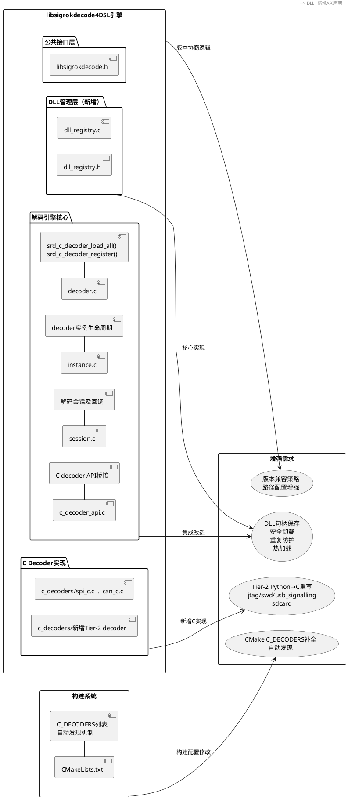
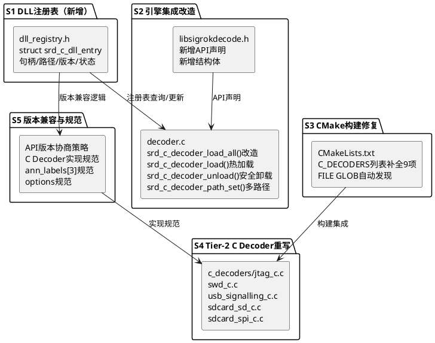
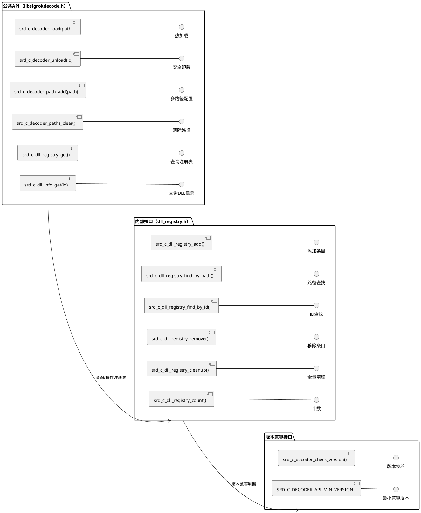
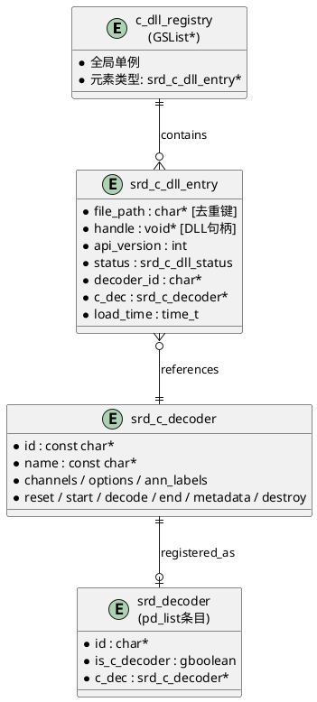
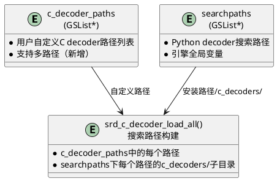

# **1. 实现模型**

## **1.1 上下文视图**

本实现方案的目标是将spec.md中识别的C decoder生态体系增强需求转化为具体架构和实现设计，涵盖DLL管理机制增强、CMake构建配置修复、Tier-2 Python→C重写方案、新增C Decoder规范实施以及DLL增强需求实现五大模块。



## **1.2 服务/组件总体架构**

实现分为五个子系统，依赖关系自底向上：

| 子系统 | 模块 | 核心内容 | 优先级 |
|--------|------|----------|--------|
| S1-DLL注册表 | `dll_registry.h/c`（新增） | DLL句柄存储、元信息管理、去重、安全卸载 | P0 |
| S2-引擎集成改造 | `decoder.c`, `libsigrokdecode.h` | 集成DLL注册表、热加载API、路径配置增强 | P0 |
| S3-CMake构建修复 | `CMakeLists.txt` | C_DECODERS列表补全、自动发现机制 | P0 |
| S4-Tier-2 C Decoder重写 | `c_decoders/`新增 | jtag_c/swd_c/usb_signalling_c/sdcard_sd_c/sdcard_spi_c C实现 | P1 |
| S5-版本兼容与规范 | `libsigrokdecode.h`, 文档 | API版本兼容策略、C Decoder实现规范文档 | P1 |



## **1.3 实现设计文档**

### **1.3.1 S1：DLL注册表子系统（新增）**

#### 1.3.1.1 设计目标

当前`decoder.c:1314-1423`的`srd_c_decoder_load_all()`函数存在核心缺陷：LoadLibraryA/dlopen返回的句柄未被保存，导致无法执行FreeLibrary/dlclose卸载操作，也无法查询已加载DLL的元信息或防护重复加载。本子系统通过引入DLL注册表解决此问题。

#### 1.3.1.2 数据结构设计

**新增文件**：`libsigrokdecode4DSL/dll_registry.h` 和 `libsigrokdecode4DSL/dll_registry.c`

```c
/* dll_registry.h - C Decoder DLL注册表 */

#ifndef DLL_REGISTRY_H
#define DLL_REGISTRY_H

#include "libsigrokdecode.h"
#include <glib.h>

/* DLL加载状态 */
enum srd_c_dll_status {
    SRD_C_DLL_LOADED,          /* 已加载且可用 */
    SRD_C_DLL_VERSION_MISMATCH,/* API版本不匹配，已拒绝 */
    SRD_C_DLL_ENTRY_MISSING,   /* 入口函数缺失，已拒绝 */
    SRD_C_DLL_LOAD_FAILED,     /* LoadLibrary/dlopen失败 */
    SRD_C_DLL_UNLOADED,        /* 已卸载 */
};

/* DLL注册表条目 - 记录每个已加载DLL的完整信息 */
struct srd_c_dll_entry {
    char *file_path;            /* DLL/SO的完整文件路径（去重键） */
    void *handle;               /* LoadLibraryA/dlopen返回的句柄 */
    int api_version;            /* DLL报告的API版本号 */
    enum srd_c_dll_status status; /* 当前加载状态 */
    char *decoder_id;           /* 关联的decoder id（entry_func返回的dec->id） */
    struct srd_c_decoder *c_dec; /* 关联的srd_c_decoder指针 */
    time_t load_time;           /* 加载时间戳 */
};

/* 全局DLL注册表 */
extern GSList *c_dll_registry;

/* 注册表操作API（内部使用） */

/* 向注册表添加条目，若file_path已存在则返回NULL（去重） */
struct srd_c_dll_entry *srd_c_dll_registry_add(const char *file_path,
    void *handle, int api_version, enum srd_c_dll_status status,
    const char *decoder_id, struct srd_c_decoder *c_dec);

/* 按文件路径查找，用于去重检查 */
struct srd_c_dll_entry *srd_c_dll_registry_find_by_path(const char *file_path);

/* 按decoder id查找，用于卸载操作 */
struct srd_c_dll_entry *srd_c_dll_registry_find_by_id(const char *decoder_id);

/* 从注册表移除条目并释放资源（不含FreeLibrary/dlclose） */
int srd_c_dll_registry_remove(const char *decoder_id);

/* 释放注册表中所有条目（srd_exit时调用） */
void srd_c_dll_registry_cleanup(void);

/* 统计已加载DLL数量 */
int srd_c_dll_registry_count(void);

#endif /* DLL_REGISTRY_H */
```

#### 1.3.1.3 核心逻辑设计

**`dll_registry.c`实现要点**：

1. **去重机制**：`srd_c_dll_registry_add()`在添加前调用`srd_c_dll_registry_find_by_path()`检查file_path是否已存在。若存在，记录调试日志`"C decoder DLL '%s' already loaded, skipping duplicate."`并返回NULL。

2. **句柄保存**：`srd_c_dll_entry.handle`字段保存LoadLibraryA/dlopen返回值。当前代码中（`decoder.c:1354/1380`），handle仅在加载函数的栈帧中使用，加载完成后即丢失。改造后将handle存入注册表条目。

3. **安全卸载**：`srd_c_dll_registry_remove()`仅从注册表移除条目并释放g_strdup的内存。实际的FreeLibrary/dlclose由`srd_c_decoder_unload()`执行，该函数需先检查是否有活跃实例（见S2设计）。

4. **cleanup**：`srd_c_dll_registry_cleanup()`在`srd_exit()`时调用，遍历注册表对所有已加载DLL执行FreeLibrary/dlclose，然后释放注册表本身。

### **1.3.2 S2：引擎集成改造**

#### 1.3.2.1 `srd_c_decoder_load_all()`改造

**修改位置**：`libsigrokdecode4DSL/decoder.c:1314-1423`

**改造要点**：

1. **句柄保存**：在`entry_func()`成功返回后（第1406-1412行区域），将handle和file_path存入DLL注册表：
   ```c
   /* 原代码（第1406-1412行）：
    * struct srd_c_decoder* dec = entry_func();
    * if (dec) {
    *     srd_c_decoder_register(dec);
    *     srd_dbg(...);
    * } else { ... }
    *
    * 改造为：
    */
   struct srd_c_decoder* dec = entry_func();
   if (dec) {
       /* 重复加载防护 */
       struct srd_c_dll_entry *existing = srd_c_dll_registry_find_by_path(full_path);
       if (existing) {
           srd_dbg("C decoder DLL '%s' already loaded as '%s', skipping.",
               full_path, existing->decoder_id);
           #ifdef _WIN32
           FreeLibrary(handle);
           #else
           dlclose(handle);
           #endif
           g_free(full_path);
           continue;
       }

       srd_c_decoder_register(dec);

       /* 保存句柄和元信息到注册表 */
       int dll_version = version_func ? version_func() : 0;
       srd_c_dll_registry_add(full_path, handle, dll_version,
           SRD_C_DLL_LOADED, dec->id, dec);

       srd_dbg("Loaded C decoder '%s' from %s (api_version=%d).",
           dec->id, full_path, dll_version);
   } else {
       srd_warn("C decoder DLL '%s' entry returned NULL.", full_path);
       #ifdef _WIN32
       FreeLibrary(handle);
       #else
       dlclose(handle);
       #endif
   }
   ```

2. **版本不匹配时的句柄释放记录**：当前版本不匹配时（第1372-1378/1397-1402行），已经执行了FreeLibrary/dlclose。改造后需额外记录到注册表（状态为VERSION_MISMATCH），便于查询诊断：
   ```c
   if (version_func && version_func() != SRD_C_DECODER_API_VERSION) {
       srd_warn("C decoder DLL '%s' API version mismatch (got %d, expected %d).",
           full_path, version_func(), SRD_C_DECODER_API_VERSION);
       /* 记录失败信息到注册表用于诊断（不保存handle，因为已释放） */
       srd_c_dll_registry_add(full_path, NULL, version_func(),
           SRD_C_DLL_VERSION_MISMATCH, NULL, NULL);
       #ifdef _WIN32
       FreeLibrary(handle);
       #else
       dlclose(handle);
       #endif
       g_free(full_path);
       continue;
   }
   ```

#### 1.3.2.2 热加载API：`srd_c_decoder_load()`

**新增函数声明**（`libsigrokdecode.h`）：
```c
SRD_API int srd_c_decoder_load(const char *dll_path);
```

**实现设计**（在`decoder.c`中新增）：
```c
/**
 * 热加载单个C decoder DLL。
 *
 * @param dll_path DLL/SO文件的完整路径
 * @return SRD_OK成功，SRD_ERR_ARG参数错误或重复，SRD_ERR加载失败
 */
SRD_API int srd_c_decoder_load(const char *dll_path)
{
    if (!dll_path)
        return SRD_ERR_ARG;

    /* 去重检查 */
    struct srd_c_dll_entry *existing = srd_c_dll_registry_find_by_path(dll_path);
    if (existing && existing->status == SRD_C_DLL_LOADED) {
        srd_warn("C decoder DLL '%s' is already loaded.", dll_path);
        return SRD_ERR_ARG;
    }

    /* 加载逻辑与srd_c_decoder_load_all()中的单个DLL加载逻辑相同 */
    /* LoadLibraryA/dlopen → GetProcAddress/dlsym → 版本校验 → entry_func → register → registry_add */
    /* 区别：此函数仅加载指定路径的单个DLL，不扫描目录 */
    /* 返回值：成功返回SRD_OK，失败返回对应错误码 */

    /* 实现模式：提取srd_c_decoder_load_all()中的单个DLL加载逻辑为内部函数
     * static int srd_c_decoder_load_single(const char *full_path)
     * 供srd_c_decoder_load_all()和srd_c_decoder_load()共用
     */
}
```

**关键设计：提取公共加载函数**：
```c
/* 内部函数：加载单个C decoder DLL */
static int srd_c_decoder_load_single(const char *full_path)
{
    /* 从srd_c_decoder_load_all()中提取的DLL加载逻辑：
     * 1. LoadLibraryA/dlopen
     * 2. GetProcAddress/dlsym查找入口函数
     * 3. API版本校验
     * 4. 重复加载防护
     * 5. entry_func()获取srd_c_decoder
     * 6. srd_c_decoder_register()注册
     * 7. srd_c_dll_registry_add()保存元信息
     */
}

/* srd_c_decoder_load_all()改造为调用srd_c_decoder_load_single() */
/* srd_c_decoder_load()直接调用srd_c_decoder_load_single() */
```

#### 1.3.2.3 安全卸载API：`srd_c_decoder_unload()`

**新增函数声明**（`libsigrokdecode.h`）：
```c
SRD_API int srd_c_decoder_unload(const char *decoder_id);
```

**实现设计**（在`decoder.c`中新增）：
```c
/**
 * 安全卸载C decoder DLL。
 * 若存在该decoder的活跃实例，拒绝卸载并返回SRD_ERR_ARG。
 *
 * @param decoder_id 要卸载的C decoder ID
 * @return SRD_OK成功，SRD_ERR_ARG参数错误或有活跃实例
 */
SRD_API int srd_c_decoder_unload(const char *decoder_id)
{
    if (!decoder_id)
        return SRD_ERR_ARG;

    /* 1. 查找注册表条目 */
    struct srd_c_dll_entry *entry = srd_c_dll_registry_find_by_id(decoder_id);
    if (!entry || entry->status != SRD_C_DLL_LOADED) {
        srd_warn("C decoder '%s' is not loaded.", decoder_id);
        return SRD_ERR_ARG;
    }

    /* 2. 检查活跃实例：遍历所有session的di_list，
     *    查找是否有srd_decoder_inst的decoder->id匹配decoder_id
     *    且decoder_state不为终止状态 */
    /* 引用sessions全局变量（在srd.c中声明为extern） */
    extern GSList *sessions;
    GSList *sl;
    for (sl = sessions; sl; sl = sl->next) {
        struct srd_session *sess = sl->data;
        GSList *dil;
        for (dil = sess->di_list; dil; dil = dil->next) {
            struct srd_decoder_inst *di = dil->data;
            if (di->decoder && g_strcmp0(di->decoder->id, decoder_id) == 0
                && di->decoder_state != /* 终止状态 */ 0) {
                srd_warn("Cannot unload C decoder '%s': active instances exist.",
                    decoder_id);
                return SRD_ERR_ARG;
            }
        }
    }

    /* 3. 从全局decoder列表(pd_list)移除 */
    /* 遍历pd_list找到is_c_decoder=TRUE且id匹配的条目并移除 */

    /* 4. 卸载DLL */
    #ifdef _WIN32
    FreeLibrary((HMODULE)entry->handle);
    #else
    dlclose(entry->handle);
    #endif

    /* 5. 从注册表移除 */
    srd_c_dll_registry_remove(decoder_id);

    srd_dbg("Unloaded C decoder '%s' (DLL: %s).", decoder_id, entry->file_path);
    return SRD_OK;
}
```

#### 1.3.2.4 DLL元信息查询API

**新增函数声明**（`libsigrokdecode.h`）：
```c
/* 查询已加载C decoder的DLL元信息 */
SRD_API const GSList *srd_c_dll_registry_get(void);

/* 按decoder_id查询指定DLL信息 */
SRD_API const struct srd_c_dll_entry *srd_c_dll_info_get(const char *decoder_id);
```

#### 1.3.2.5 路径配置增强：多自定义路径支持

**修改位置**：`libsigrokdecode4DSL/decoder.c:1305`附近

**当前实现**：
```c
static char* c_decoder_path = NULL;  /* 仅支持单个路径 */

SRD_API int srd_c_decoder_path_set(const char* path)
{
    g_free(c_decoder_path);
    c_decoder_path = g_strdup(path);
    return SRD_OK;
}
```

**改造为多路径支持**：
```c
/* 改为路径列表 */
static GSList *c_decoder_paths = NULL;

/* 设置单个路径（保持向后兼容） */
SRD_API int srd_c_decoder_path_set(const char *path)
{
    g_slist_free_full(c_decoder_paths, g_free);
    c_decoder_paths = NULL;
    if (path)
        c_decoder_paths = g_slist_append(c_decoder_paths, g_strdup(path));
    return SRD_OK;
}

/* 新增：添加额外搜索路径 */
SRD_API int srd_c_decoder_path_add(const char *path)
{
    if (!path)
        return SRD_ERR_ARG;
    /* 去重检查 */
    GSList *l;
    for (l = c_decoder_paths; l; l = l->next) {
        if (g_strcmp0((const char *)l->data, path) == 0)
            return SRD_OK;  /* 已存在，不重复添加 */
    }
    c_decoder_paths = g_slist_append(c_decoder_paths, g_strdup(path));
    return SRD_OK;
}

/* 新增：清除所有自定义路径 */
SRD_API void srd_c_decoder_paths_clear(void)
{
    g_slist_free_full(c_decoder_paths, g_free);
    c_decoder_paths = NULL;
}
```

**`srd_c_decoder_load_all()`中搜索路径构建改造**（第1316-1328行）：
```c
/* 原代码：
 * if (c_decoder_path) {
 *     search_paths_list = g_slist_append(search_paths_list, g_strdup(c_decoder_path));
 * }
 *
 * 改造为：
 */
for (l = c_decoder_paths; l; l = l->next) {
    search_paths_list = g_slist_append(search_paths_list, g_strdup(l->data));
}
```

#### 1.3.2.6 `srd_exit()`中DLL卸载集成

**修改位置**：`libsigrokdecode4DSL/srd.c:329-358`的`srd_exit()`函数

**改造**：在`srd_decoder_unload_all()`之后（第337行后），调用DLL注册表清理：
```c
srd_decoder_unload_all();
srd_c_dll_registry_cleanup();  /* 新增：释放所有DLL句柄 */
```

#### 1.3.2.7 安全约束：禁止从工作目录/PATH加载

**设计**：在`srd_c_decoder_load_all()`的搜索路径构建中，仅使用以下来源的路径：
1. `c_decoder_paths`（用户显式配置的路径列表）
2. `searchpaths`下各路径的`c_decoders/`子目录（安装路径）

**不添加**的路径来源：
- 当前工作目录（`./`）
- `PATH`/`LD_LIBRARY_PATH`环境变量
- 任意用户输入的未验证路径

这已在当前实现中隐式保证，改造后保持不变，但在`srd_c_decoder_load()`热加载API中需验证路径安全性：
```c
SRD_API int srd_c_decoder_load(const char *dll_path)
{
    /* 路径安全检查：必须是绝对路径 */
    if (!dll_path || !g_path_is_absolute(dll_path)) {
        srd_warn("C decoder DLL path must be absolute: '%s'", dll_path);
        return SRD_ERR_ARG;
    }
    /* 其余加载逻辑... */
}
```

### **1.3.3 S3：CMake构建配置修复**

#### 1.3.3.1 C_DECODERS列表补全

**修改位置**：`CMakeLists.txt:774`

**当前值**：
```cmake
set(C_DECODERS spi_c i2c_c uart_c can_c)
```

**修改为**：
```cmake
set(C_DECODERS spi_c i2c_c uart_c can_c counter_c ds1307_c ds3231_c graycode_c lm75_c numbers_and_state_c pwm_c seven_segment_c)
```

此修改将使当前c_decoders/目录下已有的12个.c文件全部被编译为独立DLL/SO。

#### 1.3.3.2 自动发现机制（可选增强）

**修改位置**：`CMakeLists.txt:774-802`

**方案A（推荐）：手动列表 + 自动发现混合模式**
```cmake
# 手动指定的decoder（确保构建顺序和依赖可控）
set(C_DECODERS_MANUAL spi_c i2c_c uart_c can_c)

# 自动发现c_decoders/目录下的.c文件（排除手动列表和辅助文件）
file(GLOB C_DECODER_SOURCES
    "${CMAKE_CURRENT_SOURCE_DIR}/libsigrokdecode4DSL/c_decoders/*.c")

# 从源文件列表中提取decoder名称
set(C_DECODERS_AUTO "")
foreach(src ${C_DECODER_SOURCES})
    get_filename_component(name_we ${src} NAME_WE)
    # 排除已在手动列表中的decoder
    list(FIND C_DECODERS_MANUAL ${name_we} idx)
    if(idx EQUAL -1)
        list(APPEND C_DECODERS_AUTO ${name_we})
    endif()
endforeach()

# 合并列表
set(C_DECODERS ${C_DECODERS_MANUAL} ${C_DECODERS_AUTO})

message(STATUS "C decoders (manual): ${C_DECODERS_MANUAL}")
message(STATUS "C decoders (auto-discovered): ${C_DECODERS_AUTO}")
message(STATUS "C decoders (total): ${C_DECODERS}")
```

**方案B（简单方案，推荐首期使用）：仅补全手动列表**

直接将C_DECODERS列表补全为包含所有12个decoder名称，不引入自动发现机制。理由：
- 当前C decoder数量仅12个，手动维护成本可接受
- `FILE GLOB`在CMake中不会自动响应新增文件触发重新配置，可能导致新文件不被发现
- 自动发现可能误包含非decoder的.c辅助文件

**建议**：首期采用方案B补全列表，后续当C decoder数量超过20个时再考虑方案A。

#### 1.3.3.3 符号导出控制（Windows .def文件）

**新增文件**：`libsigrokdecode4DSL/c_decoders/c_decoder.def`

```def
LIBRARY
EXPORTS
    srd_c_decoder_entry
    srd_c_decoder_api_version
```

**CMakeLists.txt修改**：在`foreach`循环中为Windows平台添加def文件：
```cmake
if(WIN32)
    set_target_properties(decoder_${dec} PROPERTIES
        LINK_FLAGS "/DEF:${CMAKE_CURRENT_SOURCE_DIR}/libsigrokdecode4DSL/c_decoders/c_decoder.def"
    )
endif()
```

### **1.3.4 S4：Tier-2 Python→C重写方案**

#### 1.3.4.1 重写候选优先级排序

根据spec.md 5.3节的综合得分排序：

| 优先级 | Decoder | 综合得分 | Python源 | 建议C id | 关键通道 |
|--------|---------|---------|----------|----------|----------|
| 1 | usb_signalling | 4.15 | decoders/usb_signalling/ | usb_signalling_c | DP, DM (2ch) |
| 2 | sdcard_sd | 3.95 | decoders/sdcard_sd/ | sdcard_sd_c | CMD, DAT (2ch) |
| 3 | sdcard_spi | 3.95 | decoders/sdcard_spi/ | sdcard_spi_c | CS, CLK, MOSI, MISO (4ch) |
| 4 | swd | 3.90 | decoders/swd/ | swd_c | SWCLK, SWDIO (2ch) |
| 5 | jtag | 3.70 | decoders/jtag/ | jtag_c | TCK, TMS, TDI, TDO (4ch) |
| 6 | nrf | 3.65 | decoders/nrf/ | nrf_c | CE, CSN, SCK, MOSI, MISO (5ch) |
| 7 | onewire | 3.55 | decoders/onewire/ | onewire_c | OWRX, OWTX (2ch) |

#### 1.3.4.2 各decoder C实现架构设计

**统一实现模式**：每个Tier-2 C decoder遵循以下结构模板：

```c
/* === xxx_c.c - C decoder实现 === */
#include "libsigrokdecode.h"

/* ---- 1. user_data结构体 ---- */
struct xxx_context {
    /* 协议状态机变量 */
    int state;
    /* 解码中间数据 */
    /* ... */
};

/* ---- 2. 通道定义 ---- */
static const struct srd_channel channels[] = {
    {"ch_id", "CH_NAME", "Channel description", 0, SRD_CHANNEL_SCLK, ""},
    /* ... */
};

/* ---- 3. 注解标签（ann_labels[3]格式：类型ID, 短名, 描述） ---- */
static const char *ann_labels[][3] = {
    {"", "SHORT_NAME", "Long description"},  /* ann_class 0 */
    /* ... */
};

/* ---- 4. 注解行分组 ---- */
static const struct srd_decoder_annotation_row annotation_rows[] = {
    {"row_id", "Row description", NULL},  /* ann_classes在运行时构建 */
};

/* ---- 5. 可配置选项 ---- */
static const struct srd_decoder_option options[] = {
    /* 对齐Python版本的选项定义 */
};

/* ---- 6. 回调函数实现 ---- */
static void xxx_reset(void *inst) { /* 重置状态机 */ }
static void xxx_start(void *inst) { /* 注册输出 */ }
static void xxx_decode(void *inst) { /* 主解码逻辑 */ }
static void xxx_end(void *inst) { /* 可选：解码结束 */ }
static void xxx_metadata(void *inst, int key, uint64_t value) { /* 可选 */ }
static void xxx_destroy(void *inst) { /* 释放user_data */ }

/* ---- 7. srd_c_decoder结构体初始化 ---- */
static struct srd_c_decoder decoder_xxx = {
    .id = "xxx_c",
    .name = "XXX",
    .longname = "XXX Protocol",
    .desc = "XXX protocol decoder (C implementation)",
    .license = "gplv2+",
    .channels = channels,
    .num_channels = ARRAY_SIZE(channels),
    .optional_channels = NULL,
    .num_optional_channels = 0,
    .options = options,
    .num_options = ARRAY_SIZE(options),
    .num_annotations = ARRAY_SIZE(ann_labels),
    .ann_labels = ann_labels,
    .num_annotation_rows = ARRAY_SIZE(annotation_rows),
    .annotation_rows = annotation_rows,
    .inputs = (const char*[]){"logic", NULL},
    .num_inputs = 1,
    .outputs = (const char*[]){"xxx", NULL},
    .num_outputs = 1,
    .binary = NULL,
    .num_binary = 0,
    .tags = (const char*[]){"Protocol", NULL},
    .num_tags = 1,
    .reset = xxx_reset,
    .start = xxx_start,
    .decode = xxx_decode,
    .end = xxx_end,
    .metadata = xxx_metadata,
    .destroy = xxx_destroy,
};

/* ---- 8. DLL导出函数 ---- */
SRD_C_DECODER_EXPORT struct srd_c_decoder* srd_c_decoder_entry(void)
{
    return &decoder_xxx;
}

SRD_C_DECODER_EXPORT int srd_c_decoder_api_version(void)
{
    return SRD_C_DECODER_API_VERSION;
}
```

#### 1.3.4.3 各decoder协议状态机概要设计

**usb_signalling_c**（优先级1，USB低速/全速信号解码）：
```
状态机：
  IDLE → SOP(检测K/J状态) → PACKET(解析PID+数据) → EOP(检测SE0) → IDLE
通道：DP(D+), DM(D-)
注解类：SYNC, PID, DATA, CRC, ERROR
关键逻辑：
  - 低速/全速由选项speed决定
  - NRZI解码 + bit-stuffing去除
  - PID高4位与低4位取反校验
Python对应：decoders/usb_signalling/pd.py
```

**sdcard_sd_c**（优先级2，SD模式SD卡协议）：
```
状态机：
  IDLE → CMD(接收命令) → RSP(接收响应) → DATA(数据传输) → IDLE
通道：CMD, DAT0（可选DAT1-DAT3用于宽总线）
注解类：CMD, RSP, DATA, CRC, ERROR
关键逻辑：
  - CRC7校验（命令/响应）
  - CRC16校验（数据块）
  - 命令索引与参数解析
Python对应：decoders/sdcard_sd/pd.py
```

**sdcard_spi_c**（优先级3，SPI模式SD卡协议）：
```
状态机：
  IDLE → CMD(发送命令字节) → RSP(接收R1/R3/R7响应) → DATA(数据块) → IDLE
通道：CS, CLK, MOSI, MISO
注解类：CMD, RSP, DATA, TOKEN, CRC, ERROR
关键逻辑：
  - 命令格式：0x40+cmd_index + 4字节参数 + CRC7+1
  - 响应类型：R1(1B), R3(5B), R7(5B)
  - 数据token：0xFE标记开始
Python对应：decoders/sdcard_spi/pd.py
```

**swd_c**（优先级4，Serial Wire Debug协议）：
```
状态机：
  IDLE → LINE_RESET(≥50个1) → PACKET(8-bit请求) → ACK(3-bit应答) → DATA(32-bit+PARITY) → IDLE
通道：SWCLK, SWDIO
注解类：REQUEST, ACK, DATA, PARITY, ERROR
关键逻辑：
  - SWD请求：Start(0b01) + APnDP + RnW + Addr[2:3] + Parity + Stop(0b1) + Park
  - 数据相位方向取决于RnW
  - 奇偶校验
Python对应：decoders/swd/pd.py
```

**jtag_c**（优先级5，JTAG协议）：
```
状态机：
  IDLE → DR_SCAN/IR_SCAN(TAP状态机遍历) → CAPTURE → SHIFT → UPDATE → IDLE
通道：TCK, TMS, TDI, TDO
注解类：TAP_STATE, DR_SCAN, IR_SCAN, RESET, ERROR
关键逻辑：
  - TAP状态机：16个状态，TMS驱动转换
  - Capture-DR/IR → Shift-DR/IR → Exit1 → Update
  - 命令/数据寄存器分离
Python对应：decoders/jtag/pd.py
```

**nrf_c**（优先级6，Nordic nRF SPI协议）：
```
状态机：
  IDLE → STANDBY_N(CE=0) → STANDBY_I(CE=1) → TX/RX_MODE → IDLE
通道：CE, CSN, SCK, MOSI, MISO
注解类：CMD, ADDR, PAYLOAD, STATUS, CRC, ERROR
关键逻辑：
  - SPI命令格式：命令字节 + 1-5字节地址 + 1-32字节payload
  - Enhanced ShockBurst协议层
  - CSN低电平有效
Python对应：decoders/nrf/pd.py
```

**onewire_c**（优先级7，1-Wire协议）：
```
状态机：
  IDLE → RESET(检测存在脉冲) → COMMAND(8-bit ROM命令) → DATA → IDLE
通道：OWRX（1线双向）
注解类：RESET, PRESENCE, ROM_CMD, DATA, CRC, ERROR
关键逻辑：
  - 复位/存在检测时序
  - ROM搜索算法（Search ROM命令）
  - CRC8校验
Python对应：decoders/onewire/pd.py
```

### **1.3.5 S5：API版本兼容策略与C Decoder规范**

#### 1.3.5.1 API版本兼容策略

**当前策略**：严格匹配，`SRD_C_DECODER_API_VERSION`不一致则拒绝加载。

**增强策略**：支持向后兼容的版本协商。

**修改位置**：`decoder.c`中`srd_c_decoder_load_single()`的版本校验部分

```c
/* 版本兼容策略定义 */
/* SRD_C_DECODER_API_VERSION主版本号：不兼容变更时递增 */
/* SRD_C_DECODER_API_MIN_VERSION：最小兼容版本，允许此版本及以上的DLL加载 */

#define SRD_C_DECODER_API_VERSION 2      /* 当前API版本 */
#define SRD_C_DECODER_API_MIN_VERSION 2  /* 最小兼容版本 */

/* 版本校验逻辑改造 */
static int srd_c_decoder_check_version(int dll_version)
{
    if (dll_version == SRD_C_DECODER_API_VERSION)
        return SRD_OK;  /* 完全匹配 */

    if (dll_version >= SRD_C_DECODER_API_MIN_VERSION
        && dll_version <= SRD_C_DECODER_API_VERSION) {
        srd_info("C decoder API version %d (current %d): running in compatible mode.",
            dll_version, SRD_C_DECODER_API_VERSION);
        return SRD_OK;  /* 兼容模式 */
    }

    srd_warn("C decoder API version %d incompatible (current %d, min %d).",
        dll_version, SRD_C_DECODER_API_VERSION, SRD_C_DECODER_API_MIN_VERSION);
    return SRD_ERR;  /* 不兼容 */
}
```

**版本递增规则**：
- 仅新增可选结构体字段（如srd_c_decoder新增函数指针且默认为NULL）：递增`SRD_C_DECODER_API_VERSION`，同时递增`SRD_C_DECODER_API_MIN_VERSION`不变，允许旧版DLL兼容加载
- 修改已有字段语义或删除字段：递增`SRD_C_DECODER_API_VERSION`和`SRD_C_DECODER_API_MIN_VERSION`，旧版DLL被拒绝

#### 1.3.5.2 C Decoder实现规范文档化

**新增文件**：`libsigrokdecode4DSL/c_decoders/C_DECODER_SPEC.md`

此文档定义所有新增C decoder必须遵循的实现规范：

**必须实现项**（8项）：
1. `srd_c_decoder`结构体完整初始化（id, name, longname, desc, license, channels, ann_labels[3]含类型ID）
2. `reset()`回调：分配和初始化user_data
3. `start()`回调：注册输出
4. `decode()`回调：主解码逻辑
5. `end()`回调：解码结束收尾（可为NULL）
6. `metadata()`回调：响应元数据通知（可为NULL）
7. `destroy()`回调：释放user_data
8. DLL导出函数：`srd_c_decoder_entry()`和`srd_c_decoder_api_version()`

**推荐实现项**（3项）：
1. `options`定义：与Python版本对齐的配置选项
2. `annotation_rows`定义：与Python版本对齐的注解行分组
3. `optional_channels`定义：与Python版本对齐的可选通道

**命名规则**：
- C decoder的id字段 = Python版本id + "_c"后缀
- 对于0-spi/1-spi等变体，C实现通过options而非单独decoder支持

**禁止项**：
- 禁止在decode()主循环中调用任何Python C API（PyGILState_Ensure等）
- 禁止C decoder DLL隐式链接主程序符号
- 禁止重写时破坏与Python decoder的输出兼容性

# **2. 接口设计**

## **2.1 总体设计**

接口设计分为两层：**公共API**（供前端应用调用）和**内部接口**（供引擎内部模块间调用）。



## **2.2 接口清单**

### **2.2.1 新增公共API**

| API函数 | 声明位置 | 功能 | 参数 | 返回值 | 线程安全 |
|---------|----------|------|------|--------|----------|
| `srd_c_decoder_load` | libsigrokdecode.h | 热加载单个DLL | `const char *dll_path` | SRD_OK/SRD_ERR_ARG/SRD_ERR | 需加锁 |
| `srd_c_decoder_unload` | libsigrokdecode.h | 安全卸载DLL | `const char *decoder_id` | SRD_OK/SRD_ERR_ARG | 需加锁 |
| `srd_c_decoder_path_add` | libsigrokdecode.h | 添加C decoder搜索路径 | `const char *path` | SRD_OK/SRD_ERR_ARG | 否 |
| `srd_c_decoder_paths_clear` | libsigrokdecode.h | 清除所有自定义路径 | void | void | 否 |
| `srd_c_dll_registry_get` | libsigrokdecode.h | 获取DLL注册表 | void | `const GSList*` | 否 |
| `srd_c_dll_info_get` | libsigrokdecode.h | 查询指定DLL信息 | `const char *decoder_id` | `const struct srd_c_dll_entry*` | 否 |

### **2.2.2 新增内部接口（dll_registry.h）**

| API函数 | 功能 | 参数 | 返回值 |
|---------|------|------|--------|
| `srd_c_dll_registry_add` | 向注册表添加条目（含去重） | file_path, handle, api_version, status, decoder_id, c_dec | `struct srd_c_dll_entry*` |
| `srd_c_dll_registry_find_by_path` | 按文件路径查找 | `const char *file_path` | `struct srd_c_dll_entry*` |
| `srd_c_dll_registry_find_by_id` | 按decoder ID查找 | `const char *decoder_id` | `struct srd_c_dll_entry*` |
| `srd_c_dll_registry_remove` | 移除条目 | `const char *decoder_id` | int (SRD_OK/SRD_ERR_ARG) |
| `srd_c_dll_registry_cleanup` | 释放所有条目及DLL | void | void |
| `srd_c_dll_registry_count` | 统计已加载数量 | void | int |

### **2.2.3 修改的既有API**

| API函数 | 修改内容 | 向后兼容 |
|---------|----------|----------|
| `srd_c_decoder_path_set` | 内部改为操作`c_decoder_paths`列表而非单个`c_decoder_path` | 完全兼容，行为不变 |
| `srd_c_decoder_load_all` | 集成注册表操作、去重、句柄保存 | 兼容，外部行为不变 |
| `srd_exit` | 新增`srd_c_dll_registry_cleanup()`调用 | 兼容 |

### **2.2.4 新增宏定义**

| 宏名 | 值 | 位置 | 说明 |
|------|----|------|------|
| `SRD_C_DECODER_API_MIN_VERSION` | 2 | libsigrokdecode.h | 最小兼容API版本 |

### **2.2.5 新增枚举**

| 枚举 | 位置 | 说明 |
|------|------|------|
| `enum srd_c_dll_status` | dll_registry.h | DLL加载状态枚举 |

### **2.2.6 新增结构体**

| 结构体 | 位置 | 说明 |
|--------|------|------|
| `struct srd_c_dll_entry` | dll_registry.h | DLL注册表条目 |

# **4. 数据模型**

## **4.1 设计目标**

1. **DLL生命周期可追溯**：每个DLL的加载、版本、状态信息完整记录
2. **去重键唯一性**：以file_path为去重键，确保同一DLL不重复加载
3. **句柄可达性**：通过decoder_id可快速定位DLL句柄，支持卸载操作
4. **向后兼容**：新增数据结构不影响既有`srd_c_decoder`和`srd_decoder`结构体布局

## **4.2 模型实现**

### **4.2.1 DLL注册表数据模型**



### **4.2.2 搜索路径数据模型**



### **4.2.3 C Decoder实现规范数据模型**

```plantuml
@startuml
rectangle "srd_c_decoder结构体" as sdec {
  rectangle "必须字段" as req {
    id / name / longname / desc / license
    channels / num_channels
    num_annotations / ann_labels[3]
    reset / start / decode / destroy
  }
  rectangle "推荐字段" as rec {
    optional_channels / num_optional_channels
    options / num_options
    annotation_rows / num_annotation_rows
  }
  rectangle "可选回调" as opt {
    end : void(*)(void*)
    metadata : void(*)(void*, int, uint64_t)
  }
}

rectangle "DLL导出符号" as exports {
  srd_c_decoder_entry : → srd_c_decoder*
  srd_c_decoder_api_version : → int
}
@enduml
```

### **4.2.4 Tier-2 C Decoder重写数据模型**

以`jtag_c`为示例：

```plantuml
@startuml
rectangle "jtag_c C实现" as jtag {
  rectangle "通道定义" as ch {
    TCK : order=0, type=SCLK
    TMS : order=1, type=SDATA
    TDI : order=2, type=SDATA
    TDO : order=3, type=SDATA
  }
  rectangle "注解类" as ann {
    TAP_STATE : ann_class=0
    DR_SCAN : ann_class=1
    IR_SCAN : ann_class=2
    RESET : ann_class=3
    ERROR : ann_class=4
  }
  rectangle "选项" as opts {
    ir_len : int, default=5
  }
  rectangle "状态机" as fsm {
    IDLE → DR_SCAN → CAPTURE_DR → SHIFT_DR → EXIT1_DR → PAUSE_DR → UPDATE_DR → IDLE
    IDLE → IR_SCAN → CAPTURE_IR → SHIFT_IR → EXIT1_IR → PAUSE_IR → UPDATE_IR → IDLE
    Test_Logic_Reset : TMS=1连续5个TCK
  }
}
@enduml
```

### **4.2.5 版本兼容数据模型**

```plantuml
@startuml
rectangle "版本协商逻辑" as ver {
  SRD_C_DECODER_API_VERSION = 2
  SRD_C_DECODER_API_MIN_VERSION = 2

  rectangle "DLL报告版本" as dll {
    version == API_VERSION → 完全匹配 → 加载
    MIN_VERSION <= version < API_VERSION → 兼容模式 → 加载+日志
    version < MIN_VERSION → 不兼容 → 拒绝+日志
    version > API_VERSION → 不兼容 → 拒绝+日志
  }
}
@enduml
```
