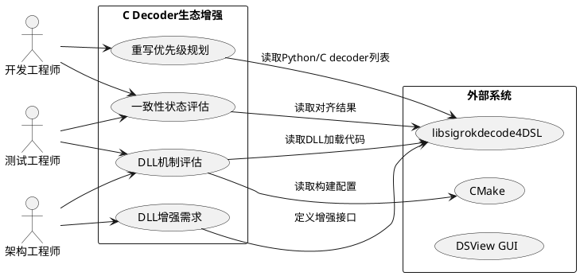
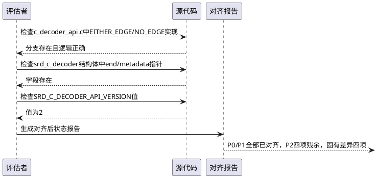
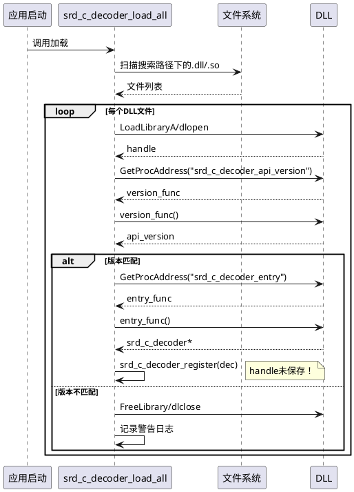
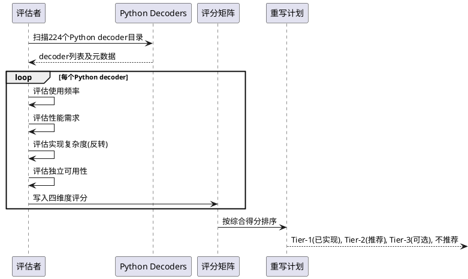
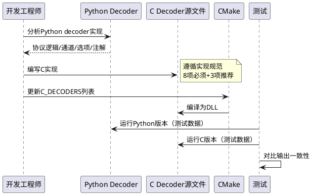
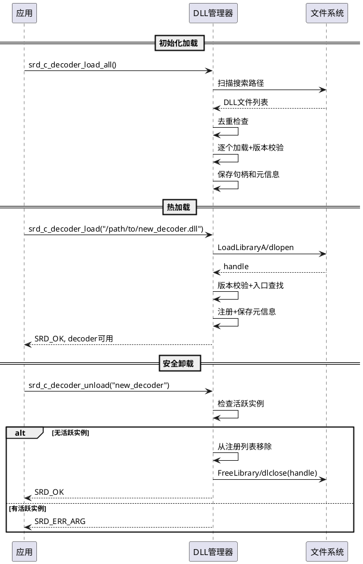
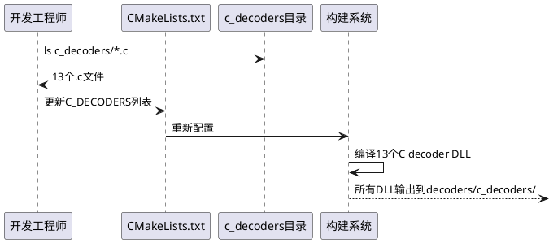

# **1. 组件定位**

## **1.1 核心职责**

本组件负责评估和增强libsigrokdecode4DSL的C decoder生态体系，包括接口一致性状态评估、DLL管理机制完善、Python→C重写优先级规划及DLL增强需求定义。

## **1.2 核心输入**

1. 已完成的P0/P1级7项接口对齐结果：EITHER_EDGE/NO_EDGE匹配、end()回调、SRD_OUTPUT_PYTHON警告、metadata()回调、ann_type字段、c_decoder_put_binary()专用API、ann_labels[3]扩展，SRD_C_DECODER_API_VERSION递增至2
2. 当前DLL加载机制代码：`decoder.c`中`srd_c_decoder_load_all()`的LoadLibraryA/dlopen动态加载逻辑、版本校验、入口函数查找
3. 当前CMakeLists.txt中C decoder构建配置：`C_DECODERS`列表、MODULE库编译、`SRD_C_DECODER_DLL`宏定义
4. Python decoders目录内容：`decoders/`下224个Python协议解码器
5. 当前C decoders列表：`c_decoders/`下13个C实现（spi_c, i2c_c, uart_c, can_c, counter_c, ds1307_c, ds3231_c, graycode_c, lm75_c, numbers_and_state_c, pwm_c, seven_segment_c）+ super_converter.py辅助脚本

## **1.3 核心输出**

1. C/Python接口一致性对齐后残余差异清单：标注P2级差异及无法对齐的固有差异
2. C decoder DLL管理机制完整性评估报告：已实现功能、缺失功能、改进建议
3. Python→C重写优先级矩阵：按使用频率、性能需求、实现复杂度、依赖关系四维度评估
4. 新增C decoder重写的具体需求与验收条件
5. DLL增强需求：热加载/卸载、版本兼容策略、符号冲突防护、路径配置改进

## **1.4 职责边界**

1. 本组件不负责实际编写C decoder实现代码（由任务文档负责）
2. 本组件不负责修改现有Python decoder（仅评估哪些应重写为C）
3. 本组件不负责评估C→Python栈桥接的具体实现方案（为P2级，本阶段不涉及）
4. 本组件不负责DSView GUI端的C decoder集成改造

# **2. 领域术语**

**C Decoder DLL/SO**
: 编译为独立动态链接库的C协议解码器，通过`LoadLibraryA`（Windows）或`dlopen`（Linux）在运行时加载，暴露`srd_c_decoder_entry`和`srd_c_decoder_api_version`两个导出符号。

**DLL入口函数**
: C decoder DLL必须导出的` srd_c_decoder_entry()`函数，返回`struct srd_c_decoder*`指针，描述decoder的元数据和回调。

**API版本校验**
: 加载DLL时检查其`srd_c_decoder_api_version()`返回值是否与主程序的`SRD_C_DECODER_API_VERSION`一致，不一致则拒绝加载。

**P0级差异（已对齐）**
: 影响C decoder功能正确性或导致运行时故障的接口差异，共3项：wait条件缺失、end()回调缺失、栈传递类型不匹配。已全部对齐。

**P1级差异（已对齐）**
: 影响C decoder功能完整性或用户体验的接口差异，共4项：metadata()回调、ann_type字段、binary输出结构、注解标签扩展。已全部对齐。

**P2级差异（未对齐）**
: 不影响功能但可提升一致性的接口差异，共4项：start()调用时序、options未定义、annotation_rows未定义、api_version方式差异。本阶段不强制对齐。

**固有差异**
: C和Python两种decoder因语言本质不同而无法消除的差异，如Python GIL、Python对象构造、动态类型等。

**重写优先级矩阵**
: 评估Python decoder是否应重写为C实现的四维度评分框架：使用频率（用户常用程度）、性能需求（解码速度/数据量要求）、实现复杂度（协议逻辑复杂程度）、依赖关系（是否依赖其他Python decoder）。

**DLL热加载**
: 在应用运行期间动态加载新的C decoder DLL，无需重启应用即可使用新解码器。

**DLL卸载**
: 在应用运行期间安全卸载已加载的C decoder DLL，释放资源。

**符号冲突防护**
: 防止多个C decoder DLL之间或DLL与主程序之间因导出同名符号而导致的链接冲突。

# **3. 角色与边界**

## **3.1 核心角色**

- 开发工程师：负责根据需求规格实现C decoder重写、DLL机制改进
- 架构工程师：负责评估DLL增强方案的技术可行性和性能影响
- 测试工程师：负责验证C/Python接口一致性、DLL加载/卸载可靠性

## **3.2 外部系统**

- libsigrokdecode4DSL引擎：提供decoder加载、实例管理、数据分发运行时服务
- CMake构建系统：负责将C decoder源文件编译为MODULE库并输出到指定目录
- DSView GUI应用：作为前端通过引擎API使用C decoder
- Python解释器：运行Python decoder的嵌入式环境（C decoder不依赖）

## **3.3 交互上下文**

# **4. DFX约束**

## **4.1 性能**

1. C decoder DLL加载时间应当不超过100ms/个（从dlopen到srd_c_decoder_register完成）
2. C decoder的decode()性能应当比等效Python decoder提升至少5倍（这是重写为C的核心动机）
3. DLL热加载操作不应当阻塞正在运行的解码会话超过50ms

## **4.2 可靠性**

1. DLL加载失败时不得导致主程序崩溃，必须降级为警告并跳过该decoder
2. API版本不匹配的DLL必须被拒绝加载，并给出明确的版本不匹配提示
3. DLL卸载时必须确保没有活跃的decoder实例引用该DLL中的符号
4. C decoder与等效Python decoder在相同输入条件下必须产生语义等价的解码结果

## **4.3 安全性**

1. C decoder DLL不得导入主程序的内部符号（仅通过c_decoder_* API函数交互）
2. DLL搜索路径应当仅限于应用安装目录和用户显式配置的路径，禁止从当前工作目录加载
3. 恶意或损坏的DLL不得导致内存越界访问（引擎侧需做参数校验）

## **4.4 可维护性**

1. C decoder API版本变更必须有明确的变更日志记录
2. 新增C decoder应当无需修改主程序代码，仅需在CMakeLists.txt中添加decoder名称
3. DLL加载/卸载事件应当有日志记录，便于排查问题

## **4.5 兼容性**

1. SRD_C_DECODER_API_VERSION递增时，旧版DLL必须被优雅拒绝（日志警告而非崩溃）
2. 新增C decoder的DLL二进制应当与现有DLL加载流程完全兼容
3. Windows（MSVC/MinGW）和Linux（GCC）平台的DLL/SO加载行为应当一致

# **5. 核心能力**

## **5.1 C/Python接口一致性对齐后状态评估**

### **5.1.1 业务规则**

1. **P0/P1级对齐完成确认规则**：已完成的7项差异对齐必须经过代码验证确认

   | 编号 | 差异点 | 对齐方案 | 对齐状态 |
   |------|--------|----------|----------|
   | P0-1 | c_decoder_wait()缺EITHER_EDGE/NO_EDGE | 补充匹配分支 | 已对齐 |
   | P0-2 | C decoder缺end()回调 | 新增end()函数指针 | 已对齐 |
   | P0-3 | C→Python栈OUTPUT_PYTHON类型不匹配 | 加载时警告+降级为ANN | 已对齐 |
   | P1-1 | C decoder缺metadata()回调 | 新增metadata()函数指针 | 已对齐 |
   | P1-2 | srd_c_annotation缺ann_type字段 | 新增ann_type字段 | 已对齐 |
   | P1-3 | BINARY输出数据结构不标准 | 新增c_decoder_put_binary()专用API | 已对齐 |
   | P1-4 | 注解标签缺类型ID | ann_labels从[2]扩展为[3] | 已对齐 |

   a. 验收条件：[检查代码中7项差异的修复实现] → [每项修复存在对应代码变更且SRD_C_DECODER_API_VERSION=2]

2. **P2级残余差异识别规则**：P2级差异不强制对齐，但必须文档记录

   | 编号 | 差异点 | 影响评估 | 处置建议 |
   |------|--------|----------|----------|
   | P2-1 | C实例创建时立即调用reset()+start()，Python延迟调用start() | C decoder的start()在选项设置前被调用，options无法在start()中读取 | 在文档中明确说明时序差异；C decoder应在decode()首次调用时读取选项 |
   | P2-2 | 现有C decoder未定义options | 用户无法配置C decoder参数（如SPI的cpol/cpha） | 在后续C decoder重写/新增时补充options定义 |
   | P2-3 | 现有C decoder未定义annotation_rows | 前端注解无法按行分组显示 | 在后续C decoder重写/新增时补充annotation_rows定义 |
   | P2-4 | api_version用DLL入口函数而非结构体字段 | 两种方式均可，不影响功能 | 保持现状 |

   a. 验收条件：[审查P2级差异列表] → [4项差异已识别并记录处置建议，无需代码修改]

3. **固有差异识别规则**：因C/Python语言本质不同而无法消除的差异必须明确列出

   - Python GIL依赖：Python decoder的decode()需要获取GIL，C decoder不需要且不应引入GIL
   - Python对象构造：C decoder无法构造Python对象，无法通过SRD_OUTPUT_PYTHON向上层Python decoder传递结构化数据
   - 动态类型vs静态类型：Python options/annotations使用动态类型，C使用强类型API函数
   - 异常处理：Python使用try/except，C使用返回值错误码

   a. 验收条件：[列出C/Python decoder的固有差异] → [至少4项固有差异已识别，每项标注不可消除的原因]

4. **禁止项**：禁止将固有差异视为缺陷，禁止为消除固有差异而引入Python GIL依赖到C decoder

   a. 验收条件：[C decoder的decode()主循环中] → [不得出现PyGILState_Ensure或任何Python C API调用]

### **5.1.2 交互流程**

### **5.1.3 异常场景**

1. **对齐代码未实际合入场景**

   a. 触发条件：spec/design文档记录差异已对齐，但对应代码变更未合入主分支
   b. 系统行为：评估报告与实际代码状态不一致
   c. 用户感知：C decoder仍存在已标注"已对齐"的差异，导致功能异常

2. **API版本未递增场景**

   a. 触发条件：结构体布局变更但SRD_C_DECODER_API_VERSION仍为旧值
   b. 系统行为：旧版DLL通过版本校验但结构体偏移错误，导致内存访问越界
   c. 用户感知：C decoder崩溃或输出乱码

## **5.2 C Decoder DLL管理机制完整性评估**

### **5.2.1 业务规则**

1. **DLL加载流程完整性规则**：当前DLL加载流程必须覆盖从发现到注册的全链路

   当前已实现的功能：
   - DLL文件发现：通过搜索路径列表（`c_decoder_path`和`searchpaths`下的`c_decoders/`子目录）扫描.dll/.so文件
   - 动态加载：Windows用`LoadLibraryA`，Linux用`dlopen(RTLD_LAZY)`
   - 入口函数查找：查找`srd_c_decoder_entry`和`srd_c_decoder_api_version`符号
   - API版本校验：比较DLL报告的版本与`SRD_C_DECODER_API_VERSION`，不匹配则拒绝加载
   - Decoder注册：调用`entry_func()`获取`srd_c_decoder*`，通过`srd_c_decoder_register()`注册到全局列表
   - 加载失败处理：符号缺失或版本不匹配时警告并跳过，不崩溃

   a. 验收条件：[审查decoder.c:1314-1423的srd_c_decoder_load_all()实现] → [加载流程6个步骤全部实现]

2. **DLL加载缺失功能识别规则**：识别当前机制中缺失的必要和改进功能

   | 缺失功能 | 严重程度 | 说明 |
   |----------|----------|------|
   | DLL句柄未保存 | 高 | LoadLibraryA/dlopen返回的句柄未存储，无法执行FreeLibrary/dlclose卸载DLL |
   | 无DLL卸载能力 | 高 | 应用退出时不释放DLL资源，虽然OS会回收，但影响热加载/重载场景 |
   | 无重复加载防护 | 中 | 同一DLL文件可能被多次加载（不同搜索路径下的同一文件），导致decoder重复注册 |
   | 无DLL加载顺序控制 | 低 | 多个搜索路径下的同名DLL，先找到的先加载，无法指定优先级 |
   | 无DLL元信息查询 | 低 | 无法查询已加载DLL的文件路径、加载时间、API版本等元信息 |
   | 无热加载支持 | 中 | 新增DLL需要重启应用才能使用 |
   | 无DLL依赖检查 | 中 | 不检查DLL是否依赖了主程序的内部符号（Windows下可能隐式链接） |
   | 路径配置仅支持单个 | 低 | `srd_c_decoder_path_set()`仅支持一个自定义路径 |

   a. 验收条件：[审查DLL加载代码和srd_c_decoder_path_set实现] → [至少7项缺失功能已识别并标注严重程度]

3. **CMake构建配置完整性规则**：C decoder的构建和输出配置必须支持独立DLL编译

   当前构建配置已实现：
   - `C_DECODERS`列表定义（当前仅spi_c i2c_c uart_c can_c四项，不含后续新增的9个C decoder）
   - MODULE库类型编译（`add_library(decoder_${dec} MODULE ...)`）
   - `SRD_C_DECODER_DLL`宏定义（使c_decoder_api.c编译为DLL侧代码）
   - 输出目录配置（`C_DECODER_OUTPUT_DIR = EXECUTABLE_OUTPUT_PATH/decoders/c_decoders`）
   - 链接glib-2.0依赖

   当前构建配置缺失：
   - `C_DECODERS`列表未包含counter_c, ds1307_c, ds3231_c, graycode_c, lm75_c, numbers_and_state_c, pwm_c, seven_segment_c等已有C decoder
   - 无自动发现c_decoders/目录下.c文件并添加到构建的机制
   - 无C decoder单元测试框架
   - 无DLL符号导出列表（.def文件）控制，Windows下可能导出过多符号

   a. 验收条件：[审查CMakeLists.txt:774-802] → [构建配置4项已实现、4项缺失已识别]

4. **禁止项**：禁止C decoder DLL隐式链接主程序（必须通过c_decoder_* API函数显式调用）

   a. 验收条件：[检查C decoder DLL的链接依赖] → [仅依赖glib-2.0和C运行时，不依赖libsigrokdecode4DSL的主程序符号]

### **5.2.2 交互流程**

### **5.2.3 异常场景**

1. **DLL文件损坏场景**

   a. 触发条件：DLL文件存在但二进制损坏（磁盘错误、下载中断等）
   b. 系统行为：LoadLibraryA/dlopen返回NULL，记录警告并跳过
   c. 用户感知：该C decoder不可用，但应用正常启动

2. **入口函数返回NULL场景**

   a. 触发条件：DLL的`srd_c_decoder_entry()`函数返回NULL
   b. 系统行为：`srd_c_decoder_register()`不执行，记录警告
   c. 用户感知：该C decoder注册失败，不影响其他decoder

3. **DLL搜索路径包含不可读目录场景**

   a. 触发条件：搜索路径列表中的目录不存在或无读取权限
   b. 系统行为：`g_dir_open()`返回NULL，`continue`跳过
   c. 用户感知：该路径下的C decoder不被发现，但无错误提示

4. **同名DLL重复加载场景**

   a. 触发条件：多个搜索路径下存在同名DLL（如c_decoders/spi_c.dll和自定义路径/spi_c.dll）
   b. 系统行为：两个DLL都被加载和注册，可能导致decoder列表中出现重复ID
   c. 用户感知：decoder选择界面出现重复项，或后加载的覆盖先加载的

## **5.3 Python→C重写优先级评估**

### **5.3.1 业务规则**

1. **重写候选评估规则**：Python decoder是否应重写为C实现，必须基于四维度评分综合判断

   评分维度（每项1-5分）：
   - **使用频率**：5=核心协议(I2C/SPI/UART/CAN)，4=常用外设，3=特定领域常用，2=偶尔使用，1=罕见
   - **性能需求**：5=高速协议/大数据量，4=中速协议，3=一般速度，2=低速协议，1=极低频
   - **实现复杂度**（反转）：5=简单状态机，4=中等复杂，3=较复杂协议，2=复杂协议+查表，1=极复杂/多依赖
   - **独立可用性**：5=无Python依赖可独立运行，4=少量依赖可剥离，3=依赖Python上层decoder，2=深度依赖Python生态，1=纯Python生态组件

   a. 验收条件：[对每个候选Python decoder按四维度评分] → [综合得分=四维度加权平均，权重依次为0.35/0.30/0.20/0.15]

2. **Tier-1重写候选（核心协议，已有C实现）**：以下decoder已有C实现，需确认C实现与Python版本的功能对齐度

   | Decoder | Python版本 | C版本 | 对齐状态 | 遗留差异 |
   |---------|-----------|-------|----------|----------|
   | SPI | 0-spi, 1-spi | spi_c | 部分对齐 | C版缺options(cpol/cpha/bit_order/cs_polarity)、缺annotation_rows |
   | I2C | 0-i2c, 1-i2c | i2c_c | 部分对齐 | C版缺options、缺annotation_rows |
   | UART | 0-uart, 1-uart | uart_c | 部分对齐 | C版缺options(baud_rate/num_data_bits/parity/stop_bits)、缺annotation_rows |
   | CAN | can | can_c | 部分对齐 | C版缺options、缺annotation_rows |

   a. 验收条件：[对比Python和C版本的decoder功能] → [列出每个已实现C decoder与Python版本的遗留功能差异]

3. **Tier-2重写候选（高优先级，推荐重写）**：以下Python decoder使用频率高且性能需求大，重写为C收益显著

   | Decoder | 使用频率 | 性能需求 | 实现复杂度(反转) | 独立可用性 | 综合得分 | 重写理由 |
   |---------|---------|---------|-----------------|-----------|---------|---------|
   | sdcard_sd | 4 | 4 | 3 | 5 | 3.95 | SD卡协议高频使用，大容量数据 |
   | sdcard_spi | 4 | 4 | 3 | 5 | 3.95 | SPI模式SD卡，嵌入式常用 |
   | onewire (1wire) | 3 | 3 | 4 | 5 | 3.55 | 单总线协议，工业常用 |
   | jtag | 4 | 4 | 3 | 4 | 3.70 | 调试接口，性能敏感 |
   | swd | 4 | 4 | 4 | 4 | 3.90 | 调试接口，高速协议 |
   | usb_signalling | 4 | 5 | 3 | 5 | 4.15 | USB底层信号，极高速 |
   | nrf | 3 | 4 | 3 | 5 | 3.65 | 无线协议，中高速 |

   a. 验收条件：[按综合得分排序Tier-2候选列表] → [得分≥3.5的decoder被列入推荐重写列表]

4. **Tier-3重写候选（中优先级，按需重写）**：以下Python decoder有重写价值但优先级较低

   | Decoder类别 | 代表decoder | 使用频率 | 性能需求 | 综合得分范围 | 备注 |
   |-------------|-----------|---------|---------|-------------|------|
   | 传感器类 | adxl345, bh1750, lm75 | 3 | 2 | 2.5-3.0 | I2C/SPI传感器，数据量小 |
   | 显示类 | ssd1306, st7735, hd44780 | 2 | 2 | 2.0-2.5 | 显示协议，非高频 |
   | 存储类 | eeprom24xx, eeprom93xx | 3 | 2 | 2.5-3.0 | EEPROM读写 |
   | 无线类 | infrared, ble | 3 | 3 | 3.0-3.5 | 无线协议 |
   | 电源类 | usb_power_delivery, pd | 3 | 4 | 3.3-3.8 | PD协议较复杂 |

   a. 验收条件：[评估Tier-3候选列表] → [综合得分2.0-3.5的decoder被列入可选重写列表]

5. **不推荐重写的Python decoder**：以下类型不适合重写为C

   - 依赖Python生态的decoder：arm_etmv3, arm_itm, arm_tpiu（依赖Python对象解析）
   - 极低频使用的decoder：a7105, adat, bean等（重写ROI极低）
   - 极复杂协议的decoder：ethernet, usb_power_delivery（协议栈庞大，Python维护更易）
   - 纯Python堆叠的decoder：stack上的中间层decoder（需要Python→Python栈传递）

   a. 验收条件：[评估不推荐重写列表] → [每项不推荐理由明确，且综合得分<2.0或独立可用性<2]

6. **禁止项**：禁止重写时破坏与Python decoder的输出兼容性

   a. 验收条件：[C decoder重写后的注解输出] → [与Python版本在相同输入下产生语义等价的注解（ann_class和ann_text内容一致）]

### **5.3.2 交互流程**

### **5.3.3 异常场景**

1. **Python decoder依赖关系复杂场景**

   a. 触发条件：目标Python decoder依赖上层Python decoder的输出（如i2c→eeprom24xx）
   b. 系统行为：C重写后无法接收Python上层输出，除非实现Python→C桥接
   c. 用户感知：C decoder无法在Python decoder栈中正确工作

2. **Python decoder行为 undocumented场景**

   a. 触发条件：Python decoder的实现细节无文档，C重写时行为差异难以发现
   b. 系统行为：C版本在边界条件下产生与Python不同的结果
   c. 用户感知：用户报告解码结果不一致

## **5.4 新增C Decoder重写需求**

### **5.4.1 业务规则**

1. **C decoder实现规范规则**：每个新增C decoder必须满足完整的实现规范

   必须实现：
   - `srd_c_decoder`结构体完整初始化（id, name, longname, desc, license, channels, ann_labels[3]含类型ID）
   - `reset()`回调：分配和初始化user_data
   - `start()`回调：注册输出
   - `decode()`回调：主解码逻辑
   - `end()`回调：解码结束收尾（可为NULL）
   - `metadata()`回调：响应元数据通知（可为NULL）
   - `destroy()`回调：释放user_data
   - DLL导出函数：`srd_c_decoder_entry()`和`srd_c_decoder_api_version()`

   推荐实现：
   - `options`定义：与Python版本对齐的配置选项
   - `annotation_rows`定义：与Python版本对齐的注解行分组
   - `optional_channels`定义：与Python版本对齐的可选通道

   a. 验收条件：[新增C decoder代码审查] → [必须实现8项、推荐实现3项全部覆盖]

2. **功能对齐验证规则**：C decoder重写后必须与Python版本进行功能对齐验证

   - 相同输入数据，C和Python版本的ann_class输出必须一致
   - 相同输入数据，C和Python版本的ann_text语义必须一致（格式允许差异）
   - C decoder必须覆盖Python版本的所有通道定义
   - C decoder必须覆盖Python版本的核心options定义

   a. 验收条件：[使用同一组测试数据分别运行C和Python版本] → [输出注解的ann_class序列完全一致]

3. **CMakeLists.txt更新规则**：新增C decoder必须在CMake构建配置中注册

   - 将decoder名称添加到`C_DECODERS`列表
   - 或实现c_decoders/目录自动发现机制

   a. 验收条件：[新增C decoder后执行构建] → [DLL正确生成到C_DECODER_OUTPUT_DIR]

4. **C decoder命名规则**：C decoder的id必须与Python版本对应，加"_c"后缀区分

   - Python "spi" → C "spi_c"（id字段为"spi_c"）
   - Python "i2c" → C "i2c_c"（id字段为"i2c_c"）
   - 对于0-spi/1-spi等变体，C实现应通过options而非单独decoder支持

   a. 验收条件：[C decoder的id字段] → [与Python版本id加"_c"后缀一致]

### **5.4.2 交互流程**

### **5.4.3 异常场景**

1. **C实现协议理解偏差场景**

   a. 触发条件：开发工程师对Python decoder的协议逻辑理解有误
   b. 系统行为：C版本在特定输入下产生与Python不同的解码结果
   c. 用户感知：C decoder解码错误，但Python版本正确

2. **新增C decoder导致CMakeLists.txt冲突场景**

   a. 触发条件：多个开发分支同时新增C decoder并修改C_DECODERS列表
   b. 系统行为：合并冲突
   c. 用户感知：构建失败，需要手动解决冲突

## **5.5 DLL增强需求**

### **5.5.1 业务规则**

1. **DLL句柄保存规则**：加载DLL后必须保存句柄，以支持后续卸载和资源管理

   When 系统成功加载C decoder DLL, the libsigrokdecode4DLL引擎 shall 将DLL句柄（HMODULE/void*）与对应的`srd_c_decoder`关联存储，支持后续FreeLibrary/dlclose操作

   a. 验收条件：[加载DLL后查询句柄存储] → [每个已加载的C decoder可查到其DLL句柄]

2. **DLL安全卸载规则**：卸载DLL前必须确保无活跃实例引用

   When 用户请求卸载C decoder DLL, the 引擎 shall 检查是否存在该decoder的活跃实例；若存在活跃实例, the 引擎 shall 拒绝卸载并返回SRD_ERR_ARG错误

   a. 验收条件：[存在活跃decoder实例时请求卸载] → [返回SRD_ERR_ARG，DLL不被释放]

3. **DLL重复加载防护规则**：同一DLL文件路径不得被重复加载

   Where 同一DLL文件路径出现在多个搜索路径下, the 引擎 shall 仅加载首次发现的实例，后续重复路径记录调试日志并跳过

   a. 验收条件：[同一DLL在两个搜索路径下] → [仅加载一次，decoder列表中无重复ID]

4. **DLL元信息查询规则**：引擎应提供查询已加载DLL元信息的API

   The 引擎 shall 提供API函数查询已加载C decoder的DLL文件路径、API版本号、加载状态

   a. 验收条件：[调用元信息查询API] → [返回DLL路径、API版本、加载状态等完整信息]

5. **DLL热加载规则**：应用运行期间应支持动态加载新的C decoder DLL

   When 用户通过`srd_c_decoder_load()`指定DLL文件路径, the 引擎 shall 在不重启应用的情况下加载该DLL、校验版本、注册decoder，并使其立即可用于创建解码实例

   a. 验收条件：[应用运行中调用热加载API加载新DLL] → [新decoder出现在srd_decoder_list()中，可创建实例并解码]

6. **DLL路径配置增强规则**：应支持多个自定义C decoder搜索路径

   Where 用户配置了多个C decoder搜索路径, the 引擎 shall 按配置顺序依次搜索，先找到的DLL优先加载

   a. 验收条件：[配置3个自定义搜索路径] → [3个路径下的DLL均被发现和加载]

7. **C decoder自动发现规则**：CMake构建系统应支持自动发现c_decoders/目录下的.c文件

   When c_decoders/目录下新增.c文件, the CMake构建系统 shall 自动将其编译为独立DLL，无需手动修改C_DECODERS列表

   a. 验收条件：[在c_decoders/目录新增test_c.c文件后执行构建] → [test_c.dll/SO自动生成到输出目录]

8. **API版本兼容策略规则**：引擎应支持向后兼容的API版本协商

   While SRD_C_DECODER_API_VERSION因结构体扩展而递增, the 引擎 shall 支持与旧版DLL的兼容加载策略（当API变更仅为新增可选字段时，允许旧版DLL在兼容模式下运行）

   a. 验收条件：[API_VERSION从2递增到3且仅新增可选字段] → [旧版DLL（报告版本2）在兼容模式下可加载]

9. **禁止项**：禁止从当前工作目录或系统PATH环境变量搜索DLL

   a. 验收条件：[工作目录下存在恶意DLL] → [引擎不加载该DLL，仅搜索配置的安装目录和用户路径]

### **5.5.2 交互流程**

### **5.5.3 异常场景**

1. **热加载版本不匹配场景**

   a. 触发条件：运行中加载的DLL报告API版本与引擎不匹配
   b. 系统行为：拒绝加载，返回SRD_ERR_ARG，记录版本不匹配警告
   c. 用户感知：新decoder不可用，应用继续正常运行

2. **卸载时DLL内存泄漏场景**

   a. 触发条件：DLL内部通过malloc分配了内存但未在destroy()中释放
   b. 系统行为：FreeLibrary/dlclose后，DLL分配的内存成为泄漏
   c. 用户感知：反复加载/卸载同一DLL导致内存持续增长

3. **热加载与解码会话并发场景**

   a. 触发条件：一个线程正在使用某decoder的decode()，另一线程卸载该decoder的DLL
   b. 系统行为：decode()线程访问已卸载DLL的代码段，导致段错误
   c. 用户感知：应用崩溃

4. **CMake自动发现包含非decoder源文件场景**

   a. 触发条件：c_decoders/目录下存在辅助文件（如super_converter.py）被自动发现机制误判为decoder源文件
   b. 系统行为：CMake尝试将.py文件编译为C DLL，构建失败
   c. 用户感知：构建报错

## **5.6 已有C decoder的CMake构建配置修复**

### **5.6.1 业务规则**

1. **C_DECODERS列表补全规则**：CMakeLists.txt中的C_DECODERS变量必须包含c_decoders/目录下所有.c文件对应的decoder名称

   当前C_DECODERS列表仅含4项（spi_c i2c_c uart_c can_c），缺少以下9项：counter_c, ds1307_c, ds3231_c, graycode_c, lm75_c, numbers_and_state_c, pwm_c, seven_segment_c

   When c_decoders/目录下存在.c源文件但未在C_DECODERS列表中, the CMake构建系统 shall 仍然将其编译为DLL输出

   a. 验收条件：[检查C_DECODERS列表] → [包含c_decoders/目录下所有13个C decoder名称]

2. **禁止项**：禁止将super_converter.py文件列入C_DECODERS构建目标

   a. 验收条件：[CMake构建过程] → [不尝试编译super_converter.py为DLL]

### **5.6.2 交互流程**

### **5.6.3 异常场景**

1. **新增C decoder缺少必要导出符号场景**

   a. 触发条件：新增的.c文件未实现srd_c_decoder_entry或srd_c_decoder_api_version导出函数
   b. 系统行为：DLL编译成功但加载失败（入口函数查找失败）
   c. 用户感知：该decoder在应用中不可见

# **6. 数据约束**

## **6.1 C Decoder DLL导出符号**

1. **srd_c_decoder_entry**：必须导出，返回`struct srd_c_decoder*`指针，无参数
2. **srd_c_decoder_api_version**：必须导出，返回`int`类型API版本号，无参数，当前期望值为2

## **6.2 srd_c_decoder结构体字段约束**

1. **id**：非NULL字符串，全局唯一，与Python版本id加"_c"后缀一致
2. **name**：非NULL字符串，简短可读名称
3. **channels/optional_channels**：数组指针，可为NULL（无通道的decoder）
4. **num_channels/num_optional_channels**：对应数组长度，为0时数组指针可为NULL
5. **ann_labels**：类型为`const char *(*)[3]`，3元素格式为{type_id, short_name, description}，type_id为空字符串""表示默认格式
6. **reset/start/decode/destroy**：非NULL函数指针，必须实现
7. **end/metadata**：可为NULL函数指针，未实现时引擎不调用

## **6.3 DLL加载路径搜索顺序**

1. `c_decoder_path`（用户通过`srd_c_decoder_path_set()`设置的路径）
2. `searchpaths`中每个路径下的`c_decoders/`子目录（Python decoder搜索路径的子目录）

## **6.4 重写优先级评分权重**

1. **使用频率权重**：0.35
2. **性能需求权重**：0.30
3. **实现复杂度(反转)权重**：0.20
4. **独立可用性权重**：0.15
5. **综合得分计算**：使用频率×0.35 + 性能需求×0.30 + 实现复杂度(反转)×0.20 + 独立可用性×0.15

## **6.5 Python Decoder目录统计**

1. **Python decoders总数**：约224个（decoders/目录下的子目录数，排除common/和subfolders_list.txt等非decoder项）
2. **当前C decoders总数**：13个（c_decoders/目录下的.c文件数）
3. **CMakeLists.txt中C_DECODERS列表项数**：4个（仅spi_c, i2c_c, uart_c, can_c）
4. **C_DECODERS列表缺失项**：9个（counter_c, ds1307_c, ds3231_c, graycode_c, lm75_c, numbers_and_state_c, pwm_c, seven_segment_c）
