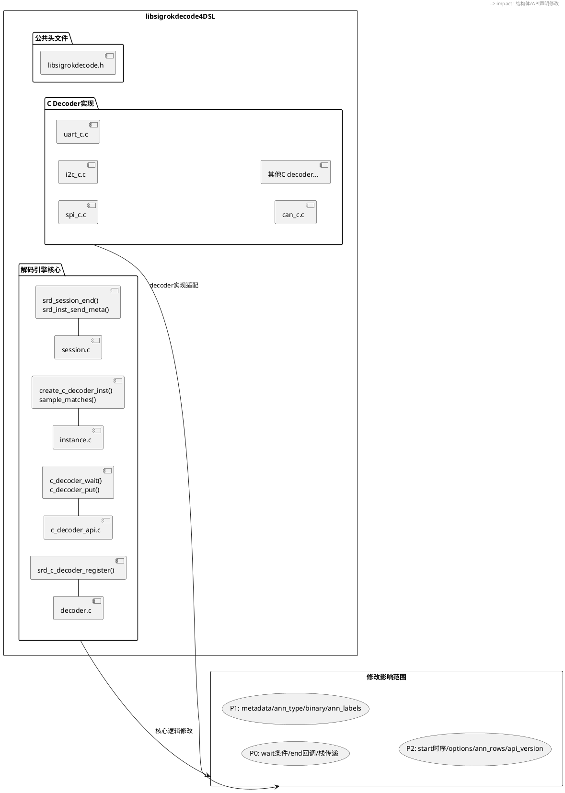
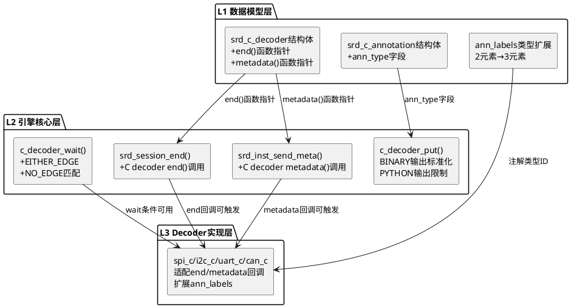

# **1. 实现模型**

## **1.1 上下文视图**

本实现方案的目标是将spec.md中识别的C decoder与Python decoder之间的10项API接口差异逐一消除，使两种decoder类型在生命周期、运行时API、数据模型三个维度实现接口规范统一。



## **1.2 服务/组件总体架构**

修改分为三个层次，自底向上逐层推进：

| 层次 | 模块 | 修改内容 | 涉及差异项 |
|------|------|----------|------------|
| L1-数据模型层 | `libsigrokdecode.h` | 结构体字段扩展、枚举值确认 | P0-3, P1-2, P1-3, P1-4 |
| L2-引擎核心层 | `c_decoder_api.c`, `session.c`, `instance.c` | API实现补充、回调逻辑扩展 | P0-1, P0-2, P0-3, P1-1, P1-3 |
| L3-Decoder实现层 | `c_decoders/*.c` | 各decoder适配新增回调、扩展注解 | P1-4, P2-2, P2-3 |



## **1.3 实现设计文档**

### **1.3.1 P0-1：c_decoder_wait()补充EITHER_EDGE和NO_EDGE条件匹配**

**现状分析**：
- `c_decoder_wait()`（`c_decoder_api.c:105-224`）的条件匹配循环中，仅处理了`SRD_TERM_HIGH`、`SRD_TERM_LOW`、`SRD_TERM_RISING_EDGE`、`SRD_TERM_FALLING_EDGE`、`SRD_TERM_SKIP`五种条件
- `SRD_TERM_EITHER_EDGE`和`SRD_TERM_NO_EDGE`虽然在枚举中定义（`libsigrokdecode.h:145-146`），但`c_decoder_wait()`的实现中缺少对应的`else if`分支，导致这两种条件永远不匹配
- 注意：`instance.c:924-930`中的`sample_matches()`函数（用于Python decoder的wait逻辑）**已经正确实现了**EITHER_EDGE和NO_EDGE的匹配逻辑

**实现方案**：
在`c_decoder_api.c`的`c_decoder_wait()`函数的条件匹配循环中（约第147-191行），在`SRD_TERM_FALLING_EDGE`分支之后，补充两个`else if`分支：

```
修改位置：libsigrokdecode4DSL/c_decoder_api.c，第180行之后（SRD_TERM_FALLING_EDGE分支之后）

新增代码：
} else if (t->type == SRD_TERM_EITHER_EDGE) {
    uint8_t old_val = 0;
    if (i > 0) {
        uint64_t prev_byte = (i - 1) / 8;
        uint8_t prev_bit = (i - 1) % 8;
        old_val = (di->inbuf[sig_idx][prev_byte] >> prev_bit) & 1;
    }
    if (!((old_val == 1 && val == 0) || (old_val == 0 && val == 1))) {
        all_match = FALSE;
        break;
    }
} else if (t->type == SRD_TERM_NO_EDGE) {
    uint8_t old_val = 0;
    if (i > 0) {
        uint64_t prev_byte = (i - 1) / 8;
        uint8_t prev_bit = (i - 1) % 8;
        old_val = (di->inbuf[sig_idx][prev_byte] >> prev_bit) & 1;
    }
    if (!((old_val == 0 && val == 0) || (old_val == 1 && val == 1))) {
        all_match = FALSE;
        break;
    }
}
```

**设计决策**：
- 匹配逻辑与`instance.c:sample_matches()`保持一致，确保C decoder和Python decoder对相同条件产生相同的匹配结果
- 无需修改`enum srd_term_type`定义，枚举值已存在
- 无需修改任何C decoder实现代码，现有decoder未使用这两种条件
- 无需递增`SRD_C_DECODER_API_VERSION`，此修改为bug修复而非接口变更

**回归风险**：低。修改仅在现有条件的分支链末尾追加分支，不影响HIGH/LOW/RISING_EDGE/FALLING_EDGE/SKIP的匹配逻辑。

---

### **1.3.2 P0-2：C decoder补充end()生命周期回调**

**现状分析**：
- `srd_session_end()`（`session.c:437-494`）中，对`di->is_c_inst`的C decoder实例直接`continue`跳过（第455-463行），不调用任何收尾回调
- `srd_call_sub_decoder_end()`（`session.c:497-535`）中，对C子decoder也直接`continue`跳过（第508-513行）
- Python decoder的end()在`srd_session_end()`中被正确调用，并设置`last_samplenum`属性

**实现方案**：

**Step 1：扩展`srd_c_decoder`结构体**

```
修改位置：libsigrokdecode4DSL/libsigrokdecode.h，第406行（destroy函数指针之后）

新增字段：
    void (*end)(void *inst);
```

结构体变为：
```c
struct srd_c_decoder {
    // ... 现有字段 ...
    void (*reset)(void *inst);
    void (*start)(void *inst);
    void (*decode)(void *inst);
    void (*end)(void *inst);      // 新增：解码结束回调
    void (*destroy)(void *inst);
};
```

**Step 2：修改`srd_session_end()`调用C decoder的end()**

```
修改位置：libsigrokdecode4DSL/session.c，第455-463行

原代码：
    if (di->is_c_inst) {
        if (di->next_di != NULL){
            ret = srd_call_sub_decoder_end(di, error);
            if (ret != SRD_OK){
                PyGILState_Release(gstate);
                return ret;
            }
        }
        continue;
    }

替换为：
    if (di->is_c_inst) {
        if (di->c_dec_inst->end) {
            di->c_dec_inst->end(di);
        }
        if (di->next_di != NULL){
            ret = srd_call_sub_decoder_end(di, error);
            if (ret != SRD_OK){
                PyGILState_Release(gstate);
                return ret;
            }
        }
        continue;
    }
```

**Step 3：修改`srd_call_sub_decoder_end()`调用C子decoder的end()**

```
修改位置：libsigrokdecode4DSL/session.c，第508-513行

原代码：
    if (sub_dec->is_c_inst) {
        if (sub_dec->next_di != NULL){
            if (srd_call_sub_decoder_end(sub_dec, error) != SRD_OK)
                return SRD_ERR_PYTHON;
        }
        continue;
    }

替换为：
    if (sub_dec->is_c_inst) {
        if (sub_dec->c_dec_inst->end) {
            sub_dec->c_dec_inst->end(sub_dec);
        }
        if (sub_dec->next_di != NULL){
            if (srd_call_sub_decoder_end(sub_dec, error) != SRD_OK)
                return SRD_ERR_PYTHON;
        }
        continue;
    }
```

**设计决策**：
- `end()`放在`destroy()`之前，与Python的生命周期顺序一致（`decode()` → `end()` → 实例销毁 → `destroy()`）
- `end()`为可选回调：现有C decoder的`srd_c_decoder`结构体初始化中未设置end字段，值为NULL，引擎通过`if (di->c_dec_inst->end)`做NULL检查保护，不会崩溃
- `end()`回调在PyGILState_Ensure()保护范围内调用（虽然C decoder的end不需要GIL，但srd_session_end()整体持有了GIL，这是安全的）
- `end()`不传递`last_samplenum`参数——C decoder可通过`di->abs_cur_samplenum`直接读取当前采样位置，无需像Python那样通过属性设置

**API版本**：需递增`SRD_C_DECODER_API_VERSION`为2，因为结构体布局发生了变化。

---

### **1.3.3 P0-3：C→Python栈传递SRD_OUTPUT_PYTHON数据类型不匹配**

**现状分析**：
- `c_decoder_put()`（`c_decoder_api.c:74-86`）对`SRD_OUTPUT_PYTHON`的处理，将`srd_c_annotation*`直接作为`pdata.data`传递给回调
- 上层Python decoder的`decode()`方法期望接收Python对象（由下层Python decoder的`self.put()`传递），但实际收到C结构体指针
- 当前项目中，C decoder（spi_c, i2c_c, uart_c, can_c）均未注册`SRD_OUTPUT_PYTHON`类型输出，也未作为栈底层feeding Python上层decoder

**实现方案**：采用**限制+文档**策略

**Step 1：在`c_decoder_put()`中对SRD_OUTPUT_PYTHON添加警告日志**

```
修改位置：libsigrokdecode4DSL/c_decoder_api.c，第74行（SRD_OUTPUT_PYTHON case内）

在现有SRD_OUTPUT_PYTHON处理逻辑前添加警告：
    case SRD_OUTPUT_PYTHON:
        _srd_err("C decoder %s: SRD_OUTPUT_PYTHON output is not fully "
                 "compatible with Python decoder stack. Consider using "
                 "SRD_OUTPUT_ANN instead.", di->c_dec_inst->name);
        // ... 现有逻辑保持不变 ...
```

**Step 2：在`c_decoder_register_output()`中对SRD_OUTPUT_PYTHON添加警告**

```
修改位置：libsigrokdecode4DSL/c_decoder_api.c，c_decoder_register_output()函数内（第233行之后）

在pdo创建后添加：
    if (output_type == SRD_OUTPUT_PYTHON) {
        _srd_err("C decoder %s: Registering SRD_OUTPUT_PYTHON output. "
                 "This output type cannot be properly consumed by "
                 "upper-layer Python decoders.", di->c_dec_inst->name);
    }
```

**设计决策**：
- **不实现C→Python对象桥接**：实现桥接需要在C decoder中构造Python对象（PyTuple、PyDict等），引入GIL依赖到C解码主循环中，违反DFX性能约束（"禁止引入Python GIL依赖到C decoder的decode()主循环中"）
- **不删除SRD_OUTPUT_PYTHON支持**：保持现有行为不变，仅添加警告。当C decoder作为栈底层feeding另一个C decoder时，SRD_OUTPUT_PYTHON在纯C栈中是可以工作的
- 长期方案：如果确实需要C→Python栈传递，应在引擎层实现C annotation到Python dict/tuple的桥接函数，但这超出当前对齐范围

---

### **1.3.4 P1-1：C decoder补充metadata()生命周期回调**

**现状分析**：
- `srd_inst_send_meta()`（`session.c:124-165`）中，对C decoder实例仅更新`di->samplerate`字段（第136-138行），不触发任何回调通知
- Python decoder通过`metadata(key, value)`方法主动接收采样率等元数据通知

**实现方案**：

**Step 1：扩展`srd_c_decoder`结构体（与P0-2合并）**

```
修改位置：libsigrokdecode4DSL/libsigrokdecode.h，srd_c_decoder结构体中

在end()函数指针之后新增：
    void (*metadata)(void *inst, int key, uint64_t value);
```

**Step 2：修改`srd_inst_send_meta()`调用C decoder的metadata()**

```
修改位置：libsigrokdecode4DSL/session.c，第136-144行

原代码：
    if (di->is_c_inst) {
        if (key == SRD_CONF_SAMPLERATE && data)
            di->samplerate = g_variant_get_uint64(data);
        for (l = di->next_di; l; l = l->next) {
            next_di = l->data;
            if ((ret = srd_inst_send_meta(next_di, key, data)) != SRD_OK)
                return ret;
        }
        return SRD_OK;
    }

替换为：
    if (di->is_c_inst) {
        if (key == SRD_CONF_SAMPLERATE && data) {
            di->samplerate = g_variant_get_uint64(data);
            if (di->c_dec_inst->metadata) {
                di->c_dec_inst->metadata(di, key, di->samplerate);
            }
        }
        for (l = di->next_di; l; l = l->next) {
            next_di = l->data;
            if ((ret = srd_inst_send_meta(next_di, key, data)) != SRD_OK)
                return ret;
        }
        return SRD_OK;
    }
```

**设计决策**：
- `metadata()`回调签名：`void (*metadata)(void *inst, int key, uint64_t value)`，与Python的`metadata(self, key, value)`对应，key为`SRD_CONF_SAMPLERATE`等配置键，value为uint64_t值
- `metadata()`为可选回调，NULL检查保护
- 先更新`di->samplerate`再调用metadata()，确保回调内部可通过`c_decoder_get_samplerate()`获取已更新的值
- 此函数在`srd_inst_send_meta()`中调用，该函数不持有GIL（对C分支直接返回），不引入GIL依赖

---

### **1.3.5 P1-2：srd_c_annotation补充ann_type字段**

**现状分析**：
- `srd_c_annotation`（`libsigrokdecode.h:563-566`）仅有`ann_class`和`ann_text`两个字段
- `srd_proto_data_annotation`（`libsigrokdecode.h:468-474`）有`ann_class`、`ann_type`、`str_number_hex`、`numberic_value`、`ann_text`五个字段
- `c_decoder_put()`对SRD_OUTPUT_ANN的处理（`c_decoder_api.c:64-71`）中，仅拷贝`ann_class`和`ann_text`到`pda`，`pda.ann_type`保持为0（memset初始化）

**实现方案**：

**Step 1：扩展`srd_c_annotation`结构体**

```
修改位置：libsigrokdecode4DSL/libsigrokdecode.h，第563-566行

原代码：
struct srd_c_annotation {
    int ann_class;
    char **ann_text;
};

替换为：
struct srd_c_annotation {
    int ann_class;
    int ann_type;
    char **ann_text;
};
```

**Step 2：修改`c_decoder_put()`对SRD_OUTPUT_ANN的处理**

```
修改位置：libsigrokdecode4DSL/c_decoder_api.c，第68行

原代码：
    pda.ann_class = ann->ann_class;
    pda.ann_text = ann->ann_text;

替换为：
    pda.ann_class = ann->ann_class;
    pda.ann_type = ann->ann_type;
    pda.ann_text = ann->ann_text;
```

**Step 3：更新所有C decoder的srd_c_annotation初始化**

所有C decoder中`srd_c_annotation`的初始化需要适配新字段。有两种兼容策略：

**策略A（推荐，零修改）**：利用C语言结构体部分初始化特性，现有代码`struct srd_c_annotation ann = {ann_class, texts};`中，`ann_type`字段会被隐式初始化为0（与当前行为一致）。但C99标准下`{ann_class, texts}`会因字段顺序不匹配产生编译警告或错误。

**策略B（推荐，显式安全）**：使用C99指定初始化器：

```
修改位置：所有c_decoders/*.c中srd_c_annotation的初始化

示例（spi_c.c）：
  原代码：struct srd_c_annotation ann; ann.ann_class = 0; ann.ann_text = ann_texts;
  保持不变（已是逐字段赋值方式）

示例（i2c_c.c，can_c.c等使用花括号初始化的）：
  原代码：struct srd_c_annotation ann = {ANN_START, ann_text};
  替换为：struct srd_c_annotation ann = {.ann_class = ANN_START, .ann_text = ann_text};
  或：struct srd_c_annotation ann; ann.ann_class = ANN_START; ann.ann_type = 0; ann.ann_text = ann_text;
```

**设计决策**：
- `ann_type`默认值为0，表示"无特定类型"，与现有行为一致（memset后ann_type为0）
- 新字段向后兼容：现有C decoder不设置ann_type，默认为0，前端按默认格式显示
- 需递增`SRD_C_DECODER_API_VERSION`（与P0-2合并递增）

---

### **1.3.6 P1-3：C decoder的SRD_OUTPUT_BINARY输出标准化**

**现状分析**：
- `c_decoder_put()`对`SRD_OUTPUT_BINARY`的处理（`c_decoder_api.c:88-93`），将`srd_c_annotation*`直接作为`pdata.data`传递
- 标准二进制输出应使用`srd_proto_data_binary{bin_class, size, data}`结构体
- 当前无C decoder使用`SRD_OUTPUT_BINARY`输出

**实现方案**：新增`c_decoder_put_binary()`专用API函数

```
修改位置：libsigrokdecode4DSL/libsigrokdecode.h，c_decoder_put()声明之后

新增声明：
SRD_API int c_decoder_put_binary(struct srd_decoder_inst *di,
    uint64_t start_sample, uint64_t end_sample,
    int output_id, int bin_class, uint64_t size, const unsigned char *data);
```

```
修改位置：libsigrokdecode4DSL/c_decoder_api.c，c_decoder_put()函数之后

新增实现：
SRD_API int c_decoder_put_binary(struct srd_decoder_inst *di,
    uint64_t start_sample, uint64_t end_sample,
    int output_id, int bin_class, uint64_t size, const unsigned char *data)
{
    struct srd_pd_output *pdo;
    struct srd_pd_callback *cb;
    struct srd_proto_data pdata;
    struct srd_proto_data_binary pdb;
    GSList *l;

    if (!di)
        return SRD_ERR_ARG;

    GSList *out_list = g_slist_nth(di->pd_output, output_id);
    if (!out_list) {
        _srd_err("C decoder %s submitted invalid output ID %d.",
            di->c_dec_inst->name, output_id);
        return SRD_ERR_ARG;
    }
    pdo = out_list->data;

    if (pdo->output_type != SRD_OUTPUT_BINARY) {
        _srd_err("C decoder %s: output ID %d is not BINARY type.",
            di->c_dec_inst->name, output_id);
        return SRD_ERR_ARG;
    }

    pdata.start_sample = start_sample;
    pdata.end_sample = end_sample;
    pdata.pdo = pdo;

    if ((cb = srd_pd_output_callback_find_c(di->sess, SRD_OUTPUT_BINARY))) {
        pdb.bin_class = bin_class;
        pdb.size = size;
        pdb.data = data;
        pdata.data = &pdb;
        cb->cb(&pdata, cb->cb_data);
    }

    return SRD_OK;
}
```

同时，在`c_decoder_put()`中对`SRD_OUTPUT_BINARY`分支添加弃用警告：

```
修改位置：libsigrokdecode4DSL/c_decoder_api.c，第88行

在SRD_OUTPUT_BINARY处理前添加：
    case SRD_OUTPUT_BINARY:
        _srd_err("C decoder %s: Use c_decoder_put_binary() for BINARY output "
                 "instead of c_decoder_put().", di->c_dec_inst->name);
        // 现有逻辑保持不变，保持向后兼容
```

---

### **1.3.7 P1-4：C decoder注解标签扩展为3元素（含类型ID）**

**现状分析**：
- `srd_c_decoder`的`ann_labels`类型为`const char *(*)[2]`（`libsigrokdecode.h:390`），每个注解只有2个元素：短名+描述
- Python的`annotations`支持3元组：类型ID+短名+描述
- 前端通过类型ID选择不同的显示格式（如hex、ascii、dec）

**实现方案**：

**Step 1：扩展`ann_labels`类型**

```
修改位置：libsigrokdecode4DSL/libsigrokdecode.h，srd_c_decoder结构体中第390行

原代码：
    const char *(*ann_labels)[2];

替换为：
    const char *(*ann_labels)[3];
```

**Step 2：更新所有C decoder的ann_labels定义**

```
修改位置：所有c_decoders/*.c中ann_labels的定义

示例（spi_c.c）：
  原代码：
    static const char *spi_ann_labels[][2] = {
        {"DATA", "SPI data"},
    };

  替换为：
    static const char *spi_ann_labels[][3] = {
        {"", "DATA", "SPI data"},
    };

  其中第一个元素""表示无特定类型ID（默认显示格式），与Python 2元组annotations的后向兼容行为一致
```

**Step 3：更新`decoder.c`中C decoder注册逻辑**

需检查`decoder.c`中`srd_c_decoder_register()`函数如何处理`ann_labels`，确保读取3元素数组时不越界。

**设计决策**：
- 第一个元素（类型ID）为空字符串""表示默认格式，与Python的2元组annotations行为一致
- 类型ID字符串对应Python annotations中的格式标识（如"106"=hex，"108"=ascii等），前端根据此ID选择格式化方式
- 需递增`SRD_C_DECODER_API_VERSION`（与P0-2、P1-2合并递增）

---

### **1.3.8 P2-1：C decoder实例start()调用时序差异**

**现状分析**：
- C decoder在`create_c_decoder_inst()`（`instance.c:436-439`）中立即调用`reset()+start()`
- Python decoder的`start()`在`srd_inst_start()`（由`srd_session_start()`调用）中延迟调用

**实现方案**：保持现状，文档记录差异

**理由**：
- C decoder没有Python的`__init__()`阶段，reset+start在创建时调用是合理的
- 修改为延迟调用需要重构C decoder实例创建流程，收益不大
- 此差异不影响功能正确性，仅影响初始化时序

**文档记录**：在`libsigrokdecode.h`的`srd_c_decoder`结构体注释中添加：
```c
/**
 * Note: For C decoders, reset() and start() are called immediately
 * during instance creation (create_c_decoder_inst()), unlike Python
 * decoders where start() is called later during srd_session_start().
 */
```

---

### **1.3.9 P2-2：C decoder补充options定义**

**实现方案**：逐个decoder补充options定义，以spi_c为例

```
修改位置：c_decoders/spi_c.c

新增options定义：
static struct srd_decoder_option spi_options[] = {
    // 示例：cpol选项
    // 需要GVariant默认值，实现较复杂，作为后续优化
};
```

**设计决策**：当前C decoder的options机制已完备（`c_decoder_get_option_int/double/string` API已实现，`srd_inst_option_set`已处理C实例的选项存储），缺少的仅是decoder自身的选项声明。此项作为后续优化，不影响本次对齐。

---

### **1.3.10 P2-3：C decoder补充annotation_rows定义**

**实现方案**：与P2-2类似，作为后续优化。当前前端对C decoder的注解显示在默认行中，不影响功能。

---

### **1.3.11 P2-4：api_version字段差异**

**实现方案**：保持现状。C decoder使用DLL入口函数`srd_c_decoder_api_version()`报告版本号，Python使用类属性`api_version`，两种方式功能等价。

---

### **1.3.12 SRD_C_DECODER_API_VERSION递增**

由于P0-2和P1-2/P1-4修改了`srd_c_decoder`结构体和`srd_c_annotation`结构体的布局，需要递增API版本号：

```
修改位置：libsigrokdecode4DSL/libsigrokdecode.h，第364行

原代码：
#define SRD_C_DECODER_API_VERSION 1

替换为：
#define SRD_C_DECODER_API_VERSION 2
```

**版本兼容**：引擎在加载C decoder DLL时（`decoder.c`），会通过`srd_c_decoder_api_version()`检查DLL的API版本是否匹配。版本递增后，现有DLL（报告版本1）将无法加载，需要重新编译所有C decoder DLL。这是预期行为，因为结构体布局已变更。

# **2. 接口设计**

## **2.1 总体设计**

### **2.1.1 新增接口**

| 接口 | 类型 | 位置 | 说明 |
|------|------|------|------|
| `srd_c_decoder.end` | 函数指针 | `libsigrokdecode.h` | C decoder解码结束回调 |
| `srd_c_decoder.metadata` | 函数指针 | `libsigrokdecode.h` | C decoder元数据通知回调 |
| `srd_c_annotation.ann_type` | 结构体字段 | `libsigrokdecode.h` | C注解类型ID字段 |
| `c_decoder_put_binary()` | API函数 | `libsigrokdecode.h` + `c_decoder_api.c` | 标准化二进制输出函数 |

### **2.1.2 修改接口**

| 接口 | 修改类型 | 位置 | 说明 |
|------|----------|------|------|
| `c_decoder_wait()` | 逻辑补充 | `c_decoder_api.c` | 补EITHER_EDGE/NO_EDGE条件匹配 |
| `c_decoder_put()` | 逻辑修改+警告 | `c_decoder_api.c` | 传递ann_type；PYTHON/BINARY添加警告 |
| `srd_session_end()` | 逻辑补充 | `session.c` | 调用C decoder的end()回调 |
| `srd_call_sub_decoder_end()` | 逻辑补充 | `session.c` | 调用C子decoder的end()回调 |
| `srd_inst_send_meta()` | 逻辑补充 | `session.c` | 调用C decoder的metadata()回调 |
| `srd_c_decoder.ann_labels` | 类型变更 | `libsigrokdecode.h` | `char*(*)[2]` → `char*(*)[3]` |

### **2.1.3 不修改接口**

| 接口 | 原因 |
|------|------|
| `c_decoder_has_channel()` | 已与Python语义一致 |
| `c_decoder_register_output()` | 已与Python语义一致 |
| `c_decoder_get_samplerate()` | 已与Python语义一致 |
| `c_decoder_get_option_*()` | 已与Python语义一致 |
| `srd_c_decoder.destroy` | 语义与Python的GC不同但功能等价 |

## **2.2 接口清单**

### **2.2.1 srd_c_decoder.end回调**

```c
/**
 * C decoder解码结束回调。
 *
 * 在srd_session_end()中被调用，表示解码会话正常结束。
 * decoder可在此回调中执行收尾逻辑，如输出尾部不完整数据。
 * 此回调为可选实现，未设置时引擎跳过调用。
 *
 * 语义对应Python decoder的end()方法。
 * 与destroy()的区别：end()后实例仍可查询状态，destroy()后实例被销毁。
 *
 * @param inst decoder实例指针（实际为srd_decoder_inst*）
 *
 * @since 2.0.0 (SRD_C_DECODER_API_VERSION 2)
 */
void (*end)(void *inst);
```

### **2.2.2 srd_c_decoder.metadata回调**

```c
/**
 * C decoder元数据通知回调。
 *
 * 在srd_inst_send_meta()中被调用，当会话的元数据配置发生变化时通知decoder。
 * 当前仅支持SRD_CONF_SAMPLERATE类型的元数据。
 *
 * 此回调为可选实现。未实现时，decoder可通过c_decoder_get_samplerate()
 * 被动查询采样率。
 *
 * 语义对应Python decoder的metadata(self, key, value)方法。
 *
 * @param inst decoder实例指针（实际为srd_decoder_inst*）
 * @param key 配置键（SRD_CONF_SAMPLERATE等）
 * @param value 配置值（如采样率，单位Hz）
 *
 * @since 2.0.0 (SRD_C_DECODER_API_VERSION 2)
 */
void (*metadata)(void *inst, int key, uint64_t value);
```

### **2.2.3 srd_c_annotation.ann_type字段**

```c
/**
 * 注解类型ID，用于前端选择显示格式。
 *
 * 值为0表示无特定类型（默认格式）。
 * 非零值对应协议特定的显示格式标识：
 *   - 空字符串""：默认格式
 *   - "106"：hex格式
 *   - "108"：ascii格式
 *   - 其他：协议自定义格式
 *
 * 语义对应Python annotations 3元组中的第一个元素（类型ID）。
 *
 * @since 2.0.0 (SRD_C_DECODER_API_VERSION 2)
 */
int ann_type;
```

### **2.2.4 c_decoder_put_binary()函数**

```c
/**
 * C decoder输出标准二进制数据。
 *
 * 使用srd_proto_data_binary结构体传递数据，与Python decoder的
 * self.put(ss, es, self.out_binary, [bin_class, data])语义一致。
 *
 * @param di decoder实例。必须非NULL。
 * @param start_sample 起始采样号。
 * @param end_sample 结束采样号。
 * @param output_id 输出ID（由c_decoder_register_output返回）。
 * @param bin_class 二进制数据类别。
 * @param size 数据长度（字节数）。
 * @param data 数据指针。
 *
 * @return SRD_OK成功，SRD_ERR_ARG参数错误。
 *
 * @since 2.0.0 (SRD_C_DECODER_API_VERSION 2)
 */
SRD_API int c_decoder_put_binary(struct srd_decoder_inst *di,
    uint64_t start_sample, uint64_t end_sample,
    int output_id, int bin_class, uint64_t size, const unsigned char *data);
```

# **4. 数据模型**

## **4.1 设计目标**

1. **结构体布局扩展**：在`srd_c_decoder`和`srd_c_annotation`中新增字段，使C decoder能表达与Python decoder同等完整的描述信息和运行时数据
2. **向后兼容**：新增字段均为可选，通过NULL检查或默认值0保证现有C decoder DLL在重新编译后无需修改即可正常工作
3. **API版本管控**：结构体布局变更通过`SRD_C_DECODER_API_VERSION`递增进行版本管控，引擎加载DLL时检查版本匹配

## **4.2 模型实现**

### **4.2.1 srd_c_decoder结构体（修改后）**

```c
struct srd_c_decoder {
    /* 描述信息（不变） */
    const char *id;
    const char *name;
    const char *longname;
    const char *desc;
    const char *license;

    /* 通道定义（不变） */
    const struct srd_channel *channels;
    int num_channels;
    const struct srd_channel *optional_channels;
    int num_optional_channels;

    /* 选项定义（不变） */
    const struct srd_decoder_option *options;
    int num_options;

    /* 注解定义（修改：ann_labels类型变更） */
    int num_annotations;
    const char *(*ann_labels)[3];    /* 原[2]改为[3]：{type_id, short_name, description} */

    /* 注解行定义（不变） */
    int num_annotation_rows;
    const struct srd_decoder_annotation_row *annotation_rows;

    /* 输入/输出/二进制/标签（不变） */
    const char **inputs;
    int num_inputs;
    const char **outputs;
    int num_outputs;
    const struct srd_decoder_binary *binary;
    int num_binary;
    const char **tags;
    int num_tags;

    /* 生命周期回调（扩展） */
    void (*reset)(void *inst);
    void (*start)(void *inst);
    void (*decode)(void *inst);
    void (*end)(void *inst);                          /* 新增 */
    void (*metadata)(void *inst, int key, uint64_t value);  /* 新增 */
    void (*destroy)(void *inst);
};
```

### **4.2.2 srd_c_annotation结构体（修改后）**

```c
struct srd_c_annotation {
    int ann_class;    /* 注解类别（不变） */
    int ann_type;     /* 注解类型ID（新增，默认0） */
    char **ann_text;  /* 注解文本行（不变） */
};
```

### **4.2.3 ann_labels元素格式变更**

| 维度 | 修改前 | 修改后 | Python对应 |
|------|--------|--------|------------|
| 元素数 | 2 | 3 | 3（annotations元组） |
| 格式 | `{short_name, description}` | `{type_id, short_name, description}` | `(type_id, short_name, description)` |
| 类型ID | 无 | 字符串，空串""表示默认 | 字符串，如"106"=hex |

### **4.2.4 生命周期回调对比（对齐后）**

| 阶段 | Python Decoder | C Decoder（对齐后） | 状态 |
|------|---------------|---------------------|------|
| 初始化 | `__init__()` | 结构体静态初始化 | 机制不同，功能等价 |
| 重置 | `reset()` | `reset()` | ✅ 一致 |
| 启动 | `start()` | `start()` | ✅ 一致（调用时序差异记为P2） |
| 元数据 | `metadata(key, value)` | `metadata(inst, key, value)` | ✅ 对齐（P1-1） |
| 解码 | `decode()` | `decode()` | ✅ 一致 |
| 结束 | `end()` | `end()` | ✅ 对齐（P0-2） |
| 销毁 | Python GC | `destroy()` | 机制不同，功能等价 |

### **4.2.5 运行时API对比（对齐后）**

| API | Python | C（对齐后） | 状态 |
|-----|--------|-------------|------|
| wait条件 | r/f/h/l/e/n/s/空 | HIGH/LOW/RISING/FALLING/EITHER_EDGE/NO_EDGE/SKIP/空 | ✅ 对齐（P0-1） |
| put注解 | `[class, [texts]]` | `{ann_class, ann_type, ann_text}` | ✅ 对齐（P1-2） |
| put二进制 | `[bin_class, data]` | `c_decoder_put_binary()` | ✅ 对齐（P1-3） |
| put Python对象 | Python对象 | ⚠️ 限制使用（P0-3） | 部分对齐 |
| has_channel | 布尔值 | 0/1 | ✅ 一致 |
| register_output | 输出ID | pdo_id | ✅ 一致 |
| get_samplerate | 属性访问 | API调用 | ✅ 一致 |
| get_option | 字典访问 | 类型化API | ✅ 一致 |
