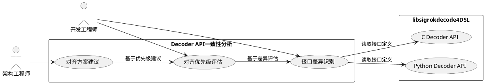
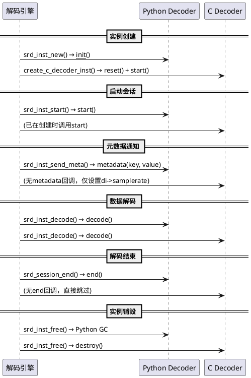
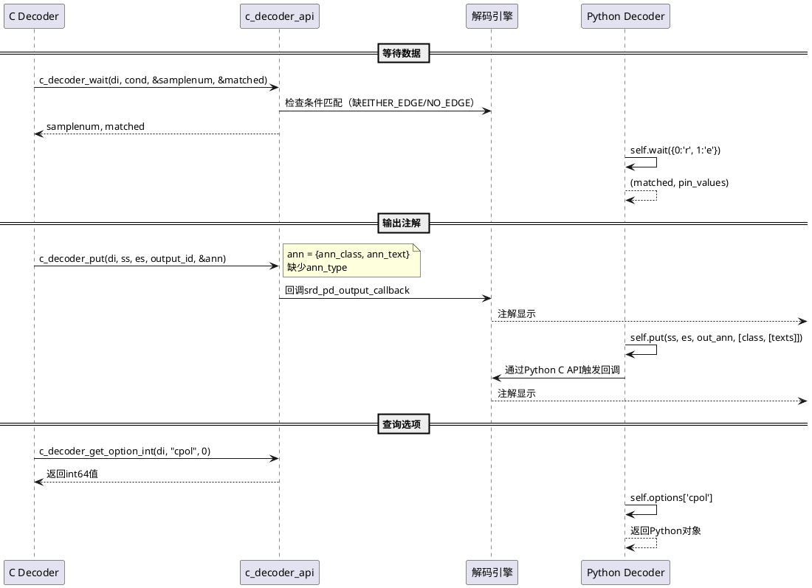
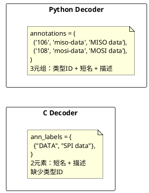
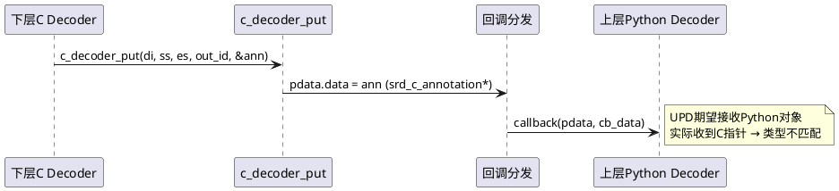

# **1. 组件定位**

## **1.1 核心职责**

本组件负责对比分析libsigrokdecode4DSL库中C decoder与Python decoder的API接口一致性，识别差异点并评估需要对齐的接口，实现两种decoder类型的接口规范统一。

## **1.2 核心输入**

1. C decoder API接口定义：`c_decoder_api.c`中暴露的运行时API函数（`c_decoder_put`, `c_decoder_wait`, `c_decoder_has_channel`, `c_decoder_register_output`, `c_decoder_get_samplerate`, `c_decoder_get_option_*`）
2. C decoder生命周期回调：`srd_c_decoder`结构体中定义的`reset()`, `start()`, `decode()`, `destroy()`函数指针
3. Python decoder API接口定义：`sigrokdecode`模块中`Decoder`类暴露的方法（`register`, `wait`, `put`, `has_channel`, `options`, `samplerate`）及生命周期方法（`start`, `decode`, `reset`, `metadata`, `end`）
4. C decoder实现示例：`spi_c.c`, `i2c_c.c`, `uart_c.c`, `can_c.c`等
5. Python decoder实现示例：`decoders/0-spi/pd.py`, `decoders/0-i2c/pd.py`等

## **1.3 核心输出**

1. C decoder与Python decoder接口差异清单：按接口类别（生命周期、数据输入、数据输出、元数据、通道、选项）分类的差异项列表
2. 需对齐的接口点及优先级评估：标注每个差异点的对齐必要性和优先级（P0-必须对齐/P1-建议对齐/P2-可选对齐）
3. 对齐方案建议：针对每个需对齐的接口点给出建议方案

## **1.4 职责边界**

1. 本组件不负责实际修改C decoder或Python decoder的代码实现
2. 本组件不负责评估对齐后的性能影响或兼容性风险（由设计文档负责）
3. 本组件不负责定义新的接口规范（仅对比和评估现有接口差异）

# **2. 领域术语**

**C Decoder**
: 以纯C语言实现的协议解码器，编译为独立DLL/SO动态加载，通过`c_decoder_*`API函数与解码引擎交互。
: 备注：也称"原生C decoder"，位于`c_decoders/`目录。

**Python Decoder**
: 以Python语言实现的协议解码器，通过嵌入式Python解释器加载，继承`srd.Decoder`基类并通过其方法与解码引擎交互。
: 备注：也称"PD"，位于`decoders/`目录，原始sigrok格式。

**Decoder实例（srd_decoder_inst）**
: 解码引擎中一个decoder的运行时实例，包含通道映射、输入缓冲区、输出注册、线程同步等状态信息。
: 备注：C decoder和Python decoder共享同一`srd_decoder_inst`结构体，通过`is_c_inst`字段区分。

**生命周期回调**
: decoder定义的用于被解码引擎在特定时刻调用的函数，包括初始化、启动、解码、重置、销毁等阶段。

**运行时API**
: decoder在`decode()`执行过程中主动调用的引擎提供的API函数，用于等待数据、输出结果、查询状态等。

**注解输出（SRD_OUTPUT_ANN）**
: decoder产生的可视化文本注解，包含注解类别（ann_class）和文本内容（ann_text），用于在GUI中显示解码结果。

**Python输出（SRD_OUTPUT_PYTHON）**
: decoder产生的Python对象输出，用于在decoder栈中向上层decoder传递结构化数据。

**二进制输出（SRD_OUTPUT_BINARY）**
: decoder产生的原始二进制数据输出。

**元数据输出（SRD_OUTPUT_META）**
: decoder产生的元数据输出，如采样率等配置信息。

**等待条件（Wait Condition）**
: decoder在`wait()`/`c_decoder_wait()`中指定的采样点匹配条件，包括高电平、低电平、上升沿、下降沿、双边沿、无边沿、跳过等类型。

**Decoder栈（Decoder Stack）**
: 多个decoder实例的层级组合，下层decoder的输出作为上层decoder的输入，通过`srd_inst_stack()`建立。

**EARS格式**
: Easy Approach to Requirements Syntax，一种需求规格编写格式，使用When/While/If/Where/The system shall等关键词构建可测试的验收条件。

# **3. 角色与边界**

## **3.1 核心角色**

- 开发工程师：负责根据差异清单和对齐方案修改C decoder或Python decoder的实现
- 架构工程师：负责评估对齐方案的技术可行性和架构影响

## **3.2 外部系统**

- libsigrokdecode4DSL引擎：提供decoder加载、实例创建、数据分发、回调触发等运行时服务
- DSView GUI应用：作为前端接收decoder的注解输出并展示

## **3.3 交互上下文**



# **4. DFX约束**

## **4.1 性能**

1. C decoder接口对齐后，其解码性能应当不低于对齐前水平（C decoder的性能优势是采用C实现的核心动机）
2. 接口对齐过程禁止引入Python GIL依赖到C decoder的`decode()`主循环中

## **4.2 可靠性**

1. 接口对齐后，C decoder和Python decoder在相同输入条件下应当产生语义等价的解码结果
2. 对齐后的接口应当保持向后兼容，现有C decoder实现（spi_c、i2c_c、uart_c、can_c等）不需重写即可继续正常工作

## **4.3 安全性**

无特殊安全要求。

## **4.4 可维护性**

1. 对齐后的C decoder API应当在`libsigrokdecode.h`中有完整的函数声明和文档注释
2. 接口差异和对齐状态应当有明确的文档记录

## **4.5 兼容性**

1. C decoder API版本号（`SRD_C_DECODER_API_VERSION`）在对齐后应当递增
2. 现有C decoder DLL的`srd_c_decoder_api_version()`函数应当能正确报告新版本号
3. 对齐新增的接口函数应当为可选实现，未实现的decoder不应崩溃

# **5. 核心能力**

## **5.1 生命周期接口对比**

### **5.1.1 业务规则**

1. **生命周期回调完整性对比规则**：C decoder和Python decoder的生命周期回调必须覆盖相同的阶段

   - Python decoder生命周期阶段：`__init__` → `reset()` → `start()` → `metadata()` → `decode()` → `end()`
   - C decoder生命周期阶段：`reset()` → `start()` → `decode()` → `destroy()`
   - 差异点：
     - C decoder缺少`metadata()`回调：Python decoder通过`metadata(key, value)`主动接收采样率等元数据通知；C decoder只能通过`c_decoder_get_samplerate()`被动查询采样率，无主动通知机制
     - C decoder缺少`end()`回调：Python decoder通过`end()`在解码会话结束时执行收尾逻辑（如设置`last_samplenum`属性）；C decoder仅有`destroy()`用于资源释放，无"解码结束但实例仍存活"的阶段通知
     - C decoder的`destroy()`与Python的`end()`语义不同：`destroy()`对应实例销毁（释放`user_data`），`end()`对应解码完成（可继续查询状态）

   a. 验收条件：[对比C decoder和Python decoder的生命周期阶段] → [列出所有缺失阶段及对应的Python接口]

2. **实例初始化流程对比规则**：C decoder和Python decoder的实例创建流程应当对关键状态进行等效初始化

   - Python实例创建：`PyObject_CallObject(dec->py_dec)` → 设置`options` → 初始化通道映射
   - C实例创建：`create_c_decoder_inst()` → 设置`is_c_inst=TRUE` → 调用`reset()` → 调用`start()`
   - 差异点：C实例在创建时立即调用`reset()`和`start()`，Python实例的`start()`在`srd_inst_start()`中延迟调用

   a. 验收条件：[创建C decoder实例] → [实例的`reset()`和`start()`在创建时即被调用，与Python实例的延迟调用存在时序差异]

3. **禁止项**：禁止将`destroy()`与`end()`合并为同一回调，因为两者语义不同

   a. 验收条件：[C decoder实例解码完成但未销毁] → [如果调用`destroy()`则实例不可用，但`end()`应当允许实例继续存活]

### **5.1.2 交互流程**



### **5.1.3 异常场景**

1. **C decoder缺少metadata通知场景**

   a. 触发条件：解码会话在运行中通过`srd_session_metadata_set()`动态更新采样率
   b. 系统行为：C decoder实例仅更新`di->samplerate`字段，不触发任何回调通知decoder自身
   c. 用户感知：如果C decoder在`start()`中依赖采样率进行初始化计算，可能使用过期值

2. **C decoder缺少end通知场景**

   a. 触发条件：解码会话正常结束，decoder需要执行收尾逻辑（如发送最后一帧不完整数据）
   b. 系统行为：`srd_session_end()`中对C decoder实例直接`continue`跳过
   c. 用户感知：C decoder无法在解码结束时输出尾部注解或执行状态清理

## **5.2 运行时API接口对比**

### **5.2.1 业务规则**

1. **数据等待接口对比规则**：`c_decoder_wait()`与Python `self.wait()`必须支持相同的条件类型

   - Python `wait()`支持的触发条件：`'r'`(上升沿)、`'f'`(下降沿)、`'h'`(高电平)、`'l'`(低电平)、`'e'`(双边沿)、`'n'`(无变化)、`'s'`(跳过)、空条件(立即返回)
   - `c_decoder_wait()`实现的触发条件：`SRD_TERM_RISING_EDGE`、`SRD_TERM_FALLING_EDGE`、`SRD_TERM_HIGH`、`SRD_TERM_LOW`、`SRD_TERM_SKIP`、空条件(立即返回)
   - 差异点：
     - `SRD_TERM_EITHER_EDGE`（双边沿）：枚举中已定义但在`c_decoder_wait()`实现中未处理，实际不会匹配
     - `SRD_TERM_NO_EDGE`（无变化/无沿）：枚举中已定义但在`c_decoder_wait()`实现中未处理

   a. 验收条件：[C decoder使用EITHER_EDGE或NO_EDGE条件调用c_decoder_wait] → [条件无法被匹配，decoder可能永远阻塞或跳过]

2. **数据输出接口对比规则**：`c_decoder_put()`与Python `self.put()`必须支持相同的输出类型和字段

   - Python `put()`输出：`[ann_class, [text_rows]]`，支持多行文本
   - `c_decoder_put()`输出：`srd_c_annotation{ann_class, ann_text}`，支持多行文本（NULL结尾的字符串数组）
   - 差异点：
     - `srd_c_annotation`缺少`ann_type`字段：Python注解支持`ann_type`用于区分注解类型（如hex格式、ascii格式），C注解无此概念
     - `srd_c_annotation`缺少`str_number_hex`和`numberic_value`字段：`srd_proto_data_annotation`结构体中有这些字段，但`srd_c_annotation`中没有，导致C decoder无法输出数值格式化信息
     - `c_decoder_put()`对`SRD_OUTPUT_PYTHON`的处理：将C annotation直接作为`pdata.data`传递给回调，而Python的`OUTPUT_PYTHON`传递Python对象，C decoder无法构造Python对象

   a. 验收条件：[C decoder调用c_decoder_put输出带ann_type的注解] → [ann_type信息丢失，前端无法区分注解的显示格式]

3. **通道查询接口对比规则**：`c_decoder_has_channel()`与Python `self.has_channel()`必须语义一致

   - Python `has_channel(ch_idx)`：返回布尔值，检查指定通道索引是否已连接
   - `c_decoder_has_channel(ch)`：返回0或1，检查`dec_channelmap[ch] >= 0`
   - 两者语义一致，无差异

   a. 验收条件：[C和Python decoder对相同通道配置调用has_channel] → [返回结果一致]

4. **输出注册接口对比规则**：`c_decoder_register_output()`与Python `self.register()`必须支持相同的输出类型

   - Python `register(srd.OUTPUT_ANN)`：返回输出ID
   - `c_decoder_register_output(di, SRD_OUTPUT_ANN, proto_id)`：返回pdo_id
   - 差异点：
     - Python `register()`不支持`SRD_OUTPUT_META`的`meta_type`/`meta_name`/`meta_descr`参数设置；C版本同样不支持
     - C版本的`proto_id`参数与Python的输出协议ID语义一致

   a. 验收条件：[C和Python decoder注册相同类型的输出] → [返回的输出ID可用于后续put操作]

5. **选项获取接口对比规则**：`c_decoder_get_option_*()`与Python `self.options[]`必须支持相同的选项类型

   - Python `self.options[key]`：直接字典访问，返回Python对象
   - C `c_decoder_get_option_int/double/string()`：类型化获取，带默认值
   - 差异点：
     - C decoder选项通过`di->c_options`哈希表存储，在`srd_inst_option_set()`中从`GHashTable *options`拷贝
     - C decoder选项必须在`decode()`运行时通过API函数查询；Python选项在`start()`中即可访问
     - 现有C decoder实现（spi_c, i2c_c）均未定义options（`num_options=0`），而对应Python版本有丰富选项定义

   a. 验收条件：[C decoder定义了选项并在实例创建时设置了选项值] → [在decode()中通过c_decoder_get_option_*()能正确获取]

6. **采样率获取接口对比规则**：`c_decoder_get_samplerate()`与Python `self.samplerate`必须语义一致

   - Python `self.samplerate`：在`metadata()`回调中设置，也可直接读取
   - C `c_decoder_get_samplerate(di)`：返回`di->samplerate`
   - 差异点：C decoder无主动通知机制，只能在采样率已被设置后被动查询

   a. 验收条件：[在metadata设置采样率后，C decoder调用c_decoder_get_samplerate] → [返回正确的采样率值]

### **5.2.2 交互流程**



### **5.2.3 异常场景**

1. **EITHER_EDGE/NO_EDGE条件未实现场景**

   a. 触发条件：C decoder在`c_decoder_wait()`的条件列表中使用`SRD_TERM_EITHER_EDGE`或`SRD_TERM_NO_EDGE`
   b. 系统行为：`c_decoder_wait()`实现中未处理这两种条件类型，条件永远不匹配
   c. 用户感知：decoder可能无限阻塞等待，导致解码会话挂起

2. **C decoder选项未定义但被查询场景**

   a. 触发条件：C decoder实例的`c_dec->options`为NULL，但在`decode()`中调用`c_decoder_get_option_int()`查询选项
   b. 系统行为：`di->c_options`为NULL，函数返回默认值
   c. 用户感知：decoder使用默认值运行，可能产生与用户配置不符的解码结果

## **5.3 元数据与描述信息对比**

### **5.3.1 业务规则**

1. **Decoder描述信息完整性规则**：C decoder的`srd_c_decoder`结构体必须能表达Python Decoder类同等完整的描述信息

   - Python Decoder类属性：`id`, `name`, `longname`, `desc`, `license`, `channels`, `optional_channels`, `options`, `annotations`, `annotation_rows`, `inputs`, `outputs`, `tags`, `binary`, `api_version`
   - C `srd_c_decoder`结构体字段：`id`, `name`, `longname`, `desc`, `license`, `channels`, `num_channels`, `optional_channels`, `num_optional_channels`, `options`, `num_options`, `num_annotations`, `ann_labels`, `num_annotation_rows`, `annotation_rows`, `inputs`, `num_inputs`, `outputs`, `num_outputs`, `binary`, `num_binary`, `tags`, `num_tags`
   - 差异点：
     - C decoder的`ann_labels`类型为`const char *(*)[2]`（二维字符串数组），每个注解只有2个标签（短名+描述）；Python的`annotations`支持3元组（类型ID+短名+描述），即Python支持注解类型ID而C不支持
     - C decoder的`options`类型为`const struct srd_decoder_option *`（数组），但现有C decoder实现均为NULL
     - C decoder缺少`api_version`字段（使用DLL入口函数`srd_c_decoder_api_version()`替代）

   a. 验收条件：[对比C和Python decoder的描述结构体] → [列出C结构体中缺失的字段或与Python不等价的字段类型]

2. **注解行定义规则**：C decoder的`annotation_rows`必须与Python decoder的`annotation_rows`语义一致

   - Python `annotation_rows`：元组列表，每项为(id, desc, (ann_class_indices))
   - C `annotation_rows`：`const struct srd_decoder_annotation_row *`数组，每项含`id`, `desc`, `ann_classes`
   - 差异点：现有C decoder实现（spi_c, i2c_c）的`num_annotation_rows=0`，即未定义任何annotation_row

   a. 验收条件：[C decoder定义了annotations但未定义annotation_rows] → [前端无法按行分组显示注解，所有注解显示在默认行中]

3. **通道类型定义规则**：C decoder的`srd_channel`结构体必须与Python decoder的通道定义语义一致

   - Python通道字典：`{'id': ..., 'type': ..., 'name': ..., 'desc': ..., 'idn': ...}`
   - C `srd_channel`结构体：`{id, name, desc, order, type, idn}`
   - 差异点：C通道的`order`字段由数组索引隐含决定，Python通道的`order`由在tuple中的位置决定，两者一致

   a. 验收条件：[C和Python decoder定义相同的通道列表] → [通道的id/name/desc/type/idn语义一致]

### **5.3.2 交互流程**



### **5.3.3 异常场景**

1. **C decoder注解缺少类型ID场景**

   a. 触发条件：前端根据注解类型ID选择不同的显示格式（如hex格式显示MISO数据，ascii格式显示MOSI数据）
   b. 系统行为：C decoder的`ann_labels`不包含类型ID，前端无法区分注解的显示格式
   c. 用户感知：所有C decoder注解使用默认格式显示，可能不符合协议特定的格式需求

## **5.4 Decoder栈与输出传递对比**

### **5.4.1 业务规则**

1. **Python输出栈传递规则**：C decoder通过`SRD_OUTPUT_PYTHON`输出向上层decoder传递数据时，必须能被Python decoder正确接收

   - Python decoder栈传递：下层decoder的`self.put(ss, es, self.out_python, [ptype, data])` → 上层decoder的`decode()`接收Python对象
   - C decoder栈传递：`c_decoder_put()`中`SRD_OUTPUT_PYTHON`分支将`ann`（`srd_c_annotation*`）作为`pdata.data`传递给回调
   - 差异点：C decoder的`SRD_OUTPUT_PYTHON`输出是C结构体指针，上层Python decoder无法直接解析为Python对象；C decoder无法构造Python对象传递给上层

   a. 验收条件：[C decoder作为栈底层输出SRD_OUTPUT_PYTHON] → [上层Python decoder收到的是C指针而非Python对象，可能导致类型错误或崩溃]

2. **二进制输出传递规则**：C decoder通过`SRD_OUTPUT_BINARY`输出时，必须与Python的二进制输出格式一致

   - Python二进制输出：`self.put(ss, es, self.out_binary, [bin_class, data_bytes])`
   - C二进制输出：`c_decoder_put()`中`SRD_OUTPUT_BINARY`分支将`ann`（`srd_c_annotation*`）作为`pdata.data`传递
   - 差异点：C decoder使用`srd_c_annotation`结构体传递二进制数据，而标准二进制输出应使用`srd_proto_data_binary{bin_class, size, data}`结构体

   a. 验收条件：[C decoder输出二进制数据] → [回调收到的数据结构与srd_proto_data_binary不匹配，可能导致解析错误]

### **5.4.2 交互流程**



### **5.4.3 异常场景**

1. **C到Python栈数据类型不匹配场景**

   a. 触发条件：C decoder作为栈底层，通过`SRD_OUTPUT_PYTHON`向上层Python decoder传递数据
   b. 系统行为：上层Python decoder的`decode()`方法收到`srd_c_annotation*`指针而非Python对象
   c. 用户感知：Python decoder抛出TypeError异常，解码栈中断

## **5.5 差异汇总与对齐优先级评估**

### **5.5.1 业务规则**

1. **P0-必须对齐的差异**：影响C decoder功能正确性或导致运行时故障的接口差异

   | 编号 | 差异点 | 影响范围 | 对齐建议 |
   |------|--------|----------|----------|
   | P0-1 | `c_decoder_wait()`未实现`SRD_TERM_EITHER_EDGE`和`SRD_TERM_NO_EDGE` | 需要双边沿/无沿检测的decoder（如UART） | 在`c_decoder_wait()`中补充这两种条件的匹配逻辑 |
   | P0-2 | C decoder缺少`end()`回调 | 需要在解码结束时执行收尾逻辑的decoder | 在`srd_c_decoder`中新增`end()`函数指针，在`srd_session_end()`中调用 |
   | P0-3 | C→Python栈传递`SRD_OUTPUT_PYTHON`数据类型不匹配 | C decoder作为栈底层 feeding Python上层 | 禁止C decoder使用`SRD_OUTPUT_PYTHON`，或实现C→Python对象桥接 |

2. **P1-建议对齐的差异**：影响C decoder功能完整性或用户体验的接口差异

   | 编号 | 差异点 | 影响范围 | 对齐建议 |
   |------|--------|----------|----------|
   | P1-1 | C decoder缺少`metadata()`回调 | 需要实时响应采样率变化的decoder | 在`srd_c_decoder`中新增`metadata()`函数指针 |
   | P1-2 | `srd_c_annotation`缺少`ann_type`字段 | 前端需要根据注解类型选择显示格式 | 在`srd_c_annotation`中新增`ann_type`字段 |
   | P1-3 | C decoder的`SRD_OUTPUT_BINARY`输出数据结构不标准 | 使用二进制输出的decoder | 修改`c_decoder_put()`对BINARY的处理，使用`srd_proto_data_binary`结构体 |
   | P1-4 | C decoder注解标签缺少类型ID（仅2元素vs Python的3元组） | 前端注解格式化显示 | 扩展`ann_labels`为3元素数组或新增`ann_types`字段 |

3. **P2-可选对齐的差异**：不影响功能但可提升一致性的接口差异

   | 编号 | 差异点 | 影响范围 | 对齐建议 |
   |------|--------|----------|----------|
   | P2-1 | C decoder实例创建时立即调用`reset()+start()`，Python延迟调用`start()` | 实例初始化时序 | 统一为延迟调用模式，或在文档中明确说明差异 |
   | P2-2 | 现有C decoder实现（spi_c, i2c_c）未定义options | 用户无法配置C decoder参数 | 为C decoder补充options定义 |
   | P2-3 | 现有C decoder实现未定义annotation_rows | 前端注解无法按行分组 | 为C decoder补充annotation_rows定义 |
   | P2-4 | C decoder缺少`api_version`字段（使用DLL入口函数替代） | 版本管理方式不同 | 保持现状，两种方式均可 |

   a. 验收条件：[按照优先级列表逐项验证差异数量] → [P0有3项、P1有4项、P2有4项，共10项差异]

### **5.5.2 交互流程**

```plantuml
@startuml
left to right direction

rectangle "P0 必须对齐" as P0 {
  usecase "EITHER_EDGE/NO_EDGE\n未实现" as P01
  usecase "缺少end()回调" as P02
  usecase "C→Python栈\n类型不匹配" as P03
}

rectangle "P1 建议对齐" as P1 {
  usecase "缺少metadata()回调" as P11
  usecase "ann_type字段缺失" as P12
  usecase "BINARY输出\n结构不标准" as P13
  usecase "注解标签\n缺少类型ID" as P14
}

rectangle "P2 可选对齐" as P2 {
  usecase "start()调用时序" as P21
  usecase "options未定义" as P22
  usecase "annotation_rows\n未定义" as P23
  usecase "api_version方式" as P24
}

P01 --> P02 --> P03 : 优先处理
P11 --> P12 --> P13 --> P14
P21 --> P22 --> P23 --> P24
@enduml
```

### **5.5.3 异常场景**

1. **对齐过程引入回归风险场景**

   a. 触发条件：修改`c_decoder_wait()`实现以支持EITHER_EDGE/NO_EDGE时，影响现有条件匹配逻辑
   b. 系统行为：如果修改导致现有HIGH/LOW/RISING/FALLING/SKIP条件的匹配逻辑变化，现有decoder可能行为异常
   c. 用户感知：原本正常的C decoder解码结果出现错误或遗漏

2. **新增回调函数指针兼容性场景**

   a. 触发条件：在`srd_c_decoder`中新增`end()`或`metadata()`函数指针
   b. 系统行为：现有C decoder的`srd_c_decoder`结构体初始化未设置新函数指针，值为NULL/0
   c. 用户感知：如果引擎无条件调用新回调，现有C decoder崩溃；需要NULL检查保护

# **6. 数据约束**

## **6.1 C Decoder运行时API函数**

1. **c_decoder_put**：参数`di`非NULL，`output_id`必须在`di->pd_output`列表范围内，`ann`非NULL（SRD_OUTPUT_ANN时）
2. **c_decoder_wait**：参数`di`非NULL，`condition_list`可为NULL（无条件等待），`samplenum`和`matched`为输出参数可为NULL
3. **c_decoder_has_channel**：参数`di`非NULL，`ch`范围[0, di->dec_num_channels)，返回值为0或1
4. **c_decoder_register_output**：参数`di`非NULL，`output_type`为SRD_OUTPUT_ANN/PYTHON/BINARY/META之一，`proto_id`可为NULL
5. **c_decoder_get_samplerate**：参数`di`非NULL，返回值为uint64_t，未设置时返回0
6. **c_decoder_get_option_int**：参数`di`非NULL且`key`非NULL，未找到时返回`defval`
7. **c_decoder_get_option_double**：参数`di`非NULL且`key`非NULL，未找到时返回`defval`
8. **c_decoder_get_option_string**：参数`di`非NULL且`key`非NULL，未找到时返回`defval`

## **6.2 C Decoder生命周期回调**

1. **reset**：参数为`void *inst`（实际为`srd_decoder_inst*`），负责重置`di->user_data`中的decoder状态
2. **start**：参数为`void *inst`，负责注册输出（调用`c_decoder_register_output`）和读取选项
3. **decode**：参数为`void *inst`，主解码循环，通过`c_decoder_wait()`和`c_decoder_put()`与引擎交互
4. **destroy**：参数为`void *inst`，负责释放`di->user_data`分配的资源

## **6.3 Python Decoder类属性和方法**

1. **api_version**：必须为整数，当前值为3
2. **id**：字符串，唯一标识符，如'0:spi'
3. **channels**：元组，每个元素为包含id/type/name/desc/idn的字典
4. **optional_channels**：元组，格式同channels
5. **options**：元组，每个元素为包含id/desc/default/values/idn的字典
6. **annotations**：元组，支持2元组(短名,描述)或3元组(类型ID,短名,描述)
7. **annotation_rows**：元组，每项为(id, desc, (ann_class_indices))的3元组

## **6.4 差异清单**

1. **差异编号**：P0-1至P0-3、P1-1至P1-4、P2-1至P2-4，共10项
2. **优先级**：P0（必须对齐）> P1（建议对齐）> P2（可选对齐）
3. **影响范围**：每项差异标注了受影响的decoder类型和使用场景
4. **对齐状态**：未对齐/已对齐/不适用，初始状态均为"未对齐"
