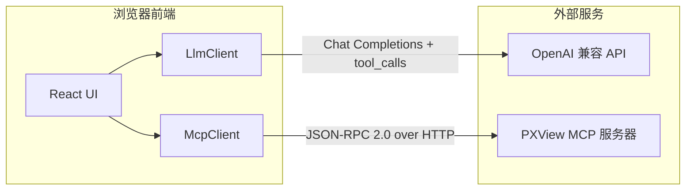

## 1. 架构设计



前端纯静态应用，无后端服务器。浏览器直接与两个外部服务通信：
1. **OpenAI 兼容 API** — LLM 推理（支持任意 OpenAI 兼容端点）
2. **PXView MCP 服务器** — 逻辑分析仪控制（`http://127.0.0.1:10430`）

## 2. 技术说明

- **前端**：React 18 + TypeScript + Vite
- **样式**：Tailwind CSS 4（暗色主题）
- **图标**：Lucide React
- **初始化工具**：Vite
- **后端**：无（纯前端）
- **数据库**：localStorage（设置持久化）

## 3. 路由定义

单页应用，无路由切换。所有功能在一个页面内通过面板切换实现。

## 4. API 定义

### 4.1 MCP 客户端 API

```typescript
interface McpClient {
  connect(url: string): Promise<McpCapabilities>;
  disconnect(): void;
  listTools(): Promise<McpTool[]>;
  callTool(name: string, args: Record<string, unknown>): Promise<McpToolResult>;
}

interface McpTool {
  name: string;
  description: string;
  inputSchema: Record<string, unknown>;
}

interface McpToolResult {
  content: Array<{ type: string; text: string }>;
  isError?: boolean;
}
```

### 4.2 LLM 客户端 API

```typescript
interface LlmClient {
  chat(messages: ChatMessage[], tools: OpenAITool[]): Promise<ChatResponse>;
}

interface ChatMessage {
  role: 'system' | 'user' | 'assistant' | 'tool';
  content?: string;
  tool_calls?: ToolCall[];
  tool_call_id?: string;
}

interface ToolCall {
  id: string;
  type: 'function';
  function: { name: string; arguments: string };
}

interface ChatResponse {
  message: { content?: string; tool_calls?: ToolCall[] };
  done: boolean;
}
```

### 4.3 MCP → OpenAI 工具转换

```typescript
function mcpToOpenAITools(mcpTools: McpTool[]): OpenAITool[] {
  return mcpTools.map(tool => ({
    type: 'function',
    function: {
      name: tool.name,
      description: tool.description,
      parameters: tool.inputSchema,
    },
  }));
}
```

## 5. 数据模型

### 5.1 对话状态

```typescript
interface ConversationState {
  messages: ChatMessage[];
  toolCallResults: Map<string, { status: 'running' | 'success' | 'error'; result?: string; elapsed?: number }>;
  isProcessing: boolean;
}
```

### 5.2 设置持久化

```typescript
interface AppSettings {
  mcpServerUrl: string;    // 默认 http://127.0.0.1:10430
  llmBaseUrl: string;      // 默认 https://api.openai.com/v1
  llmApiKey: string;
  llmModel: string;        // 默认 gpt-4o
}
```
