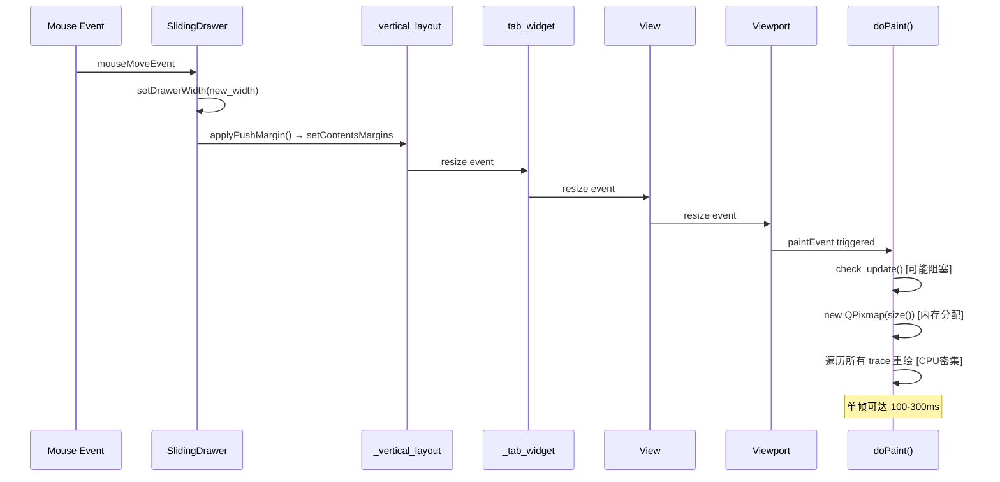

# 窗口拖动卡顿原因调查报告

> **项目:** PXView (DSView fork)
> **日期:** 2026-05-17
> **分析对象:** SlidingDrawer 边框拖动 / 整体窗口拖动 / 侧边栏操作

---

## 一、现象描述

尽管已经做了大量优化（如拖动时延迟 `removePushMargin`、`mouseGrabber()` 保护、FPS 帧间隔计时器等），拖动窗口/侧边栏时仍然**间歇性**出现 300ms 级别的卡顿帧。

## 二、发现的卡顿根因（按严重程度排序）

---

### 🔴 根因 1：`applyPushMargin()` 触发整棵 Widget 树重布局

**严重程度：高 | 触发频率：每帧**

[applyPushMargin()](file:///c:/Users/admin/Downloads/DSView-main_2026_4_27cppnb/PXView/pv/widgets/slidingdrawer.cpp#L179-L185) 修改 `_push_layout->setContentsMargins(0, 0, _drawer_width, 0)`。

**问题链条：**
```
mouseMoveEvent → setDrawerWidth() → applyPushMargin()
    → _push_layout->setContentsMargins()
        → _tab_widget resize
            → View resize
                → Viewport resize + repaint (paintEvent)
                    → doPaint() → paintSignals() 
                        → 重新创建 QPixmap(size())  ← 🔴 每帧分配像素缓冲
                        → 遍历所有 trace 重绘信号波形
```

关键代码 [viewport.cpp:544-545](file:///c:/Users/admin/Downloads/DSView-main_2026_4_27cppnb/PXView/pv/view/viewport.cpp#L544-L545)：
```cpp
_pixmap = QPixmap(size());   // 每次 size 变化都重新分配！
_pixmap.fill(Qt::transparent);
```

只要 Viewport 的 `size()` 变了（因为 layout margin 变了），**就会重新创建一个全尺寸 QPixmap 并重绘所有信号波形**。这是单帧耗时最大的操作。

---

### 🔴 根因 2：`doPaint()` 中的 `check_update()` 同步调用

**严重程度：高 | 触发频率：每帧**

[viewport.cpp:355](file:///c:/Users/admin/Downloads/DSView-main_2026_4_27cppnb/PXView/pv/view/viewport.cpp#L355)：
```cpp
void Viewport::doPaint() {
  ...
  _view.session().check_update();  // ← 在 paint 中做同步状态检查
  ...
}
```

`check_update()` 在每次 `paintEvent` 中被调用，可能涉及设备状态查询（USB/硬件通信）。如果设备响应慢或 USB 调用阻塞，就会直接卡住整个 paint 帧。

---

### 🟡 根因 3：`setSlideOffset()` 对父 Widget 调用 `update(dirtyRect)` 触发额外重绘

**严重程度：中 | 触发频率：动画期间每帧**

[slidingdrawer.cpp:403-421](file:///c:/Users/admin/Downloads/DSView-main_2026_4_27cppnb/PXView/pv/widgets/slidingdrawer.cpp#L403-L421)：
```cpp
void SlidingDrawer::setSlideOffset(int offset) {
  ...
  _slide_offset = offset;
  positionOverlay();

  QWidget *pw = parentWidget();
  if (pw) {
    ...
    pw->update(dirtyRect);   // ← 每帧请求父 Widget 的部分重绘
  }
}
```

动画过程中每帧都对 `_central_widget`（父 widget）发 `update(dirtyRect)`。由于 `_central_widget` 包含 `_tab_widget`、`View`、`Viewport` 等子 widget，这个 dirtyRect 会**级联触发**子 widget 的 `paintEvent`。

---

### 🟡 根因 4：`mode_check_timer`（500ms）在 Dock 可见时做 USB 轮询

**严重程度：中 | 触发频率：每 500ms**

[deviceoptionsdock.cpp:520-556](file:///c:/Users/admin/Downloads/DSView-main_2026_4_27cppnb/PXView/pv/dock/deviceoptionsdock.cpp#L520-L556)：
```cpp
void DeviceOptionsDock::mode_check_timeout() {
  if (_device_agent->is_hardware()) {
    QtConcurrent::run([this, agent, saved_opt_mode]() {
      int mode;
      bool got_mode = agent->get_config_int16(SR_CONF_OPERATION_MODE, mode);
      // ...
      QMetaObject::invokeMethod(this, [this, mode]() {
        build_dynamic_panel();    // ← 重建整个 UI panel
        try_resize_scroll();      // ← 遍历所有子 widget 重设大小
      });
    });
  }
}
```

虽然 `QtConcurrent::run` 将 USB 通信放到了线程池，但 `QMetaObject::invokeMethod` 回到主线程后会调用 `build_dynamic_panel()` + `try_resize_scroll()`，这两个函数：

- `build_dynamic_panel()`：删除旧 widget、创建新 widget、添加到 layout
- `try_resize_scroll()`：遍历所有 QLabel 子 widget，逐个 `setFixedSize()`

这些操作在主线程执行，会与拖动操作**竞争 UI 线程时间片**。

---

### 🟡 根因 5：`disk_cache_status_timer`（500ms）持续刷新 StatusBar

**严重程度：低-中 | 触发频率：每 500ms**

[mainwindow.cpp:3073-3131](file:///c:/Users/admin/Downloads/DSView-main_2026_4_27cppnb/PXView/pv/mainwindow.cpp#L3073-L3131)：
```cpp
void MainWindow::update_disk_cache_status() {
  // 多次调用 _device_agent->get_config_*() 查询设备
  _device_agent->get_config_bool(SR_CONF_DISK_CACHE_ENABLE, cache_enabled);
  _device_agent->get_config_string(SR_CONF_DISK_CACHE_PATH, cache_path);
  // ... 
  _disk_cache_status_label->setText(text);  // 触发 label 重绘
  _disk_cache_status_label->setStyleSheet(...);  // 样式重算
}
```

每 500ms 查一次设备配置 + 修改 StyleSheet，StyleSheet 变更会触发整个 StatusBar 重绘。

---

### 🟡 根因 6：SlidingDrawer 的 `resizeEvent` 中三次 `setGeometry()` + `raise()`

**严重程度：低-中 | 触发频率：每帧（拖动时）**

[slidingdrawer.cpp:443-456](file:///c:/Users/admin/Downloads/DSView-main_2026_4_27cppnb/PXView/pv/widgets/slidingdrawer.cpp#L443-L456)：
```cpp
void SlidingDrawer::resizeEvent(QResizeEvent *event) {
  if (_panel_content) {
    _panel_content->setGeometry(0, 0, width(), height());  // #1
  }
  if (_edge_grip && height() > 0) {
    _edge_grip->setGeometry(0, 0, EDGE_GRIP_WIDTH, height());  // #2
    _edge_grip->raise();   // z-order 重排
  }
  if (_left_separator && height() > 0) {
    _left_separator->setGeometry(0, 0, 1, height());  // #3
    _left_separator->raise();  // z-order 重排
  }
}
```

每次 resize 触发 3 次 `setGeometry()` + 2 次 `raise()`。`raise()` 会触发 z-order 重排和额外的重绘请求。

---

### 🟢 根因 7：开/关动画时的 `removePushMargin()` → `applyPushMargin()` 双击

**严重程度：低 | 触发频率：动画开始/结束各一次**

[slidingdrawer.cpp:270](file:///c:/Users/admin/Downloads/DSView-main_2026_4_27cppnb/PXView/pv/widgets/slidingdrawer.cpp#L268-L270) (open)：
```cpp
  removePushMargin();  // margin 从 _drawer_width 变到 0
  ...
  _animation->start();
```

[slidingdrawer.cpp:140-145](file:///c:/Users/admin/Downloads/DSView-main_2026_4_27cppnb/PXView/pv/widgets/slidingdrawer.cpp#L140-L145) (animation finished)：
```cpp
  applyPushMargin();   // margin 从 0 变到 _drawer_width
  _slide_offset = 0;
  positionOverlay();
```

`removePushMargin` + 动画 + `applyPushMargin` 总共会触发 2 次完整的 layout reflow（布局重排），每次都级联到 Viewport 重建 QPixmap。

---

### 🟢 根因 8：拖动开始时的异步 `removePushMargin` 仍然不够

**严重程度：低 | 触发频率：拖动开始时一次**

[slidingdrawer.cpp:496-502](file:///c:/Users/admin/Downloads/DSView-main_2026_4_27cppnb/PXView/pv/widgets/slidingdrawer.cpp#L496-L502)：
```cpp
if (!_drag_margin_removed) {
  _drag_margin_removed = true;
  QTimer::singleShot(0, this, [this]() {
    if (_drag_active) {
      removePushMargin();   // ← 异步执行，但仍然触发一次完整重布局
    }
  });
}
```

用了 `QTimer::singleShot(0, ...)` 延迟到下一个事件循环 tick，但 `removePushMargin()` 本身还是会触发一次完整的 layout reflow + Viewport repaint，这就是拖动开始时会"卡一下"的原因。

---

## 三、300ms 卡顿帧的典型触发路径



---

## 四、为什么显示 300ms 帧间隔

状态栏显示的 `UI: XXms` 是 `_max_frame_time`，即**过去 1 秒内 paintEvent 之间最大的帧间隔**。

[viewport.cpp:326-335](file:///c:/Users/admin/Downloads/DSView-main_2026_4_27cppnb/PXView/pv/view/viewport.cpp#L326-L335)：
```cpp
_paint_in_this_second++;
if (_is_idle || !_frame_interval_timer.isValid()) {
  _frame_interval_timer.restart();
  _is_idle = false;
} else {
  int elapsed = static_cast<int>(_frame_interval_timer.restart());
  if (elapsed > _max_frame_time) {
    _max_frame_time = elapsed;
  }
}
```

这个值 **不是单帧渲染时间**，而是**两次 paintEvent 之间的间隔**。300ms 意味着在这个间隔内，主线程被其他工作阻塞了（如 layout reflow、USB 查询、widget 树重建等）。

---

## 五、总结：卡顿因素汇总表

| # | 根因 | 严重程度 | 触发频率 | 影响 |
|---|------|---------|---------|------|
| 1 | `applyPushMargin()` 级联触发 Viewport 全量重绘 | 🔴 高 | 拖动每帧 | 100-300ms/帧 |
| 2 | `doPaint()` 中 `check_update()` 同步阻塞 | 🔴 高 | 每帧 | 不可预测的阻塞 |
| 3 | `setSlideOffset()` 的 `pw->update(dirtyRect)` 级联 | 🟡 中 | 动画每帧 | 额外的重绘请求 |
| 4 | `mode_check_timer` 回调重建 UI panel | 🟡 中 | 每 500ms | 与拖动竞争 UI 线程 |
| 5 | `disk_cache_status_timer` 设备查询 + StyleSheet | 🟡 中 | 每 500ms | 额外开销 |
| 6 | `resizeEvent` 中 3× `setGeometry` + 2× `raise()` | 🟡 低-中 | 拖动每帧 | 冗余重绘 |
| 7 | 开/关动画的双重 margin 变更 | 🟢 低 | 开关各 1 次 | 初始/结束卡一下 |
| 8 | 拖动开始时异步 `removePushMargin` | 🟢 低 | 拖动开始 1 次 | 起始卡一下 |

---

## 六、建议修复优先级

### P0（必须修复）：
1. **拖动时停止 layout margin 变更**，仅 overlay 模式调整 drawer 位置/大小
2. **将 `check_update()` 从 `doPaint()` 中移出**，改为独立的低频定时器

### P1（应该修复）：
3. **拖动时暂停 `mode_check_timer` 和 `disk_cache_status_timer`**
4. **Viewport 的 QPixmap 缓存优化**：仅当 size 变化超过阈值时才重建

### P2（锦上添花）：
5. **`resizeEvent` 减少冗余**：只在首次 resize 时 `raise()`
6. **`setSlideOffset` 优化**：动画时用 `QWidget::scroll()` 代替 `update(dirtyRect)`
