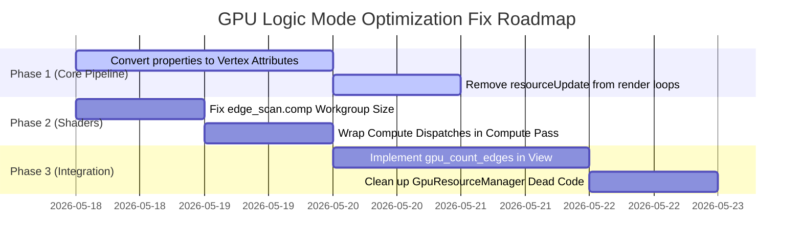

# PXView GPU Logic Mode Optimization Code Review Report

## Executive Summary & Verdict

We have completed a comprehensive code and architectural review of the proposed **GPU Logic Mode rendering and edge-scanning optimizations**. 

* **The Vision:** The proposed strategy aims to transition the rendering of millions of logic signal segments and protocol annotations from the CPU (via `QWidget` + `QPainter`) to the GPU using Qt6's **QRhiWidget** (Qt Rendering Hardware Interface).
* **The Genius:** The introduction of `GpuTextOverlay`—using a transparent standard `QWidget` with a `QPainter` overlay for elided labels—is a **brilliant design choice**. It completely avoids the extreme complexity of building dynamic GPU font atlases, while keeping performance high (text is sparse and extremely cheap to draw on CPU).
* **The Reality (Fatal Flaw):** Despite the elegant structure, **the current implementation is fundamentally broken and cannot be compiled or run successfully**. It contains multiple critical API violations of Qt's RHI pipeline, a syntax error in the compute shader, and complete feature stubs that render the optimization inert.

> [!WARNING]
> This GPU optimization pipeline cannot render multi-channel logic waveforms or multiple annotation blocks correctly under any circumstances in its current state. Attempting to run it will trigger immediate backend crashes, driver warnings, or render all elements overlapping in a single place.

---

## 🔴 1. Critical Rendering Pipeline Bugs

### 1.1 Uniform Buffer Overwriting & Illegal `resourceUpdate` (Most Critical)

#### The Bug Location
This structural pattern of bugs is present in:
* `LogicWaveRenderer::render()` ([logicwaverenderer.cpp:L249-284](file:///c:/Users/admin/Downloads/DSView-main_2026_4_27cppnb/PXView/pv/view/logicwaverenderer.cpp#L249-L284))
* `DecodeAnnotationRenderer::render()` ([decodeannotationrenderer.cpp:L284-325](file:///c:/Users/admin/Downloads/DSView-main_2026_4_27cppnb/PXView/pv/view/decodeannotationrenderer.cpp#L284-L325))
* `OverlayRenderer::renderGroupCards()`, `renderDashedLines()`, `renderCursorLines()`, `renderTriggerMarkers()`, `renderMeasureOverlays()` ([overlayrenderer.cpp](file:///c:/Users/admin/Downloads/DSView-main_2026_4_27cppnb/PXView/pv/view/overlayrenderer.cpp))
* `HeaderRenderer::renderGroupCards()`, `renderDividers()`, `renderColorButtons()`, `renderLabelPolygons()` ([headerrenderer.cpp](file:///c:/Users/admin/Downloads/DSView-main_2026_4_27cppnb/PXView/pv/view/headerrenderer.cpp))

#### The Technical Issue
In all these render loops, the code iterates over all items (channels, cards, or annotations) and executes:
```cpp
for (const auto &item : items) {
    ...
    QRhiResourceUpdateBatch *ubufBatch = _rhi->nextResourceUpdateBatch();
    ubufBatch->updateDynamicBuffer(_ubuf, 0, UBUF_SIZE, ubufData);
    cb->resourceUpdate(ubufBatch); // <--- Bug 1

    cb->setGraphicsPipeline(_pipeline);
    cb->setShaderResources(_srb); // <--- Bug 2
    cb->draw(...);
}
```

1. **Rule Violation (Illegal Resource Update):** In QRhi, calling `cb->resourceUpdate()` to queue buffer updates is **strictly prohibited inside an active render pass** (i.e., between `cb->beginPass()` and `cb->endPass()`). Doing this triggers RHI assertions and backend driver crashes, particularly on strict APIs like Vulkan, DirectX 12, or Metal.
2. **Asynchronous Execution & Overwriting:** Even if RHI allowed this, uniform buffers are read asynchronously by the GPU during drawing. Because all draw calls share the single dynamic uniform buffer `_ubuf` and bindings `_srb`, overwriting `_ubuf` multiple times in a CPU loop before submitting the command buffer will cause the GPU to see **only the last item's data** when it executes the pass.
   * **Result:** All logic channels will draw at the *exact same* vertical coordinate, height, and color of the last channel. All annotations will overlap at the last annotation's position and color.

#### Architectural Solutions
* **Solution A (Highly Recommended - Zero Cost):** Pack Y-offset, signal height, and color directly into the **Vertex Buffer** as per-vertex attributes (repeating the attributes for all vertices belonging to a particular channel/annotation). This allows drawing **all** logic channels or annotations in **a single `draw()` call** without updating uniforms or changing pipelines!
* **Solution B (Storage Buffer):** Pass an array of properties (`struct Channel { float y; vec4 col; ... }`) via a single Large Uniform Buffer or Storage Buffer, and add an index attribute (e.g. `in float channelIndex;`) to the vertex shader to look up the correct properties.
* **Solution C (Dynamic Offsets):** Allocate a single large uniform buffer containing blocks for all channels, and bind them using dynamic uniform buffer offsets (`QRhiShaderResourceBinding::uniformBufferWithDynamicOffset`).

---

### 1.2 Compute Shader Missing Workgroup Size (Syntax Error)

#### The Bug Location
* `PXView/shaders/edge_scan.comp` ([edge_scan.comp](file:///c:/Users/admin/Downloads/DSView-main_2026_4_27cppnb/PXView/shaders/edge_scan.comp))

#### The Technical Issue
GLSL compute shaders require a mandatory layout block specifying the local workgroup size. The compiler (`qsb`) will fail to compile the shader with a syntax error because the following is missing:
```glsl
layout(local_size_x = 64, local_size_y = 1, local_size_z = 1) in;
```
Without this declaration, the shader is completely invalid and cannot compile.

---

### 1.3 Compute Shader Dispatch Outside Compute Pass

#### The Bug Location
* `GpuEdgeScanner::dispatchScan()` ([gpuedgescanner.cpp:L229-234](file:///c:/Users/admin/Downloads/DSView-main_2026_4_27cppnb/PXView/pv/view/gpuedgescanner.cpp#L229-L234))

#### The Technical Issue
The code attempts to execute compute dispatch directly on the main command buffer:
```cpp
cb->setComputePipeline(_computePipeline);
cb->setShaderResources(_computeSrb);
cb->dispatch(workGroups, 1, 1);
```
In QRhi, compute dispatches **must** be wrapped inside a compute pass:
```cpp
QRhiComputePassDescriptor *cpDesc = ...;
cb->beginComputePass(cpDesc);
cb->setComputePipeline(_computePipeline);
cb->setShaderResources(_computeSrb);
cb->dispatch(workGroups, 1, 1);
cb->endComputePass();
```
Omitting the compute pass will cause rendering pipeline crashes or pipeline state invalidation.

---

## 🟡 2. Gaps, Stubs, & Dead Code

### 2.1 Complete Edge-Scan Stubbing
The specification proudly advertises "GPU Compute Shader Parallel Scan for Edge Finding/Scanning". However, in `PXView/pv/view/view.cpp` ([view.cpp:L1494-1533](file:///c:/Users/admin/Downloads/DSView-main_2026_4_27cppnb/PXView/pv/view/view.cpp#L1494-L1533)), the GPU integration points are completely stubbed out:
```cpp
bool View::gpu_count_edges(uint64_t start, uint64_t end, int sig_index,
                           uint64_t &rising, uint64_t &falling) {
  ...
  return false; // Stubbed!
}

bool View::gpu_find_nxt_edge(uint64_t &index, bool last_sample, uint64_t end,
                             int sig_index) {
  ...
  return false; // Stubbed!
}
```
* **Impact:** The application still completely relies on slow, single-threaded CPU routines (`get_display_edges`) for all scanning and count-edges operations, bypassing the GPU entirely.

### 2.2 Unused `GpuEdgeScanner` Class
While `GpuEdgeScanner` is instantiated and initialized inside `GpuViewport` ([gpuviewport.cpp:L83-84](file:///c:/Users/admin/Downloads/DSView-main_2026_4_27cppnb/PXView/pv/view/gpuviewport.cpp#L83-L84)), **no method of this class is ever invoked anywhere in the codebase**. It is entirely dead code.

### 2.3 Unused `GpuResourceManager` Methods
`GpuResourceManager` implements helper methods like `createPipeline()` and `createBindings()`, but all renderers bypass them completely and allocate directly using the `_rhi` pointer (e.g. `_rhi->newGraphicsPipeline()`).
* **Impact:** The lists in `GpuResourceManager` are completely empty. When `releaseAll()` is called, it frees absolutely nothing, leading to potential resource leaks if not cleaned up manually.

---

## 🟢 3. Highlighted Architectural Triumphs

While the pipeline has bugs, the **structure and philosophy** of the optimization contain some brilliant elements that should be preserved:

1. **`GpuTextOverlay` (Hybrid Rendering Architecture):**
   ```mermaid
   graph TD
       A[QRhiWidget / GpuViewport] -->|GPU Wave & Box Render| B(Draw Pass)
       C[GpuTextOverlay transparent QWidget] -->|CPU paintEvent QPainter| D(Overlay Text)
       B --> E(Display Surface)
       D -->|Overlay| E
   ```
   By positioning a transparent QWidget on top of the RHI surface, the developers completely bypassed the nightmare of building a dynamic font atlas in GPU memory. Since text is sparse, this is a massive engineering win that preserves performance while drastically reducing code complexity.
2. **Abandoning Qt5 Compatibility:** By cleaning up `QT_COMPAT_POS` macros and focusing solely on **Qt 6.6+**, the codebase gets a significant cleanup and eliminates technical debt.
3. **`CMakeLists.txt` Integration:**
   Using `qt6_add_shaders()` to compile GLSL shaders to `.qsb` (Qt Shader Baker) formats automatically at build time is excellent. It enables automatic backend compilation for HLSL (D3D11/12), SPIR-V (Vulkan), MSL (Metal), and GLSL (OpenGL).

---

## 🚀 4. Actionable Roadmap for Implementation

If we decide to resume and complete this optimization, here is the exact sequence of fixes required:



### Action 1: Re-architect Vertex Layout (Waveform & Annotation)
Modify `LogicChannelData` and vertex inputs:
```glsl
// logic_wave.vert
layout(location = 0) in vec2 position;
layout(location = 1) in float yOffset;
layout(location = 2) in float signalHeight;
layout(location = 3) in vec4 color;
```
Now, upload all channel segment vertices into a **single Vertex Buffer**, set up a single `cb->draw()`, and enjoy optimal zero-CPU overhead logic wave drawing!

### Action 2: Fix Compute Shader Syntax
Add the missing workgroup size to `edge_scan.comp` on Line 2:
```glsl
#version 440
layout(local_size_x = 64) in; // <--- ADD THIS
```

### Action 3: Wrap Compute Dispatch
Fix `GpuEdgeScanner::dispatchScan()`:
```cpp
QRhiComputePassDescriptor *cpDesc = _rhi->newComputePassDescriptor();
cb->beginComputePass(cpDesc);
cb->setComputePipeline(_computePipeline);
cb->setShaderResources(_computeSrb);
cb->dispatch(workGroups, 1, 1);
cb->endComputePass();
```
