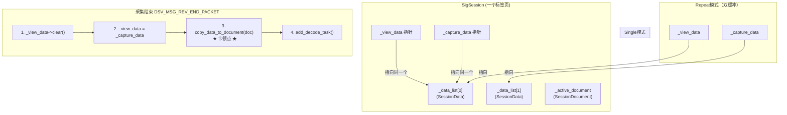

# LogicSnapshot 采集后卡顿优化 — 完整重构计划

## 一、代码审计结论

### 1.1 卡顿根因确认

经过对全部代码路径的审计，确认卡顿发生在 **两个时间点**：

| 卡顿时机 | 触发路径 | 阻塞线程 | 根因 |
|---|---|---|---|
| **采集结束后** | `SR_DF_END` → `DSV_MSG_REV_END_PACKET` → `copy_data_to_document()` → `copy_from_logic()` | **GUI 主线程** | 大量 `malloc` + `memcpy` |
| **第二次采集开始时** | `exec_capture()` → `_capture_data->clear()` → `LogicSnapshot::free_data()` | **GUI 主线程** | 大量 `free()` |

### 1.2 `malloc(LeafBlockSpace)` 全部调用点清单（共 9 处）

> `LeafBlockSpace` = 2,130,440 字节（约 2.03 MB）

**[logicsnapshot.cpp](file:///c:/Users/admin/Downloads/DSView-main_2026_4_27cppnb/PXView/pv/data/logicsnapshot.cpp)** — 9 处 `malloc`：

| 行号 | 函数 | 用途 |
|---|---|---|
| [L398](file:///c:/Users/admin/Downloads/DSView-main_2026_4_27cppnb/PXView/pv/data/logicsnapshot.cpp#L398) | `append_cross_payload` | 采集过程中分配叶子块（bit align 路径） |
| [L471](file:///c:/Users/admin/Downloads/DSView-main_2026_4_27cppnb/PXView/pv/data/logicsnapshot.cpp#L471) | `append_cross_payload` | 采集过程中分配叶子块（主路径入口） |
| [L533](file:///c:/Users/admin/Downloads/DSView-main_2026_4_27cppnb/PXView/pv/data/logicsnapshot.cpp#L533) | `append_cross_payload` | 采集过程中，块满后分配下一个叶子块 |
| [L563](file:///c:/Users/admin/Downloads/DSView-main_2026_4_27cppnb/PXView/pv/data/logicsnapshot.cpp#L563) | `append_cross_payload` | 采集过程中，数据包到达末尾后补块 |
| [L590](file:///c:/Users/admin/Downloads/DSView-main_2026_4_27cppnb/PXView/pv/data/logicsnapshot.cpp#L590) | `append_cross_payload` | 采集过程中，尾部通道补块 |
| [L694](file:///c:/Users/admin/Downloads/DSView-main_2026_4_27cppnb/PXView/pv/data/logicsnapshot.cpp#L694) | `copy_from` | 完整深度拷贝（Glitch Filter 备份） |
| [L1813](file:///c:/Users/admin/Downloads/DSView-main_2026_4_27cppnb/PXView/pv/data/logicsnapshot.cpp#L1813) | `set_sample_range` | 编辑波形时按需实例化 |
| [L1971](file:///c:/Users/admin/Downloads/DSView-main_2026_4_27cppnb/PXView/pv/data/logicsnapshot.cpp#L1971) | `clone_data` | 完整克隆 |
| [L2057](file:///c:/Users/admin/Downloads/DSView-main_2026_4_27cppnb/PXView/pv/data/logicsnapshot.cpp#L2057) | `apply_glitch_filter` | 毛刺过滤时按需实例化 |

**通过 `SessionDocument` 和 `SessionSnapshot` 的间接 `malloc`** — 这两处是**卡顿最严重的元凶**：

| 文件 | 行号 | 函数 |
|---|---|---|
| [sessiondocument.cpp:L112](file:///c:/Users/admin/Downloads/DSView-main_2026_4_27cppnb/PXView/pv/data/sessiondocument.cpp#L112) | `copy_from_logic` | 将采集数据拷贝到文档 |
| [sessionsnapshot.cpp:L210](file:///c:/Users/admin/Downloads/DSView-main_2026_4_27cppnb/PXView/pv/data/sessionsnapshot.cpp#L210) | `copy_from_logic` | 将采集数据拷贝到快照 |

### 1.3 `free(lbp)` 全部调用点清单（共 3 处）

| 文件 | 行号 | 函数 | 用途 |
|---|---|---|---|
| [logicsnapshot.cpp:L101](file:///c:/Users/admin/Downloads/DSView-main_2026_4_27cppnb/PXView/pv/data/logicsnapshot.cpp#L101) | `free_data` | **主释放路径**：清空全部叶子块 |
| [logicsnapshot.cpp:L1728](file:///c:/Users/admin/Downloads/DSView-main_2026_4_27cppnb/PXView/pv/data/logicsnapshot.cpp#L1728) | `decode_end` | 解码结束后释放空闲块列表 |
| [logicsnapshot.cpp:L1741](file:///c:/Users/admin/Downloads/DSView-main_2026_4_27cppnb/PXView/pv/data/logicsnapshot.cpp#L1741) | `free_decode_lpb` | 解码过程中按需释放单个空闲块 |

还有 `free_data()` 中 [L110-112](file:///c:/Users/admin/Downloads/DSView-main_2026_4_27cppnb/PXView/pv/data/logicsnapshot.cpp#L110) 释放 `_free_block_list` 中缓存的空闲块。

### 1.4 双缓冲架构与线程安全审计



**关键发现**：
- `copy_data_to_document()` 在 [sigsession.cpp:L2171-2172](file:///c:/Users/admin/Downloads/DSView-main_2026_4_27cppnb/PXView/pv/sigsession.cpp#L2171) 被调用时，`_view_data` 已经被切换到新缓冲区（L2161），旧缓冲区已被 `clear()`（L2159）。所以此时 `copy_from_logic` 操作的源是 `_view_data`（已经等于 `_capture_data`），是安全的独占数据。
- 但这个拷贝操作在 GUI 主线程的消息循环中执行，会导致界面冻结。

---

## 二、重构方案：内存池 + 异步化

### 第一阶段：LeafBlock 内存池（消除 malloc/free 卡顿）

#### Step 1：创建 `LeafBlockPool` 类

**新建文件**：`PXView/pv/data/leaf_block_pool.h`

```cpp
#ifndef DSVIEW_PV_DATA_LEAF_BLOCK_POOL_H
#define DSVIEW_PV_DATA_LEAF_BLOCK_POOL_H

#include <vector>
#include <mutex>
#include <cstdlib>
#include <cstdint>

namespace pv {
namespace data {

class LeafBlockPool {
public:
    static LeafBlockPool& instance() {
        static LeafBlockPool pool;
        return pool;
    }

    // 从池中获取一个 LeafBlock 大小的内存块
    void* acquire(size_t block_size) {
        std::lock_guard<std::mutex> lock(_mutex);
        if (!_free_blocks.empty()) {
            void* ptr = _free_blocks.back();
            _free_blocks.pop_back();
            return ptr;
        }
        return malloc(block_size);
    }

    // 将内存块归还到池中（而非调用 free）
    void release(void* ptr) {
        if (!ptr) return;
        std::lock_guard<std::mutex> lock(_mutex);
        if (_free_blocks.size() < _max_pool_size) {
            _free_blocks.push_back(ptr);
        } else {
            free(ptr); // 池满则真正释放
        }
    }

    // 设置池的最大容量（按块数计）
    void set_max_pool_size(size_t max_blocks) {
        std::lock_guard<std::mutex> lock(_mutex);
        _max_pool_size = max_blocks;
    }

    // 释放池中所有闲置内存（在软件退出或内存紧张时调用）
    void drain() {
        std::lock_guard<std::mutex> lock(_mutex);
        for (void* ptr : _free_blocks) {
            free(ptr);
        }
        _free_blocks.clear();
    }

    // 当前池中的闲置块数量
    size_t idle_count() {
        std::lock_guard<std::mutex> lock(_mutex);
        return _free_blocks.size();
    }

private:
    LeafBlockPool() : _max_pool_size(2048) {} // 默认最多缓存 2048 块 ≈ 4GB
    ~LeafBlockPool() { drain(); }
    LeafBlockPool(const LeafBlockPool&) = delete;
    LeafBlockPool& operator=(const LeafBlockPool&) = delete;

    std::vector<void*> _free_blocks;
    std::mutex _mutex;
    size_t _max_pool_size;
};

} // namespace data
} // namespace pv

#endif // DSVIEW_PV_DATA_LEAF_BLOCK_POOL_H
```

#### Step 2：替换 `logicsnapshot.cpp` 中的 malloc/free

**修改文件**：[logicsnapshot.cpp](file:///c:/Users/admin/Downloads/DSView-main_2026_4_27cppnb/PXView/pv/data/logicsnapshot.cpp)

1. **添加头文件引用**（文件顶部）：
```diff
 #include "logicsnapshot.h"
+#include "leaf_block_pool.h"
 #include "../dsvdef.h"
```

2. **替换 `free_data()` 中的 `free` 调用**（L97-113）：
```diff
     for(auto& iter : _ch_data) {
         for(auto& iter_rn : iter) {
             for (unsigned int k = 0; k < Scale; k++){
                 if (iter_rn.lbp[k] != NULL)
-                    free(iter_rn.lbp[k]);
+                    LeafBlockPool::instance().release(iter_rn.lbp[k]);
             }
         }
         ...
     }
     ...
     for(void *p : _free_block_list){
-        free(p);
+        LeafBlockPool::instance().release(p);
     }
```

3. **替换 `append_cross_payload()` 中的 5 处 `malloc`**（L398, L471, L533, L563, L590）：
```diff
-                lbp = malloc(LeafBlockSpace);
+                lbp = LeafBlockPool::instance().acquire(LeafBlockSpace);
```
> [!IMPORTANT]
> 这 5 处修改是完全机械化的，对每处 `malloc(LeafBlockSpace)` 做同样的替换即可。

4. **替换 `copy_from()` 中的 `malloc`**（L694）：
```diff
-                    new_rn.lbp[k] = malloc(LeafBlockSpace);
+                    new_rn.lbp[k] = LeafBlockPool::instance().acquire(LeafBlockSpace);
```

5. **替换 `decode_end()` 中的 `free`**（L1728）：
```diff
    for(void *p : _free_block_list){
-        free(p);
+        LeafBlockPool::instance().release(p);
    }
```

6. **替换 `free_decode_lpb()` 中的 `free`**（L1741）：
```diff
-        free(lbp);
+        LeafBlockPool::instance().release(lbp);
```

7. **替换 `set_sample_range()` 中的 `malloc`**（L1813）：
```diff
-            void *lbp = malloc(LeafBlockSpace);
+            void *lbp = LeafBlockPool::instance().acquire(LeafBlockSpace);
```

8. **替换 `clone_data()` 中的 `malloc`**（L1971）：
```diff
-                    void *new_lbp = malloc(LeafBlockSpace);
+                    void *new_lbp = LeafBlockPool::instance().acquire(LeafBlockSpace);
```

9. **替换 `apply_glitch_filter()` 中的 `malloc`**（L2057）：
```diff
-                    void *lbp = malloc(LeafBlockSpace);
+                    void *lbp = LeafBlockPool::instance().acquire(LeafBlockSpace);
```

#### Step 3：替换 `sessiondocument.cpp` 和 `sessionsnapshot.cpp` 中的 malloc

**修改文件**：[sessiondocument.cpp](file:///c:/Users/admin/Downloads/DSView-main_2026_4_27cppnb/PXView/pv/data/sessiondocument.cpp)

```diff
+#include "leaf_block_pool.h"
 ...
 // L112
-                    new_rn.lbp[k] = malloc(LogicSnapshot::LeafBlockSpace);
+                    new_rn.lbp[k] = LeafBlockPool::instance().acquire(LogicSnapshot::LeafBlockSpace);
```

**修改文件**：[sessionsnapshot.cpp](file:///c:/Users/admin/Downloads/DSView-main_2026_4_27cppnb/PXView/pv/data/sessionsnapshot.cpp)

```diff
+#include "leaf_block_pool.h"
 ...
 // L210
-                    new_rn.lbp[k] = malloc(LogicSnapshot::LeafBlockSpace);
+                    new_rn.lbp[k] = LeafBlockPool::instance().acquire(LogicSnapshot::LeafBlockSpace);
```

> [!NOTE]
> 这两个文件中的 `free` 操作不需要单独处理，因为它们内部持有的 `LogicSnapshot _logic` 对象在调用 `free_data()` 时，已经在 Step 2 中被替换为了 `LeafBlockPool::instance().release()`。

#### Step 4：在软件退出时释放内存池

**修改文件**：[appcontrol.cpp](file:///c:/Users/admin/Downloads/DSView-main_2026_4_27cppnb/PXView/pv/appcontrol.cpp)

在 `AppControl::Destroy()` 或析构函数中添加：
```cpp
#include "data/leaf_block_pool.h"
// ...
pv::data::LeafBlockPool::instance().drain();
```

---

### 第二阶段：`copy_data_to_document` 异步化（消除 memcpy 阻塞 UI）

#### Step 5：将 `copy_data_to_document` 移至后台线程

**修改文件**：[sigsession.cpp](file:///c:/Users/admin/Downloads/DSView-main_2026_4_27cppnb/PXView/pv/sigsession.cpp)

在 `OnMessage` 处理 `DSV_MSG_REV_END_PACKET` 时（L2119-2186），将数据拷贝和解码器启动逻辑移至后台：

```diff
       // Switch the captured data buffer to view.
       if (bSwapBuffer) {
         if (_view_data != _capture_data)
           _view_data->clear();
         _view_data = _capture_data;
         attach_data_to_signal(_view_data);
         set_session_time(_trig_time);
         _callback->receive_trigger(_view_data->_trig_pos);
         _callback->trigger_message(DSV_MSG_DATA_POOL_CHANGED);
       }

-      if (bAddDecoder && _active_document) {
-        copy_data_to_document(_active_document);
-      }
-
-      for (auto de : decode_traces()) {
-        de->decoder()->set_capture_end_flag(true);
-        if (bAddDecoder) {
-          de->frame_ended();
-          add_decode_task(de);
-        }
-      }
-
-      _callback->frame_ended();
+      _callback->frame_ended(); // 先让 UI 立即刷新显示波形
+
+      if (bAddDecoder) {
+        // 标记正在进行后台拷贝，防止重入
+        _copy_in_progress = true;
+
+        // 捕获需要的局部变量（避免 lambda 中访问已变化的成员）
+        auto doc = _active_document;
+        auto traces = decode_traces(); // 拷贝当前 decode trace 列表
+
+        std::thread([this, doc, traces]() {
+          // 后台线程：执行耗时的深度拷贝
+          if (doc) {
+            copy_data_to_document(doc);
+          }
+
+          // 拷贝完成后，回到主线程启动解码器
+          QMetaObject::invokeMethod(
+            static_cast<QObject*>(_callback->get_qobject()),
+            [this, traces]() {
+              for (auto de : traces) {
+                de->decoder()->set_capture_end_flag(true);
+                de->frame_ended();
+                add_decode_task(de);
+              }
+              _copy_in_progress = false;
+            },
+            Qt::QueuedConnection
+          );
+        }).detach();
+      }
```

#### Step 6：添加重入保护

**修改文件**：[sigsession.h](file:///c:/Users/admin/Downloads/DSView-main_2026_4_27cppnb/PXView/pv/sigsession.h)

```diff
     std::thread     *_signal_invert_thread;
     bool            _signal_invert_running;
+    volatile bool   _copy_in_progress = false; // 后台拷贝进行中标志
```

在 `exec_capture()` 和 `action_start_capture()` 中，添加等待保护：

```cpp
// 如果后台拷贝仍在进行，等待完成后再开始新采集
while (_copy_in_progress) {
    QThread::msleep(10);
    QCoreApplication::processEvents(); // 保持 UI 响应
}
```

---

## 三、风险评估与缓解

| 风险 | 等级 | 缓解措施 |
|---|---|---|
| 内存池在长时间运行后占用过多内存 | 低 | `_max_pool_size` 限制（默认 2048 块 ≈ 4GB），可通过 `drain()` 手动回收 |
| 后台拷贝线程与主线程竞争 `_view_data` | 低 | `copy_data_to_document` 只读 `_view_data`，不写入；且在 `bSwapBuffer` 模式下此时 `_view_data` 已切换完毕，不会被再次修改 |
| 后台拷贝未完成时用户点击了新采集 | 中 | Step 6 的重入保护确保等待拷贝完成 |
| 内存池的 mutex 锁竞争影响采集线程性能 | 极低 | 采集线程每次 `malloc` 调用间隔约 1ms-10ms（一个 2MB 块的填充时间），mutex 锁持有时间为纳秒级（仅 vector 的 push/pop），不会有任何可观测的性能影响 |
| `SessionDocument::copy_from_logic` 中的 `free_data()` | 低 | 该函数内部调用 `LogicSnapshot::free_data()`，已在 Step 2 中被替换为内存池释放 |

---

## 四、修改文件清单

| # | 文件 | 修改类型 | 说明 |
|---|---|---|---|
| 1 | `PXView/pv/data/leaf_block_pool.h` | **新建** | LeafBlock 内存池（仅头文件） |
| 2 | `PXView/pv/data/logicsnapshot.cpp` | 修改 | 替换 9 处 `malloc` + 3 处 `free` |
| 3 | `PXView/pv/data/sessiondocument.cpp` | 修改 | 替换 1 处 `malloc` |
| 4 | `PXView/pv/data/sessionsnapshot.cpp` | 修改 | 替换 1 处 `malloc` |
| 5 | `PXView/pv/sigsession.cpp` | 修改 | `OnMessage` 中异步化拷贝逻辑 |
| 6 | `PXView/pv/sigsession.h` | 修改 | 添加 `_copy_in_progress` 成员 |
| 7 | `PXView/pv/appcontrol.cpp` | 修改 | 退出时调用 `drain()` |

---

## 五、验证 Checklist

### 第一阶段验证（内存池）
- [ ] 编译通过，无警告
- [ ] 单次采集（Single Mode）：高频率 + 大深度信号，采集完成后 UI 无明显卡顿
- [ ] 重复采集（Repeat Mode）：连续多次采集，第 2 次及后续采集启动无卡顿
- [ ] 循环采集（Loop Mode）：长时间运行，内存占用稳定不泄漏
- [ ] 关闭标签页后，内存池 `idle_count()` 增长（块被正确回收）
- [ ] 打开新标签页并采集，验证使用回收块（无新 `malloc` 系统调用）
- [ ] Glitch Filter 功能正常
- [ ] Signal Invert 功能正常
- [ ] 保存/加载 `.dsl` 文件正常

### 第二阶段验证（异步化）
- [ ] 采集结束瞬间，UI 立刻可交互（可拖拽、缩放波形）
- [ ] 解码器在后台拷贝完成后正确启动
- [ ] 在后台拷贝进行时切换标签页，无崩溃
- [ ] 在后台拷贝进行时点击新采集，等待完成后正确启动新采集
- [ ] Repeat 模式下连续多轮采集，解码结果正确

---

## 六、预期性能提升

| 场景 | 修改前 | 修改后（预期） |
|---|---|---|
| 16通道 × 1G 采样点，采集结束后 UI 恢复时间 | **3-8 秒** | **< 50 毫秒**（第一阶段），**0 毫秒**（第二阶段） |
| 第二次采集启动（Repeat 模式）旧数据释放时间 | **1-3 秒** | **< 1 毫秒** |
| 内存峰值 | 采集数据 × 2（拷贝期间） | 采集数据 × 2（不变，但响应更快） |
