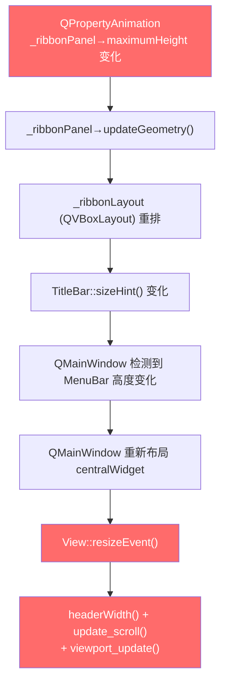
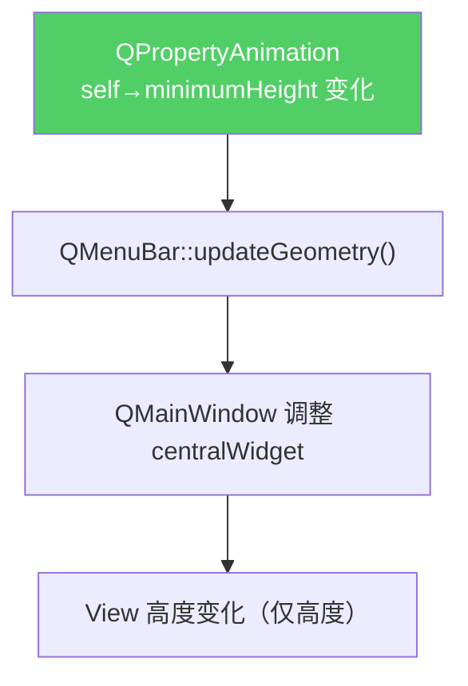

# TitleBar Ribbon 展开/折叠 卡顿与抽搐分析

## 核心结论

当前项目 TitleBar 的 Ribbon 展开/收起之所以出现**抽搐式位移**和**卡顿**，根本原因是**动画属性选择不当** + **布局传播链过长**。旧版 QRibbon 之所以流畅，是因为其动画方式完全不同。

---

## 一、两种实现的关键差异对比

| 维度 | 本项目 TitleBar | 旧版 QRibbon |
|---|---|---|
| **动画属性** | `maximumHeight` (子面板 `_ribbonPanel`) | `minimumHeight` (自身 QMenuBar) |
| **动画对象** | 单独的 `_ribbonPanel` 子 widget | QRibbon 自身 (`this`) |
| **安装方式** | `setMenuBar(_titleBar)` → 嵌入 QMainWindow 内部 | 同样作为 QMenuBar 安装到 QMainWindow |
| **面板 show/hide** | 动画前 `show()`，结束后 `hide()` | 无 show/hide 切换 |
| **缓和曲线** | `OutCubic` (200ms) | `Linear` (默认 ~250ms) |
| **布局影响范围** | `_ribbonPanel→TitleBar→QMenuBar→QMainWindow→View` | 仅改变自身高度，QMainWindow 内部消化 |

---

## 二、具体原因分析

### 原因 1：`maximumHeight` 动画每帧触发完整布局重排（最大元凶）

```cpp
// titlebar.cpp L162
_ribbonAnimation = new QPropertyAnimation(_ribbonPanel, "maximumHeight", this);
```

`maximumHeight` 是 Qt 的 **size constraint 属性**，每次值变化时：

1. `_ribbonPanel` 的 `maximumHeight` 改变
2. → `_ribbonPanel` 调用 `updateGeometry()`
3. → 父布局 `_ribbonLayout` 重新计算
4. → TitleBar 的 `mainLayout` (QVBoxLayout) 重新计算
5. → TitleBar 自身的 `sizeHint()` 改变
6. → **QMainWindow::setMenuBar()** 检测到 QMenuBar 高度变化 → 重新布局 centralWidget
7. → **View::resizeEvent()** 被触发
8. → View 执行 `headerWidth()` / `update_scroll()` / `viewport_update()` 等

**每一帧动画（约 60fps = ~16ms/帧）都要跑完整条链路**，非常昂贵。

尽管 [view.cpp L1244-1256](file:///c:/Users/admin/Downloads/DSView-main_2026_4_27cppnb/PXView/pv/view/view.cpp#L1244-L1256) 做了宽度不变时的快速路径优化，但仍然执行了：
```cpp
setViewportMargins(headerWidth(), RulerHeight, 0, 0);
_header->header_resize();
update_scroll();
viewport_update();
```
这 4 步在每帧 16ms 时间窗口里仍然过重。

### 原因 2：`show()`/`hide()` 切换造成布局跳变（抽搐的直接来源）

```cpp
// titlebar.cpp L268
void TitleBar::expandRibbon() {
    _ribbonPanel->show();               // ← 立刻 show → 高度从 0 瞬间可见
    _ribbonAnimation->setStartValue(_ribbonPanel->height());  // ← 此时 height() 可能为 0
    _ribbonAnimation->setEndValue(_ribbonExpandedHeight);
    _ribbonAnimation->start();
}
```

问题链：
1. `_ribbonPanel->show()` → 此时 `maximumHeight` 仍然是 0 → widget 可见但面积为 0
2. `_ribbonPanel->height()` 返回 0（因为还没布局过）
3. 动画从 0→65 开始，但 `show()` 那一瞬间可能触发一次**多余的布局计算**
4. 这就是你看到的**开始瞬间有一次跳动/抽搐**的原因

折叠时类似：
```cpp
void TitleBar::hideRibbon() {
    _ribbonAnimation->setEndValue(0);
    _ribbonAnimation->start();
    // 动画结束后：
    // if (!_ribbonExpanded) _ribbonPanel->hide();  ← 又一次布局跳变
}
```

### 原因 3：`sizeHint()` 和 `minimumSizeHint()` 动态依赖布局

```cpp
// titlebar.cpp L347-354
QSize TitleBar::sizeHint() const {
    return layout()->sizeHint();     // ← 每次布局系统询问时都要递归计算
}
QSize TitleBar::minimumSizeHint() const {
    return layout()->minimumSize();
}
```

因为 TitleBar 作为 QMenuBar 安装在 QMainWindow 上，QMainWindow 会**频繁查询 menuBar 的 sizeHint** 来决定 centralWidget 的可用空间。动画过程中 `_ribbonPanel` 的 `maximumHeight` 在变，所以每帧都返回不同的 sizeHint → QMainWindow 每帧都重排。

### 原因 4：旧版 QRibbon 为什么流畅？

```cpp
// QRibbon.cpp L493-510
void QRibbon::hideTab() {
    _->animationHideBar.setTargetObject(this);       // ← 动画对象是自身
    _->animationHideBar.setPropertyName("minimumHeight");  // ← 改的是 minimumHeight
    _->animationHideBar.setStartValue(height());
    _->animationHideBar.setEndValue(MINIMUM_HEIGHT);       // ← 30px，不是 0
    _->animationHideBar.setEasingCurve(QEasingCurve::Linear);
    _->animationHideBar.start();
}
```

关键差异：
1. **不使用 show/hide** → 没有布局跳变
2. **minimumHeight 从完整高度→30px**（始终可见，只是缩小）→ 没有从 0 开始的问题
3. **动画对象是自身**（QMenuBar），而不是一个子面板 → 布局传播更短
4. **使用 Direction（Forward/Backward）** → 动画参数只设置一次，之后只是切换方向，避免了重复设置 startValue/endValue 的开销
5. **Linear 缓和曲线** → 每帧变化量均匀，不像 OutCubic 开始变化大后来小

---

## 三、布局传播链路图

### 当前项目（每帧动画）：



### 旧版 QRibbon（每帧动画）：



---

## 四、修复建议

### 方案 A：改为与 QRibbon 一致的方式（推荐）

将动画属性改为 TitleBar 自身的 `minimumHeight`，不再用 `_ribbonPanel` 的 `maximumHeight`：

```cpp
// 初始化时设置一次
_ribbonAnimation = new QPropertyAnimation(this, "minimumHeight", this);
_ribbonAnimation->setDuration(200);
_ribbonAnimation->setEasingCurve(QEasingCurve::Linear);

// 展开
void TitleBar::expandRibbon() {
    _ribbonPanel->show();
    _categoryStack->show();
    _ribbonAnimation->stop();
    _ribbonAnimation->setStartValue(height());       // 当前高度
    _ribbonAnimation->setEndValue(32 + _ribbonExpandedHeight);  // 标题行+面板
    _ribbonAnimation->start();
    _ribbonExpanded = true;
}

// 折叠
void TitleBar::hideRibbon() {
    _ribbonAnimation->stop();
    _ribbonAnimation->setStartValue(height());
    _ribbonAnimation->setEndValue(32);  // 只保留标题行
    _ribbonAnimation->start();
    _ribbonExpanded = false;
}
```

### 方案 B：使用 Overlay 弹出（避免布局联动）

将 Ribbon 面板改为浮动 Overlay（类似下拉菜单），不参与父布局：

```cpp
_ribbonPanel->setParent(parentWidget());  // 脱离 TitleBar 布局
_ribbonPanel->setWindowFlags(Qt::Popup | Qt::FramelessWindowHint);
// 动画时只改变 Overlay 的 geometry，完全不触发主窗口布局
```

### 方案 C：最小改动 —— 抑制动画期间的布局传播

```cpp
void TitleBar::expandRibbon() {
    _ribbonPanel->show();
    // 冻结 QMainWindow 的布局
    parentWidget()->setUpdatesEnabled(false);
    
    _ribbonAnimation->setStartValue(0);
    _ribbonAnimation->setEndValue(_ribbonExpandedHeight);
    _ribbonAnimation->start();
}

// 在动画的 valueChanged 中手动控制：
connect(_ribbonAnimation, &QPropertyAnimation::finished, [this]() {
    parentWidget()->setUpdatesEnabled(true);
    parentWidget()->update();
});
```

> [!IMPORTANT]
> 方案 A 最简单且已被旧版验证有效。方案 B 效果最好但改动大。方案 C 是临时补丁，可能导致动画期间画面不刷新。

---

## 五、额外发现的小问题

1. **`_ribbonPanel->height()` 在 show 后立即调用可能返回 0** — 因为布局还没有处理过（[L270](file:///c:/Users/admin/Downloads/DSView-main_2026_4_27cppnb/PXView/pv/toolbars/titlebar.cpp#L270)）
2. **动画中途切换 tab 的处理不完善** — `onTabClicked` 没有考虑动画正在运行的情况，如果快速连续点击不同 tab，可能导致动画叠加
3. **`OutCubic` 曲线**会导致开始几帧变化非常大 → 视觉上的"跳跃感"更明显
