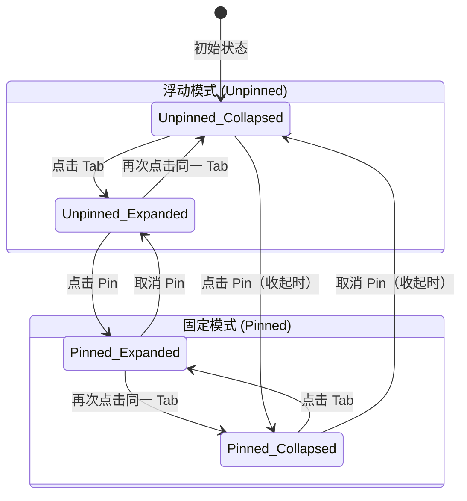

# Ribbon Pin 按钮实现计划

## 目标

在 Ribbon 面板的**右下角**添加一个 Pin（📌）SVG 按钮，点击后切换 Ribbon 的"固定"/"浮动"模式：

| 模式 | 行为 |
|------|------|
| **浮动（默认）** | 当前行为不变 — Ribbon 作为浮动覆盖层（`_ribbonContainer`）滑出/收回，主视图不动 |
| **固定（Pin 激活）** | Ribbon 像 QRibbon.cpp 一样通过动画改变 TitleBar 自身的 `minimumHeight`/`fixedHeight`，让 Qt 布局系统自动把主视图往下推（"主视图滑上去"效果），**不需要重算布局** |

## 核心原理分析

### 当前 TitleBar 的 Ribbon 实现（浮动模式）
- TitleBar 固定 32px 高度
- `_ribbonContainer` 是 `parent`（SubMainFrame）的子控件，浮在主视图上方
- `_ribbonPanel` 在容器内做 Y 轴平移动画（`slideOffset` 属性）
- 展开/收起不影响主视图位置 → **覆盖式**

### QRibbon.cpp 的实现（固定模式）
```cpp
_->animationHideBar.setTargetObject(this);
_->animationHideBar.setPropertyName("minimumHeight");
_->animationHideBar.setStartValue(height());      // 展开高度
_->animationHideBar.setEndValue(MINIMUM_HEIGHT);   // 30px（仅 tab 栏）
```
- 直接动画化 QMenuBar 的 `minimumHeight`
- Qt 布局系统自动调整中央控件位置 → **推式**
- 不需要手动计算任何子控件坐标 → **性能好**

## 实现步骤

### 第 1 步：创建 Pin SVG 图标

在 `icons/light/` 和 `icons/dark/` 目录下各添加 `pin.svg` 和 `unpin.svg`（或用同一个 `pin.svg` 配合旋转/颜色变化区分状态）。

> 考虑到简洁性，用单个 `pin.svg`，通过 QToolButton 的 checked 状态 + CSS 区分。

### 第 2 步：修改 `titlebar.h` — 添加成员变量和方法

```diff
 // 新增成员变量
+    QToolButton     *_pinButton;        // Pin 按钮
+    bool            _ribbonPinned;      // 是否固定模式
+    QPropertyAnimation *_pinnedAnimation; // 固定模式的高度动画

 // 新增方法声明
+private slots:
+    void onPinToggled(bool checked);
+
+private:
+    void expandRibbonPinned();   // 固定模式：展开
+    void hideRibbonPinned();     // 固定模式：收起
```

### 第 3 步：修改 `titlebar.cpp` — 构造函数

在 `_ribbonPanel` 构建完成后（约 L188 `_categoryStack` 添加之后），创建 Pin 按钮：

```cpp
// --- Pin 按钮（放在 _ribbonPanel 的右下角）---
_pinButton = new QToolButton(_ribbonPanel);
_pinButton->setObjectName("RibbonPinButton");
_pinButton->setFixedSize(20, 20);
_pinButton->setIconSize(QSize(14, 14));
_pinButton->setAutoRaise(true);
_pinButton->setCheckable(true);
_pinButton->setChecked(false);
_pinButton->setToolTip(tr("Pin Ribbon"));
connect(_pinButton, &QToolButton::toggled, this, &TitleBar::onPinToggled);
```

Pin 按钮**不加入布局**，而是在 `setSlideOffset()` 和 `positionRibbonContainer()` 中手动定位到右下角（`_ribbonPanel` 右下角减去 margin）。

### 第 4 步：Pin 按钮定位

在 `setSlideOffset()` 中（每帧调用），更新 Pin 按钮位置：

```cpp
// 定位 pin 按钮到 ribbonPanel 的右下角
int pinX = _ribbonPanel->width() - _pinButton->width() - 6;
int pinY = _ribbonPanel->height() - _pinButton->height() - 4;
_pinButton->move(pinX, pinY);
```

### 第 5 步：固定模式的展开/收起

**核心思路**：像 QRibbon.cpp 一样，动画化 TitleBar 自身的 `fixedHeight`（从 32px → 32 + 65 = 97px），让 Qt 布局自动推开主视图。

```cpp
void TitleBar::expandRibbonPinned()
{
    // 停止浮动模式动画
    if (_ribbonAnimation->state() == QAbstractAnimation::Running)
        _ribbonAnimation->stop();

    // 隐藏浮动容器（不再需要）
    _ribbonContainer->hide();

    // 让 _categoryStack 作为 TitleBar 自身布局的一部分
    // 方案：将 _ribbonPanel 重新 parent 到 this，插入 mainLayout
    // 或者：直接动画化 this 的 fixedHeight

    if (_pinnedAnimation->state() == QAbstractAnimation::Running)
        _pinnedAnimation->stop();

    _pinnedAnimation->setStartValue(height());
    _pinnedAnimation->setEndValue(32 + _ribbonExpandedHeight);
    _pinnedAnimation->setEasingCurve(QEasingCurve::OutCubic);
    _pinnedAnimation->start();

    _ribbonExpanded = true;
}

void TitleBar::hideRibbonPinned()
{
    if (_pinnedAnimation->state() == QAbstractAnimation::Running)
        _pinnedAnimation->stop();

    _pinnedAnimation->setStartValue(height());
    _pinnedAnimation->setEndValue(32);
    _pinnedAnimation->setEasingCurve(makeTailwindCurve());
    _pinnedAnimation->start();

    _ribbonExpanded = false;
}
```

**关键设计**：
- `_pinnedAnimation` 的 `propertyName` 是 `"minimumHeight"` + 同步 `setFixedHeight()`
- 实际上只需设置一个 `Q_PROPERTY(int pinnedHeight ...)` 包装 `setFixedHeight()`
- 这样 Qt 的布局管理器自动把下方的 `_contentWidget` 推下去

### 第 6 步：固定模式下的 Ribbon 内容显示

固定模式展开时：
1. 将 `_ribbonPanel` 从 `_ribbonContainer` 移到 TitleBar 自身的 `mainLayout` 中
2. 或者 —— **更好的方案**：保持 `_ribbonContainer` 但改变其布局方式

**推荐方案**（最小改动、性能最优）：

```
固定模式展开：
  1. setFixedHeight(32 + 65)  ← 动画过程
  2. _ribbonPanel->setParent(this)
  3. _ribbonPanel->move(0, 32)
  4. _ribbonPanel->show()
  5. _ribbonPanel->raise()
  6. 无需 _ribbonContainer

固定模式收起：
  1. setFixedHeight(32)  ← 动画过程
  2. 动画结束后 _ribbonPanel->setParent(_ribbonContainer)
  3. _ribbonPanel->move(0, -65)
```

### 第 7 步：`onPinToggled` 实现

```cpp
void TitleBar::onPinToggled(bool checked)
{
    _ribbonPinned = checked;

    QString iconPath = GetIconPath();
    if (checked) {
        _pinButton->setIcon(QIcon(iconPath + "/unpin.svg"));
        _pinButton->setToolTip(tr("Unpin Ribbon"));

        // 如果当前浮动模式正在展开，切换到固定模式
        if (_ribbonExpanded) {
            hideRibbon();  // 先收起浮动
            expandRibbonPinned();  // 再以固定模式展开
        }
    } else {
        _pinButton->setIcon(QIcon(iconPath + "/pin.svg"));
        _pinButton->setToolTip(tr("Pin Ribbon"));

        // 如果当前固定模式正在展开，切换到浮动模式
        if (_ribbonExpanded) {
            hideRibbonPinned();  // 先收起固定
        }
    }
}
```

### 第 8 步：修改 `onTabClicked` / `expandRibbon` / `hideRibbon`

在 `onTabClicked` 中根据 `_ribbonPinned` 分发到不同的展开/收起方法：

```cpp
void TitleBar::onTabClicked(int index)
{
    if (_ribbonExpanded && index == _tabBar->currentIndex()) {
        _ribbonPinned ? hideRibbonPinned() : hideRibbon();
    } else {
        _ribbonPinned ? expandRibbonPinned() : expandRibbon();
    }
}
```

### 第 9 步：添加 `pinnedHeight` Q_PROPERTY

```cpp
Q_PROPERTY(int pinnedHeight READ pinnedHeight WRITE setPinnedHeight)

int TitleBar::pinnedHeight() const { return height(); }

void TitleBar::setPinnedHeight(int h)
{
    setFixedHeight(h);

    // 固定模式下，ribbonPanel 跟随高度变化
    if (_ribbonPinned && _ribbonPanel->parent() == this) {
        _ribbonPanel->setFixedWidth(width());
        _ribbonPanel->move(0, 32);

        // 裁切效果：只显示已展开的部分
        int visibleH = h - 32;
        _ribbonPanel->setFixedHeight(_ribbonExpandedHeight);
        // 用 mask 或 clip 限制可见区域
    }
}
```

### 第 10 步：`reStyle` 中添加 Pin 图标更新

```cpp
void TitleBar::reStyle()
{
    // ... 现有代码 ...

    // Pin 按钮图标
    if (_pinButton) {
        if (_ribbonPinned)
            _pinButton->setIcon(QIcon(iconPath + "/unpin.svg"));
        else
            _pinButton->setIcon(QIcon(iconPath + "/pin.svg"));
    }
}
```

## 文件变更清单

| 文件 | 变更内容 |
|------|---------|
| `titlebar.h` | 添加 `_pinButton`, `_ribbonPinned`, `_pinnedAnimation` 成员; 添加 `pinnedHeight` Q_PROPERTY; 添加 `onPinToggled`, `expandRibbonPinned`, `hideRibbonPinned` 方法声明 |
| `titlebar.cpp` | 构造函数中创建 Pin 按钮和固定模式动画; 实现固定模式展开/收起; 修改 `onTabClicked` 分发逻辑; `reStyle` 更新 Pin 图标; `setSlideOffset` 中定位 Pin 按钮 |
| `icons/light/pin.svg` | 新增 Pin 图标（light 主题） |
| `icons/dark/pin.svg` | 新增 Pin 图标（dark 主题） |
| `icons/light/unpin.svg` | 新增 Unpin 图标（light 主题） |
| `icons/dark/unpin.svg` | 新增 Unpin 图标（dark 主题） |
| `PXView.qrc`（或对应资源文件） | 注册新 SVG 文件 |

## 性能优势

与 QRibbon.cpp 相同的高性能方案：
- ✅ **不重算布局**：通过 `minimumHeight`/`fixedHeight` 动画，Qt 布局系统自动调整
- ✅ **无 repaint 开销**：只改变一个 property，Qt 增量更新
- ✅ **单一动画引擎**：每种模式只有一个 `QPropertyAnimation`
- ✅ **零额外控件**：固定模式直接复用 `_ribbonPanel`

## 状态图


