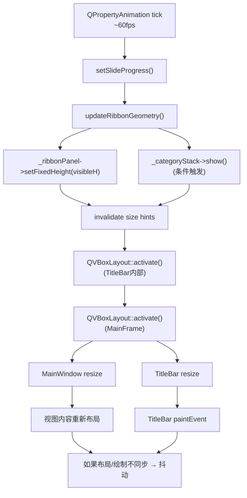

# TitleBar Ribbon 动画抖动/抽搐分析

## 问题描述

在 Ribbon 面板执行展开/折叠动画时，标题栏出现视觉"抽搐"——表现为内容闪烁、位置跳变或者帧间高度不一致。

---

## 根因分析

定位到 **三个相互关联的根因**：

### 根因 1：`setFixedHeight()` 在动画循环中逐帧调用

```cpp
// titlebar.cpp:329-337
void TitleBar::updateRibbonGeometry()
{
    int visibleH = qRound(_ribbonExpandedHeight * _slideProgress);
    _ribbonPanel->setFixedHeight(visibleH);  // ← 每帧触发

    if (visibleH > 0 && !_categoryStack->isVisible()) {
        _categoryStack->show();
    }
}
```

> [!CAUTION]
> `setFixedHeight()` 会同时设置 `minimumHeight` 和 `maximumHeight`，这会使该 widget **invalidate** 自身的 size hint 并向上传播 `QEvent::LayoutRequest`。Qt 布局引擎在**同一帧**内可能执行多次 `layout->activate()`，导致父 widget（MainFrame 的 QVBoxLayout）反复重新计算几何。

**抖动机制**：
1. `QPropertyAnimation` 以 ~16ms 间隔调用 `setSlideProgress()`
2. `setSlideProgress()` → `updateRibbonGeometry()` → `setFixedHeight(visibleH)`
3. `setFixedHeight()` → invalidate size constraints → 触发 `QLayout::activate()` 向上传播
4. 父布局 `QVBoxLayout` 重新分配 TitleBar 高度 + MainWindow 高度
5. **如果布局更新与绘制不同步**，就会出现一帧"旧高度 + 新内容"或"新高度 + 旧内容"的撕裂

### 根因 2：`qRound()` 产生的整数跳变

```cpp
int visibleH = qRound(_ribbonExpandedHeight * _slideProgress);
//            65 * 0.49 = 31.85 → 32
//            65 * 0.50 = 32.50 → 33  ← 突然跳 1px
//            65 * 0.51 = 33.15 → 33
```

当 `_ribbonExpandedHeight = 65` 时，`qRound` 在某些进度值附近会产生 ±1px 的非单调跳变。虽然 1px 看起来很小，但由于布局传播延迟，这个跳变会被放大。

### 根因 3：`_categoryStack->show()` 在动画中途触发

```cpp
if (visibleH > 0 && !_categoryStack->isVisible()) {
    _categoryStack->show();  // ← 额外触发一次完整的 layout recalc
}
```

`QStackedWidget::show()` 会立即触发 `updateGeometry()` + `QEvent::Show` + 重新布局，和动画的 `setFixedHeight` 叠加导致**同一帧内两次布局计算**。

---

## 问题传播路径



---

## 评估：修复 vs. 重写

| 维度 | 修复（Fix） | 重写（Rewrite） |
|------|------------|----------------|
| **工作量** | 改动 ~30 行 | 需要重构整个 TitleBar + 布局架构 |
| **风险** | 低，局部改动 | 高，可能影响拖拽/最大化/多显示器逻辑 |
| **效果** | 能完全消除抖动 | 同样能消除，但没有额外收益 |
| **必要性** | ✅ 足够 | ❌ 过度工程 |

> [!IMPORTANT]
> **建议：修复，不重写。** 
> 
> 抖动的根因是动画策略问题，不是架构问题。TitleBar 的其余功能（Tab 管理、拖拽、双击最大化、样式）都工作正常。重写会引入不必要的回归风险。

---

## 推荐修复方案

### 修改 1：用 `setMaximumHeight()` 替代 `setFixedHeight()`

`setFixedHeight()` 同时设置 min 和 max，每次调用产生两次 constraint change。改用只设 max 可以减少一半的 invalidation：

```diff
 void TitleBar::updateRibbonGeometry()
 {
     int visibleH = qRound(_ribbonExpandedHeight * _slideProgress);
-    _ribbonPanel->setFixedHeight(visibleH);
+    _ribbonPanel->setMinimumHeight(0);
+    _ribbonPanel->setMaximumHeight(visibleH);
+    _ribbonPanel->resize(_ribbonPanel->width(), visibleH);
```

但更好的方案是：

### 修改 2（推荐）：用 `QWidget::setMaximumHeight` + 抑制布局传播

```diff
 void TitleBar::updateRibbonGeometry()
 {
     int visibleH = qRound(_ribbonExpandedHeight * _slideProgress);
-    _ribbonPanel->setFixedHeight(visibleH);
+
+    // Directly set geometry without triggering full layout cascade
+    _ribbonPanel->setMaximumHeight(visibleH);
+    _ribbonPanel->setMinimumHeight(visibleH);

     if (visibleH > 0 && !_categoryStack->isVisible()) {
         _categoryStack->show();
     }
+
+    // Force immediate synchronous layout to avoid paint/layout desync
+    if (layout()) {
+        layout()->activate();
+    }
 }
```

### 修改 3：将 `_categoryStack->show()` 移到动画开始前

```diff
 void TitleBar::expandRibbon()
 {
     if (_ribbonAnimation->state() == QAbstractAnimation::Running) {
         _ribbonAnimation->stop();
     }
     _categoryStack->show();
+    // Ensure the stack has resolved its geometry before animation starts
+    _categoryStack->updateGeometry();
     _ribbonAnimation->setStartValue(_slideProgress);
     _ribbonAnimation->setEndValue(1.0);
     _ribbonAnimation->start();
     _ribbonExpanded = true;
 }
```

并从 `updateRibbonGeometry()` 中移除条件 show：

```diff
 void TitleBar::updateRibbonGeometry()
 {
     int visibleH = qRound(_ribbonExpandedHeight * _slideProgress);
     _ribbonPanel->setFixedHeight(visibleH);
-
-    if (visibleH > 0 && !_categoryStack->isVisible()) {
-        _categoryStack->show();
-    }
 }
```

### 修改 4（可选增强）：使用 clip 代替改变高度

最彻底的方案是**不改变 `_ribbonPanel` 的实际高度**，而是用 `setClipRect` 或 `setContentsMargins` 来裁剪可见区域。这样完全不会触发 layout invalidation：

```cpp
void TitleBar::updateRibbonGeometry()
{
    int visibleH = qRound(_ribbonExpandedHeight * _slideProgress);
    
    // Keep ribbon at full height, only clip the visible portion
    _ribbonPanel->setFixedHeight(_ribbonExpandedHeight);
    
    // Use negative top margin to "slide" content up
    int hideH = _ribbonExpandedHeight - visibleH;
    _ribbonPanel->setContentsMargins(0, -hideH, 0, 0);
    
    // Clip to prevent overflow
    _ribbonPanel->setMask(QRegion(0, hideH, _ribbonPanel->width(), visibleH));
}
```

> [!TIP]
> 修改 3 + 修改 2 的组合是**最小改动、最大效果**的方案。修改 4 更彻底但改动更大。

---

## 建议实施优先级

1. **首先** 应用修改 3（移动 `show()` 到动画开始前）——这消除了动画中途的 layout 冲击
2. **然后** 应用修改 2（`layout()->activate()`）——确保绘制与布局同步
3. **验证** 效果后决定是否需要修改 4

要我现在实施修改 3 + 修改 2 的组合方案吗？
